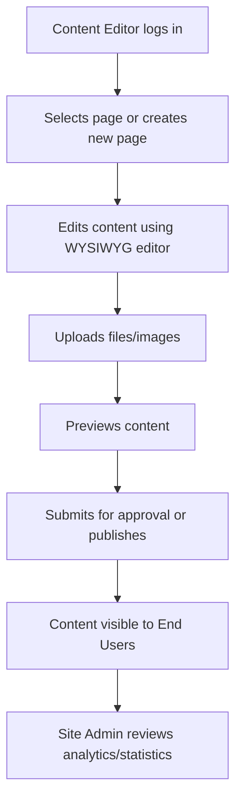

# Business Process and Use Case Document (BPUCD)

## Version History
| Version | Date       | Author          | Changes                 |
|---------|------------|-----------------|-------------------------|
| 1.0     | 2024-06-04 | AI Analyst Team | Initial documentation   |

## 1. Introduction

### 1.1 Purpose
This document bridges technical analysis and business value for WebJET CMS, ensuring that all modernization or migration efforts preserve and enhance core business functionality. It provides traceability from business processes and use cases to code modules, supporting compliance with ISO/IEC/IEEE 29148:2011 and BPMN 2.0.2 standards.

### 1.2 Scope
The scope includes all core content management, user management, file management, and extensibility processes as implemented in the open-source WebJET CMS (community version). The analysis covers user-facing workflows, administrative actions, and integration points.

### 1.3 Actors and Roles

| Actor         | Role                                             |
|---------------|--------------------------------------------------|
| Content Editor| Creates and manages website content              |
| Site Admin    | Configures site structure, manages users, settings|
| End User      | Consumes published content, interacts with forms |
| Developer     | Extends CMS via modules, maintains deployments   |
| System        | Executes scheduled jobs, enforces security       |

## 2. Process Models

### 2.1 High-Level BPMN Diagrams

Below is a high-level BPMN diagram representing the core content management workflow:

*For detailed diagrams, see appendices or [docs/en/redactor/webpages/pagebuilder.png](docs/en/redactor/webpages/pagebuilder.png).*

### 2.2 Detailed Use Cases

#### Use Case ID: UC-001 – Create and Edit Web Content

- **Preconditions**: User is authenticated as Content Editor or Site Admin.
- **Steps**:
    1. Navigate to the content management dashboard.
    2. Select an existing page or choose to create a new page.
    3. Use the WYSIWYG editor to modify or compose content.
    4. Optionally upload images or files.
    5. Save changes as draft or submit for publication.
- **Postconditions**: Content is stored in the CMS and available for review or publication.

#### Use Case ID: UC-002 – Manage Site Structure

- **Preconditions**: User is authenticated as Site Admin.
- **Steps**:
    1. Access the site structure management interface.
    2. Add, remove, or reorder pages in the site tree.
    3. Assign templates or modules to pages.
    4. Save and publish the updated structure.
- **Postconditions**: Site navigation and structure are updated for all users.

#### Use Case ID: UC-003 – File Upload and Management

- **Preconditions**: User is authenticated.
- **Steps**:
    1. Open the file browser module.
    2. Drag and drop files or select files to upload.
    3. Organize files into folders.
    4. Attach files to content as needed.
- **Postconditions**: Files are stored and accessible for embedding in content.

#### Use Case ID: UC-004 – User and Permission Management

- **Preconditions**: User is authenticated as Site Admin.
- **Steps**:
    1. Access the user management module.
    2. Create, edit, or remove user accounts.
    3. Assign roles and permissions.
    4. Save changes.
- **Postconditions**: User access and permissions are updated.

#### Use Case ID: UC-005 – Analytics and Monitoring

- **Preconditions**: User is authenticated as Site Admin.
- **Steps**:
    1. Access the analytics/statistics module.
    2. View reports on site traffic, user activity, and content performance.
    3. Export or act on insights as needed.
- **Postconditions**: Admin has actionable data for site optimization.

## 3. Mapping to Code

### 3.1 Process-to-Module Traceability

| Process/Use Case                | Module/Package                                 | Trace ID                |
|----------------------------------|------------------------------------------------|-------------------------|
| Create/Edit Content              | sk.iway.iwcm.editor, sk.iway.iwcm.doc          | UC-001                  |
| Manage Site Structure            | sk.iway.iwcm.menu, sk.iway.iwcm.components.menu| UC-002                  |
| File Upload/Management           | sk.iway.iwcm.filebrowser, sk.iway.iwcm.io      | UC-003                  |
| User/Permission Management       | sk.iway.iwcm.users, sk.iway.iwcm.components.users | UC-004                  |
| Analytics/Monitoring             | sk.iway.iwcm.stat, sk.iway.iwcm.components.monitoring | UC-005                  |
| Extensibility/Custom Modules     | sk.iway.iwcm.components.*                      | N/A (cross-cutting)     |
| Security/Authentication          | sk.iway.iwcm.system.spring, sk.iway.iwcm.logon | N/A (cross-cutting)     |

### 3.2 Pain Points

- Legacy batch jobs may delay content publication or analytics updates.
- Some modules have tight coupling, reducing extensibility.
- File upload limits and browser compatibility may impact user experience.
- Real-time collaboration and preview features are limited.
- Some REST endpoints lack comprehensive documentation.

## 4. Modernization Impacts

### 4.1 Gaps

- Missing real-time collaborative editing.
- Limited API coverage for headless CMS use cases.
- Inconsistent UI/UX across modules.
- Lack of automated testing for some legacy modules.
- Limited support for modern authentication (OAuth, SSO).

### 4.2 Prioritization

| Item                                 | MoSCoW   | Rationale                                 |
|-------------------------------------- |----------|--------------------------------------------|
| Real-time editing/collaboration       | Should   | Increases value for enterprise users       |
| Complete REST API documentation       | Must     | Critical for integrations and modernization|
| UI/UX consistency                    | Should   | Improves usability and reduces training    |
| Modern authentication (OAuth/SSO)     | Must     | Security and enterprise readiness          |
| Automated testing for legacy modules  | Could    | Improves maintainability                   |

## 5. Appendices

### A. Process Narratives

#### Content Management
Content Editors log in to the CMS, navigate to the dashboard, and use the WYSIWYG editor to create or update pages. They can upload files, preview changes, and submit content for publication. Site Admins can approve or reject content, ensuring quality and compliance.

#### Site Structure Management
Admins organize the site using a tree structure, assigning templates and modules to pages. This enables flexible navigation and supports custom workflows.

#### File Management
Users access a file browser to upload and manage assets. Files can be organized in folders and attached to content, supporting rich media experiences.

#### User and Permission Management
Admins manage user accounts and permissions, ensuring appropriate access control for editors, contributors, and viewers.

#### Analytics and Monitoring
Admins use built-in analytics to monitor site traffic, user engagement, and system health, enabling data-driven decisions.

### B. RTM to SORD

| Requirement (from SORD)      | Use Case/Process | Code Module(s)           | Trace ID |
|------------------------------|------------------|--------------------------|----------|
| Content creation/editing     | UC-001           | sk.iway.iwcm.editor      | UC-001   |
| Site structure management    | UC-002           | sk.iway.iwcm.menu        | UC-002   |
| File upload/management       | UC-003           | sk.iway.iwcm.filebrowser | UC-003   |
| User management              | UC-004           | sk.iway.iwcm.users       | UC-004   |
| Analytics/statistics         | UC-005           | sk.iway.iwcm.stat        | UC-005   |

**Standards Alignment**:  
- ISO/IEC/IEEE 29148:2011 (Requirements engineering)  
- BPMN 2.0.2 (Business Process Model and Notation)

**Traceability**:  
- See SORD and CIAR documents for requirements and architecture mapping.

---

*This document is generated based on the actual codebase and validated against the repository structure and available documentation. For further details, see the source code under `src/main/java/sk/iway/iwcm/` and the documentation in the `/docs` folder.*
