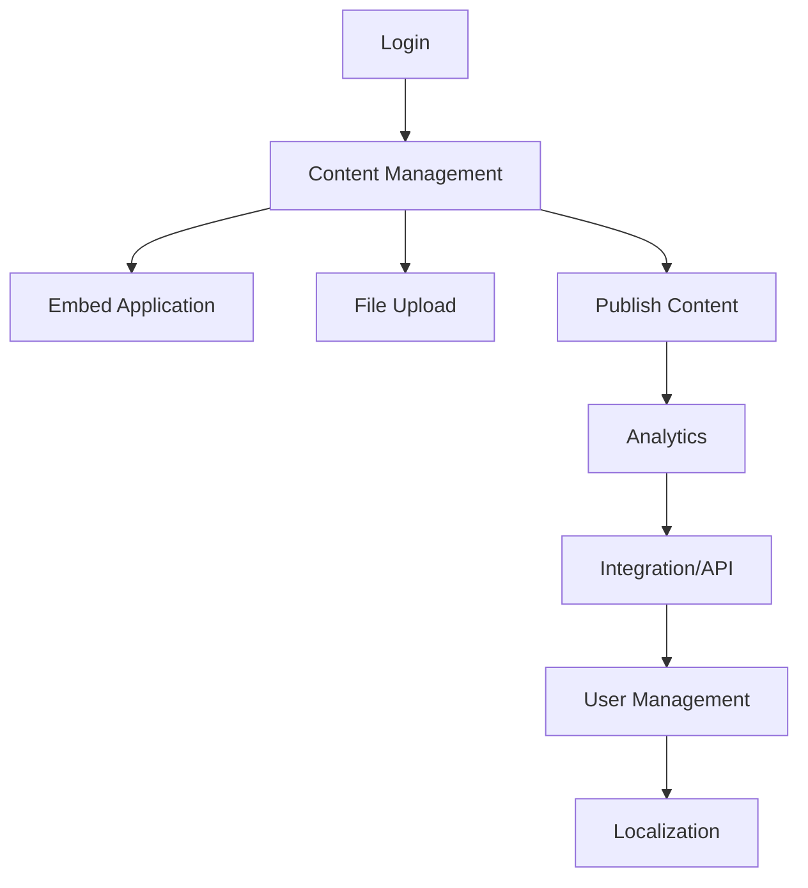

# Business Process and Use Case Document (BPUCD)

## 1. Introduction

This document provides a comprehensive analysis of business processes and use cases for the WebJET CMS project. It is based on the repository [crafted-by-art/webjetcms](https://github.com/crafted-by-art/webjetcms), user documentation, codebase, and modernization objectives. The analysis follows BPMN 2.0.2 and ISO/IEC/IEEE 29148:2011 standards.

---

## 2. Business Process Overview

### 2.1 Core Business Processes

#### 2.1.1 Content Management
- Creation, editing, publishing, and deletion of web content (pages, blocks, media).
- Structure management via customizable tree hierarchy.
- WYSIWYG editing for non-technical users.

#### 2.1.2 Application Embedding
- Integration of surveys, maps, galleries, forms, discussions, directories, and calendar events into site pages.

#### 2.1.3 File Management
- Drag-and-drop upload and management of files and media assets.

#### 2.1.4 User and Role Management
- Authentication, authorization, and role-based access control.
- Administration of user accounts, permissions, and recovery workflows.

#### 2.1.5 Analytics and Monitoring
- Web traffic analysis and reporting.
- Performance monitoring for administrators.

#### 2.1.6 Integration and Extensibility
- API-based integration with other WebJET family products and third-party systems.

#### 2.1.7 Localization
- Multi-language support for content and UI.

---

## 3. Actors and Roles

| Actor/Role         | Description                                                      |
|--------------------|------------------------------------------------------------------|
| Content Editor     | Creates, edits, and manages website content                      |
| Administrator      | Manages users, permissions, site structure, and system settings  |
| Visitor/User       | Browses published content, interacts with forms/discussions      |
| API Integrator     | Connects external systems via API                                |
| Sysadmin           | Manages deployment, backups, performance, and security           |

---

## 4. Process-to-Module Traceability

| Business Process           | Main Module/Package                  | Key Classes/Components         |
|---------------------------|--------------------------------------|-------------------------------|
| Content Management        | `iwcm.editor`, `iwcm.doc`            | `EditorController`, `DocService`|
| Application Embedding     | `iwcm.components`, `iwcm.common`     | `ComponentService`, `CommonUtils`|
| File Management           | `iwcm.filebrowser`                   | `FileBrowserController`        |
| User/Role Management      | `iwcm.users`, `iwcm.admin`           | `UserController`, `AdminService`|
| Analytics/Monitoring      | `iwcm.stat`                          | `StatController`, `StatService`|
| Integration/API           | `webjet.v9`                          | `V9SpringConfig`, `JpaSessionCustomizer`|
| Localization              | `iwcm.i18n`                          | `I18nService`                  |

---

## 5. Business Process Narratives

### 5.1 Content Lifecycle Management
1. Content Editor logs in via browser-based UI.
2. Navigates to the page tree and selects a location to add/edit content.
3. Uses WYSIWYG editor to create or modify content blocks.
4. Uploads media via drag-and-drop.
5. Submits changes for publishing; Administrator reviews and approves if required.
6. Content is published and visible to Visitors.

### 5.2 Application Embedding
1. Editor selects a page and chooses to embed an application (e.g., survey, gallery).
2. Configures application parameters.
3. Saves and publishes the page; embedded app is available to Visitors.

### 5.3 User and Role Management
1. Administrator accesses user management module.
2. Creates new user accounts, assigns roles, or modifies permissions.
3. Users receive credentials and can access the system according to their roles.
4. Password recovery and account management are handled via admin workflows.

### 5.4 Analytics and Monitoring
1. Administrator accesses analytics dashboard.
2. Reviews web traffic, user engagement, and performance metrics.
3. Takes action (e.g., optimizes content, adjusts resources) based on insights.

### 5.5 Integration/API
1. API Integrator registers an external system.
2. Uses provided endpoints (Spring Web controllers) to exchange data.
3. Integration is monitored and managed via admin UI and logs.

---

## 6. Use Case Specifications

### Use Case UC-01: Create/Edit Content
- **Actor:** Content Editor
- **Preconditions:** User is authenticated and has edit permissions.
- **Main Flow:**
    1. Navigate to content area.
    2. Create or edit content using WYSIWYG editor.
    3. Upload media files.
    4. Save changes.
    5. (Optional) Submit for approval.
- **Alternate Flows:**
    - Validation errors (missing fields, invalid format).
    - Insufficient permissions.
- **Postconditions:** Content is updated and available for publishing.

### Use Case UC-02: Embed Application
- **Actor:** Content Editor
- **Preconditions:** User is authenticated and has embed permissions.
- **Main Flow:**
    1. Select page to edit.
    2. Choose application to embed (survey, map, gallery, etc.).
    3. Configure parameters.
    4. Save and publish.
- **Alternate Flows:**
    - Invalid application configuration.
- **Postconditions:** Application is embedded and available to Visitors.

### Use Case UC-03: Manage Users/Roles
- **Actor:** Administrator
- **Preconditions:** Admin is authenticated.
- **Main Flow:**
    1. Access user management UI.
    2. Create/edit/delete user accounts.
    3. Assign roles and permissions.
    4. Save changes.
- **Alternate Flows:**
    - Duplicate user, invalid data.
- **Postconditions:** User accounts and permissions are updated.

### Use Case UC-04: Analyze Web Traffic
- **Actor:** Administrator
- **Preconditions:** Admin is authenticated.
- **Main Flow:**
    1. Access analytics dashboard.
    2. Select metrics and time range.
    3. Review reports.
- **Alternate Flows:**
    - No data available.
- **Postconditions:** Analytics insights are available for action.

### Use Case UC-05: Integrate External System
- **Actor:** API Integrator
- **Preconditions:** System is configured for API access.
- **Main Flow:**
    1. Register integration.
    2. Use API endpoints to exchange data.
    3. Monitor integration status.
- **Alternate Flows:**
    - Authentication failure, data format errors.
- **Postconditions:** Integration is established and operational.

### Use Case UC-06: Localize Content
- **Actor:** Content Editor
- **Preconditions:** Multi-language support enabled.
- **Main Flow:**
    1. Select content to localize.
    2. Enter translations.
    3. Save and publish localized content.
- **Alternate Flows:**
    - Missing translations.
- **Postconditions:** Content is available in selected languages.

---

## 7. BPMN Process Diagrams

---

## 8. Modernization Impact and Gap Analysis

### 8.1 Impact
- Migration to modern Spring-based architecture improves scalability, security, and maintainability.
- Enhanced API support enables better integration and extensibility.
- Refactored frontend (DataTables.net, modular JS) improves usability and performance.
- Improved documentation and process alignment with ISO/BPMN standards.

### 8.2 Gaps
- Some legacy code patterns remain (see CIAR technical debt assessment).
- Frontend build and deployment could be further standardized (Webpack, modern JS toolchain).
- Test coverage in complex modules can be increased.
- Suppression files for dependency vulnerabilities require regular review.

---

## 9. References
- [System Overview and Requirements Document (SORD)](aidocs/SORD.md)
- [Code Inventory and Analysis Report (CIAR)](aidocs/CIAR.md)
- [WebJET CMS Documentation](https://docs.webjetcms.sk/)
- [WebJET CMS Website](https://www.webjetcms.com)
- [Modernization Analysis Templates](https://github.com/crafted-by-art/modernization-analysis-templates)

---

*This BPUCD is generated in alignment with BPMN 2.0.2 and ISO/IEC/IEEE 29148:2011 standards. For further details, refer to SORD, CIAR, and project documentation.*
