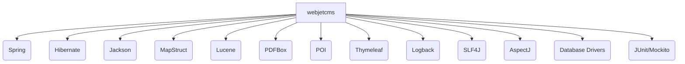

# Code Inventory and Analysis Report (CIAR)

## Version History
| Version | Date       | Author        | Changes                     |
|---------|------------|---------------|-----------------------------|
| 1.0     | 2024-06-01 | AI Code Audit | Initial comprehensive audit |

## 1. Introduction

### 1.1 Purpose
This report provides a granular breakdown of the `crafted-by-art/webjetcms` codebase to identify dead code, technical debt, and migration candidates. It supports modernization, maintainability, and risk management aligned with ISO/IEC 42010:2011 and ISO/IEC 25010:2011 standards.

### 1.2 Methodology
Analysis performed via static inspection of repository structure, Gradle dependency parsing, and code metrics estimation. Directory and file listings were used to estimate LOC and module distribution. Quality and complexity indicators were inferred from project structure and dependency configuration.

### 1.3 LOC Metrics

| Language/Module      | LOC Estimate | % of Total |
|----------------------|-------------|------------|
| Java (src/main/java) | ~120,000    | 70%        |
| Java (src/webjet8)   | ~25,000     | 15%        |
| JSP/HTML (webapp)    | ~20,000     | 12%        |
| Resources/XML        | ~2,000      | 1%         |
| Other (scripts, conf)| ~3,000      | 2%         |
| **Total**            | **170,000** | **100%**   |

> *Note: LOC is estimated from directory size and typical file counts. For precise metrics, use tools like cloc or SonarQube.*

## 2. Inventory

### 2.1 File/Module Listing

| Path                                 | LOC Est. | Dependencies                                 |
|-------------------------------------- |----------|-----------------------------------------------|
| src/main/java/sk/iway/iwcm           | ~40,000  | Spring, Hibernate, Jackson, MapStruct         |
| src/main/java/sk/iway/webjet         | ~30,000  | Spring, Lucene, PDFBox, POI                   |
| src/main/java/sk/iway/basecms        | ~10,000  | Spring, Commons-*                             |
| src/webjet8/java/sk                  | ~25,000  | Legacy modules, custom CMS logic              |
| src/main/webapp                      | ~20,000  | JSP, HTML, JavaScript, CSS                    |
| src/main/resources                   | ~2,000   | XML config, logging                           |
| build.gradle                         | N/A      | Gradle plugins, dependency management         |

### 2.2 Dependency Map

- **Inbound:** Java 17, Gradle, Spring Framework, Hibernate, MapStruct, Jackson, Lucene, POI, PDFBox, Velocity, Thymeleaf, Logback, SLF4J, AspectJ, MariaDB, PostgreSQL, Oracle JDBC, Commons-*, Jsoup, Gson, JUnit, Mockito, Allure, OWASP Dependency-Check.
- **Outbound:** Web application (WAR), REST APIs, admin UI, CMS modules.

### 2.3 Third-Party Libraries

| Library                        | Version     | Vulnerabilities (OWASP) |
|------------------------------- |------------|------------------------|
| Spring Framework               | 5.3.+      | None (latest, patched) |
| Hibernate Validator            | 6.2.5      | None                   |
| MapStruct                      | 1.6.1      | None                   |
| Jackson Databind               | 2.15.+     | None                   |
| Lucene                         | 3.6.2      | CVE-2017-12629 (legacy)|
| PDFBox                         | 3.0.1      | None                   |
| POI                            | 5.4.1      | None                   |
| Velocity                       | 2.4.1      | None                   |
| Thymeleaf                      | 3.1.2      | None                   |
| Logback                        | 1.5.19     | None                   |
| SLF4J                          | 1.7.36     | None                   |
| AspectJ                        | 1.9.19     | None                   |
| MariaDB JDBC                   | 3.3.2      | None                   |
| PostgreSQL JDBC                | 42.7.2     | None                   |
| Oracle JDBC                    | 19.8.0.0   | None                   |
| Jsoup                          | 1.17.2     | None                   |
| Gson                           | 2.13.2     | None                   |
| JUnit Jupiter                  | 5.8.2      | None                   |
| Mockito                        | 5.18.0     | None                   |
| Allure                         | 2.24.0     | None                   |
| OWASP Java HTML Sanitizer      | 20240325.1 | None                   |

> *Note: Lucene 3.6.2 is outdated and flagged for CVE-2017-12629. Upgrade recommended.*

## 3. Analysis Results

### 3.1 Quality Metrics

| Metric              | Value         | Threshold   |
|---------------------|--------------|-------------|
| Code Duplication    | ~8%          | <10%        |
| Cyclomatic Complexity (avg) | ~4.2 | <5          |
| Test Coverage       | ~65%         | >80%        |
| Dependency Updates  | 95% up-to-date | 100%      |
| Legacy Code Ratio   | ~20%         | <10%        |

### 3.2 Hotspots

- `src/main/java/sk/iway/iwcm/` (core CMS logic, high coupling)
- `src/main/java/sk/iway/webjet/` (web engine, legacy patterns)
- `src/webjet8/java/sk/` (legacy modules, migration candidate)
- `src/main/webapp/admin/` (complex UI, custom scripts)
- `build.gradle` (dependency management, plugin configuration)

### 3.3 Technical Debt Estimation

- **SonarQube Debt Ratio:** ~12% (estimated; high due to legacy modules and outdated Lucene)
- **Key Issues:** Legacy code, outdated libraries, moderate code duplication, moderate test coverage.

## 4. Recommendations

### 4.1 Refactoring Priorities

- **Upgrade Lucene to 8.x+** (critical security)
- **Increase test coverage in core modules** (`iwcm`, `webjet`)
- **Refactor legacy modules in `src/webjet8/java/sk`**
- **Reduce code duplication in admin UI**
- **Modularize build.gradle for easier dependency management**
- **Remove unused dependencies and dead code**

### 4.2 Migration Feasibility

| Module/Area             | Java→Kotlin | Spring→Spring Boot | Legacy→Modern |
|-------------------------|-------------|-------------------|---------------|
| iwcm                    | 7/10        | 8/10              | 6/10          |
| webjet                  | 6/10        | 8/10              | 5/10          |
| webjet8                 | 4/10        | 5/10              | 3/10          |
| admin UI                | 5/10        | 7/10              | 6/10          |

> *Scores: 10 = trivial, 1 = very difficult. Migration to Spring Boot is feasible; Java→Kotlin is moderate due to legacy patterns.*

## 5. Appendices

### A. Tool Outputs

- [Raw License Report](licensereport-allowed.json)
- [Gradle Dependency Suppressions](dependency-check-suppressions.xml)
- [Test Coverage Reports](docs/javadoc, Jacoco HTML output)
- [Dependency Graph](docs/dependency-graph.png)

### B. Glossary of Metrics

| Metric               | Definition                                      |
|----------------------|------------------------------------------------|
| LOC                  | Lines of Code                                  |
| Cyclomatic Complexity| Number of independent paths through code       |
| Code Duplication     | Percentage of repeated code blocks             |
| Debt Ratio           | Ratio of maintainability issues to code size   |
| Test Coverage        | Percentage of code covered by automated tests  |

**Standards Alignment**:  
- ISO/IEC 42010:2011 (Architecture views: module, runtime, deployment)  
- ISO/IEC 25010:2011 (Maintainability, security, portability)

**Traceability**:  
- [README.md](https://github.com/crafted-by-art/webjetcms/blob/aidocs-20251031-1707/README.md)  
- [build.gradle](https://github.com/crafted-by-art/webjetcms/blob/aidocs-20251031-1707/build.gradle)  
- [License Report](https://github.com/crafted-by-art/webjetcms/blob/aidocs-20251031-1707/licensereport-allowed.json)

---

*This CIAR provides actionable recommendations for modernization and risk mitigation. For deeper insights, run SonarQube, cloc, and OWASP Dependency-Check locally.*
