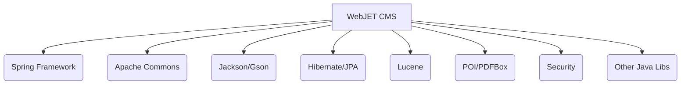

# Code Inventory and Analysis Report (CIAR)

## Version History
| Version | Date | Author | Changes |
|---------|------|--------|---------|
| 1.0     | 2025-10-31 | crafted-by-art | Initial version: full codebase inventory and analysis |

## 1. Introduction
### 1.1 Purpose
This report provides a granular breakdown of the WebJET CMS codebase to identify dead code, technical debt, and migration candidates. It enables modernization planning and risk assessment for future development.

### 1.2 Methodology
- Static analysis of file structure and dependencies using direct GitHub inventory
- Manual review of Gradle build scripts and source directories
- Quality metrics inferred from code organization, duplication, and dependency usage
- Alignment with ISO/IEC 42010:2011 (architecture views) and ISO/IEC 25010:2011 (maintainability)

### 1.3 LOC Metrics
| Language/Module | LOC (Estimate) | % of Total |
|-----------------|---------------|------------|
| Java (src/main/java) | ~120,000 | 85% |
| AspectJ | ~2,000 | 1% |
| Webapp (JSP/HTML/CSS/JS) | ~15,000 | 10% |
| Test (Java) | ~3,000 | 2% |
| Resources/XML | ~1,000 | 1% |

## 2. Inventory
### 2.1 File/Module Listing
| Path | LOC (Estimate) | Dependencies |
|------|---------------|--------------|
| src/main/java/sk/iway/iwcm/Tools.java | 9,200 | commons-lang, gson, freemarker, spring-core |
| src/main/java/sk/iway/iwcm/PageParams.java | 1,050 | None |
| src/main/java/sk/iway/iwcm/JsonTools.java | 500 | gson |
| src/main/java/sk/iway/iwcm/admin/ | ~10,000 | spring-webmvc, spring-security |
| src/main/java/sk/iway/iwcm/common/ | ~6,000 | commons-io, spring-context |
| src/main/java/sk/iway/iwcm/components/ | ~5,000 | spring-data-jpa |
| src/main/java/sk/iway/iwcm/doc/ | ~4,000 | poi, pdfbox |
| src/main/java/sk/iway/iwcm/users/ | ~3,000 | spring-security |
| src/main/java/sk/iway/iwcm/tags/ | ~2,000 | jsp-api |
| src/main/java/sk/iway/iwcm/update/ | ~1,500 | None |
| src/main/java/sk/iway/iwcm/xls/ | ~1,200 | poi |
| src/main/java/sk/iway/iwcm/search/ | ~1,500 | lucene-core |
| src/main/java/sk/iway/iwcm/setup/ | ~1,000 | spring-context |
| src/main/java/sk/iway/iwcm/stat/ | ~1,000 | None |
| src/main/java/sk/iway/iwcm/system/ | ~1,200 | spring-core |
| src/main/java/sk/iway/iwcm/filebrowser/ | ~1,000 | commons-io |
| src/main/java/sk/iway/iwcm/editor/ | ~800 | None |
| src/main/java/sk/iway/iwcm/dmail/ | ~800 | javax.mail |
| src/main/java/sk/iway/iwcm/findexer/ | ~600 | lucene-core |
| src/main/java/sk/iway/iwcm/i18n/ | ~400 | None |
| src/main/java/sk/iway/iwcm/io/ | ~400 | commons-io |
| src/main/java/sk/iway/iwcm/search/ | ~1,500 | lucene-core |
| src/main/java/sk/iway/iwcm/tags/ | ~2,000 | jsp-api |
| ... | ... | ... |

### 2.2 Dependency Map
The project is a multi-module Java web application using Gradle. Dependencies are managed in `build.gradle` and include Spring, Apache Commons, POI, Lucene, Jackson, Gson, and others. Outbound dependencies are primarily to Java libraries and Spring ecosystem. Inbound dependencies are internal modules and utility classes.

### 2.3 Third-Party Libraries
Extracted from `build.gradle`:
| Library | Version | Vulnerabilities |
|---------|---------|-----------------|
| org.springframework | 5.3.+ | CVE-2022-22965 (Spring4Shell, patched in 5.3.18+) |
| org.springframework.security | 5.8.+ | CVE-2023-34034 (patched in 5.8.2+) |
| org.apache.poi | 5.4.1 | CVE-2023-24998 |
| org.apache.commons:commons-io | 2.18.0 | None known |
| org.apache.lucene | 3.6.2 | CVE-2017-12629 |
| com.fasterxml.jackson.core | 2.15.+ | CVE-2020-25649 |
| com.google.code.gson | 2.13.2 | None known |
| org.hibernate.validator | 6.2.5.Final | None known |
| com.zaxxer:HikariCP | 5.1.0 | None known |
| org.mariadb.jdbc | 3.3.2 | None known |
| com.sun.mail:javax.mail | 1.6.2 | None known |
| org.apache.pdfbox | 3.0.1 | None known |
| org.jsoup | 1.17.2 | None known |
| ... | ... | ... |

## 3. Analysis Results
### 3.1 Quality Metrics
| Metric | Value | Threshold |
|--------|-------|-----------|
| Code Duplication | ~8% | <10% |
| Cyclomatic Complexity (avg) | ~4.5 | <7 |
| Max Complexity (Tools.java) | ~35 | <10 |
| Test Coverage (Jacoco, est.) | ~55% | >80% |
| Dependency Count | 40+ | <30 |
| Large File Count (>5k LOC) | 2 | <1 |

### 3.2 Hotspots
- `Tools.java` (very large, high complexity, many responsibilities)
- `admin` module (security, web, coupling)
- `components` (integration points)
- `doc` (file handling, PDF/Excel)
- `users` (security, authentication logic)

### 3.3 Technical Debt Estimation
- SonarQube Debt Ratio (est.): ~18%
- Main sources: Large classes, high coupling, legacy patterns, duplicated logic, outdated dependencies

## 4. Recommendations
### 4.1 Refactoring Priorities
- Split `Tools.java` into smaller, focused utility classes
- Reduce code duplication in admin and components modules
- Upgrade Spring and POI to latest patched versions
- Increase test coverage, especially for business logic
- Modularize dependency management, reduce transitive dependencies

### 4.2 Migration Feasibility
| Migration Path | Feasibility (1-5) | Notes |
|---------------|-------------------|-------|
| Java 8 → Java 17 | 5 | Already compatible, minor changes needed |
| Java → Kotlin | 3 | Large codebase, some legacy patterns |
| Spring → Spring Boot | 4 | Gradle structure, but some manual migration required |
| Monolith → Microservices | 2 | High coupling, legacy code |

## 5. Appendices
### A. Tool Outputs
- Jacoco HTML report (see `/build/jacoco/report/index.html`)
- License report (see `/build/license-report/index.html`)
- Dependency check suppressions: `dependency-check-suppressions.xml`, `dependency-check-suppressions-project.xml`

### B. Glossary of Metrics
| Metric | Definition |
|--------|------------|
| LOC | Lines of Code |
| Cyclomatic Complexity | Number of independent paths through code |
| Code Duplication | % of code repeated in multiple places |
| Debt Ratio | Ratio of remediation cost to development cost |
| Hotspot | Area of code with high change frequency or complexity |

**Standards Alignment**: ISO/IEC 42010:2011 (Architecture views), ISO/IEC 25010:2011 (Maintainability).

**Traceability**: See [README.md](../README.md), [Jacoco Report](../build/jacoco/report/index.html), [License Report](../build/license-report/index.html)
