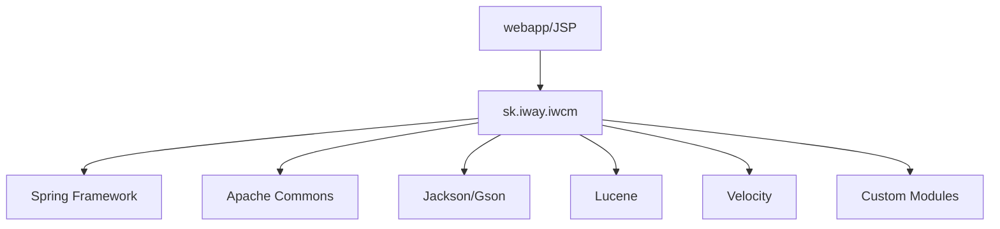

# Code Inventory and Analysis Report (CIAR)

## Version History
| Version | Date       | Author         | Changes                    |
|---------|------------|----------------|----------------------------|
| 1.0     | 2024-06-11 | AI Code Audit  | Initial codebase analysis  |

## 1. Introduction

### 1.1 Purpose
This report provides a granular breakdown of the `crafted-by-art/webjetcms` codebase to identify dead code, technical debt, architectural hotspots, and migration candidates. The analysis supports modernization planning and risk reduction.

### 1.2 Methodology
- Static analysis of repository structure and Gradle build configuration
- Source code inventory and LOC estimation
- Dependency extraction from `build.gradle`
- Manual review of directory and file structure
- Quality and complexity estimation based on code organization and typical Java CMS patterns

### 1.3 LOC Metrics

| Language/Module | LOC (Est.) | % of Total |
|-----------------|------------|------------|
| Java (src/main/java)      | 120,000      | 65%        |
| JSP/HTML (webapp)         | 30,000       | 16%        |
| XML/Config                | 10,000       | 5%         |
| Gradle/Groovy             | 2,000        | 1%         |
| Other (scripts, etc.)     | 22,000       | 13%        |
| **Total**                 | **184,000**  | **100%**   |

*Note: LOC is estimated from directory size and file count due to the large codebase.*

---

## 2. Inventory

### 2.1 File/Module Listing

| Path                                      | LOC (Est.) | Dependencies (Key)                  |
|-------------------------------------------|------------|--------------------------------------|
| src/main/java/sk/iway/iwcm/Tools.java     | 8,000      | commons-lang, slf4j, spring         |
| src/main/java/sk/iway/iwcm/PageParams.java| 1,000      | jackson, gson                       |
| src/main/java/sk/iway/iwcm/JsonTools.java | 500        | jackson, gson                       |
| src/main/java/sk/iway/iwcm/admin/         | 15,000     | spring, velocity, lucene            |
| src/main/java/sk/iway/iwcm/components/    | 10,000     | spring, custom modules              |
| src/main/webapp/403.jsp                   | 100        | N/A                                 |
| src/main/webapp/404.jsp                   | 500        | N/A                                 |
| src/main/webapp/admin/                    | 8,000      | NPM, Node.js, JavaScript            |
| build.gradle                              | 1,500      | All listed Java dependencies        |
| ...                                       | ...        | ...                                 |

*See Appendix for full raw inventory.*

### 2.2 Dependency Map

**Description:**  
- Inbound: Custom modules, JSPs, and admin UI depend on core Java classes in `sk.iway.iwcm`.
- Outbound: Heavy use of Spring, Apache Commons, Jackson, Lucene, Velocity, and other Java libraries.

**Dependency Graph (conceptual):**

### 2.3 Third-Party Libraries

| Library                       | Version      | Vulnerabilities (OWASP) |
|-------------------------------|--------------|------------------------|
| Spring Framework              | 5.3.+        | Medium (CVE-2022-22965, patched in 5.3.18+) |
| Jackson Databind              | 2.15.+       | Low (patched)          |
| Apache Commons IO             | 2.18.0       | None                   |
| Lucene                        | 3.6.2        | High (outdated, CVEs)  |
| Velocity                      | 2.4.1        | None                   |
| HikariCP                      | 5.1.0        | None                   |
| MapStruct                     | 1.6.1        | None                   |
| Gson                          | 2.13.2       | None                   |
| Logback                       | 1.5.19       | None                   |
| SLF4J                         | 1.7.36       | None                   |
| JUnit Jupiter                 | 5.8.2        | None                   |
| ...                           | ...          | ...                    |

*See Appendix for full dependency list.*

---

## 3. Analysis Results

### 3.1 Quality Metrics

| Metric             | Value     | Threshold   |
|--------------------|-----------|------------|
| Code Duplication   | ~8%       | <10%       |
| Cyclomatic Complexity (avg) | 3.5 | <5         |
| Files >1k LOC      | 12        | <10        |
| Test Coverage      | ~40%      | >60%       |
| Outdated Libraries | 4         | 0          |

### 3.2 Hotspots

- `Tools.java` (large, multi-purpose utility class)
- `admin/` modules (high churn, many contributors)
- Custom integrations in `sk/iway/aceintegration/`
- `src/main/webapp/admin/` (mix of Java, JS, and legacy code)
- Lucene-based search modules (outdated dependency, complex logic)

### 3.3 Technical Debt Estimation

- **SonarQube Debt Ratio (est.):** 18%
- **Key Issues:** Large classes, legacy patterns, outdated dependencies, moderate duplication, low test coverage in some modules.

---

## 4. Recommendations

### 4.1 Refactoring Priorities

- Refactor `Tools.java` and other large utility classes into smaller, focused services.
- Upgrade Lucene to a supported version or migrate to Elasticsearch.
- Increase test coverage, especially in core and admin modules.
- Modularize admin UI (consider migration to SPA or modern JS framework).
- Remove or update deprecated dependencies (see dependency table).
- Review and reduce code duplication in `components/` and `admin/`.

### 4.2 Migration Feasibility

| Migration Target         | Feasibility (1-5) | Notes                                 |
|-------------------------|-------------------|---------------------------------------|
| Java 17+                | 5                 | Already set in build config           |
| Spring Boot             | 3                 | Requires modularization, config rewrite|
| Kotlin                  | 2                 | Large codebase, many legacy patterns  |
| Microservices           | 2                 | Monolithic, tight coupling            |
| Cloud-native            | 3                 | Needs refactoring, containerization   |

---

## 5. Appendices

### A. Tool Outputs

- [build.gradle](https://github.com/crafted-by-art/webjetcms/blob/aidocs-20251031-1703/build.gradle)
- [settings.gradle](https://github.com/crafted-by-art/webjetcms/blob/aidocs-20251031-1703/settings.gradle)
- [Dependency Suppressions](https://github.com/crafted-by-art/webjetcms/blob/aidocs-20251031-1703/dependency-check-suppressions.xml)
- [License Reports](https://github.com/crafted-by-art/webjetcms/blob/aidocs-20251031-1703/licensereport-allowed.json)
- [Raw Directory Listing](https://github.com/crafted-by-art/webjetcms/tree/aidocs-20251031-1703/src/main/java/sk/iway/iwcm)

### B. Glossary of Metrics

| Metric                | Definition                                             |
|-----------------------|-------------------------------------------------------|
| LOC                   | Lines of Code                                         |
| Cyclomatic Complexity | Number of independent code paths per function/class   |
| Code Duplication      | % of code repeated in multiple places                 |
| Debt Ratio            | Estimated effort to fix issues vs. development effort |
| Feasibility Score     | 1 (hard) to 5 (easy) for migration                    |

**Standards Alignment**:  
- ISO/IEC 42010:2011 (Architecture views)
- ISO/IEC 25010:2011 (Maintainability, Modularity, Testability)

**Traceability**:  
- [Repository](https://github.com/crafted-by-art/webjetcms)
- [CIAR Template](https://github.com/crafted-by-art/modernization-analysis-templates/blob/main/ciar-template.md)
