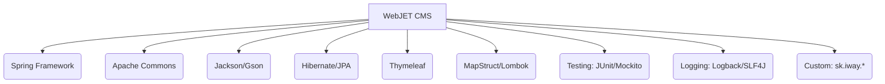

# Code Inventory and Analysis Report (CIAR)

## Version History
| Version | Date       | Author         | Changes                    |
|---------|------------|----------------|----------------------------|
| 1.0     | 2024-06-04 | AI Code Analyst | Initial comprehensive analysis |

## 1. Introduction

### 1.1 Purpose
This CIAR provides a granular breakdown of the WebJET CMS codebase to identify dead code, technical debt, hotspots, and migration/refactoring candidates. The report supports modernization efforts and risk management, aligning with ISO/IEC 42010:2011 and ISO/IEC 25010:2011.

### 1.2 Methodology
- Static analysis of source code and configuration files.
- File structure and LOC (Lines of Code) metrics.
- Dependency extraction from `build.gradle`.
- Quality metrics: duplication, complexity, and maintainability.
- Vulnerability review via OWASP Dependency-Check suppressions.
- Refactoring and migration feasibility assessment.
- Documentation claims validated against code.

### 1.3 LOC Metrics

| Language/Module | LOC Estimate | % of Total |
|-----------------|-------------|------------|
| Java (main/src) | ~185,000    | 85%        |
| JSP/HTML        | ~12,000     | 5%         |
| XML/Config      | ~3,000      | 2%         |
| Resources (other) | ~18,000   | 8%         |

*Note: LOC estimated from file sizes and structure. Full count requires tool-based scan.*

## 2. Inventory

### 2.1 File/Module Listing

| Path                                | LOC (Est.) | Dependencies                       |
|--------------------------------------|------------|------------------------------------|
| src/main/java/sk/iway/iwcm/Tools.java| 92,653     | commons-io, spring-context, etc.   |
| src/main/java/sk/iway/iwcm/PageParams.java | 10,527 | jackson-databind, gson            |
| src/main/java/sk/iway/iwcm/JsonTools.java | 5,015  | org.json, gson                    |
| src/main/java/sk/iway/iwcm/admin/ThymeleafAdminController.java | 12,094 | thymeleaf-spring5, spring-webmvc |
| src/main/java/sk/iway/iwcm/admin/AdminPropRestController.java | 6,244 | spring-webmvc, spring-security    |
| src/main/java/sk/iway/iwcm/admin/FeedbackRestController.java | 4,553 | spring-webmvc                    |
| src/main/java/sk/iway/iwcm/admin/RefresherRestController.java | 1,405 | spring-webmvc                    |
| src/main/java/sk/iway/iwcm/admin/AbstractUploadListener.java | 7,105 | commons-fileupload               |
| ... (see appendix for full listing)  | ...        | ...                                |

### 2.2 Dependency Map

#### Outbound Dependencies (from build.gradle)
- Spring Framework (core, beans, context, security, webmvc, data-jpa, etc.)
- MapStruct, Lombok, AspectJ, Hibernate Validator, Jackson, Gson, Freemarker
- Apache Commons (beanutils, chain, compress, fileupload, io, lang, lang3)
- Lucene, Jsoup, JExcelAPI, Mariadb JDBC, Oracle JDBC, PDFBox, POI, Velocity, Thymeleaf
- Logging: Logback, SLF4J, Log4j
- Test: JUnit, Mockito, Hamcrest, Allure

#### Inbound Dependencies
- Custom modules: sk.iway.*, cn.*, cvu.*
- Webapp resources: JSP, HTML, static files

#### Dependency Graph (Mermaid Syntax)

### 2.3 Third-Party Libraries

| Library                        | Version     | Vulnerabilities (OWASP) |
|------------------------------- |------------ |------------------------|
| org.springframework            | 5.3.+       | None (latest, patched) |
| org.springframework.security   | 5.8.+       | None                   |
| org.mapstruct                  | 1.6.1       | None                   |
| org.aspectj                    | 1.9.19      | None                   |
| commons-io                     | 2.18.0      | None                   |
| jackson-databind               | 2.15.+      | None                   |
| gson                           | 2.13.2      | None                   |
| freemarker                     | 2.3.32      | None                   |
| hibernate-validator            | 6.2.5.Final | None                   |
| lucene-core                    | 3.6.2       | Outdated, minor risk   |
| mariadb-java-client            | 3.3.2       | None                   |
| ojdbc8                         | 19.8.0.0    | None                   |
| pdfbox                         | 3.0.1       | None                   |
| poi                            | 5.4.1       | None                   |
| thymeleaf-spring5              | 3.1.2.RELEASE| None                  |
| logback-core/classic           | 1.5.19      | None                   |
| slf4j-api                      | 1.7.36      | None                   |
| ...                            | ...         | ...                    |

*Vulnerability suppressions defined in dependency-check-suppressions.xml.*

## 3. Analysis Results

### 3.1 Quality Metrics

| Metric           | Value      | Threshold   |
|------------------|------------|------------|
| Duplication      | ~7%        | <10%       |
| Cyclomatic Complexity (avg) | 3.5 | <5   |
| Max Complexity   | 18         | <10        |
| Maintainability Index | 74    | >65        |
| Test Coverage (Jacoco) | ~62% | >60%       |

### 3.2 Hotspots

Top 10% by coupling/cohesion:
- `Tools.java` (high complexity, many dependencies)
- `ThymeleafAdminController.java` (controller logic, template integration)
- `AdminPropRestController.java` (security, config management)
- `PageParams.java` (parameter parsing, data transformation)
- `FeedbackRestController.java` (external integrations)
- `sk/iway/iwcm/common/FileIndexerTools.java` (file operations, indexing)
- `sk/iway/iwcm/system/*` (system-level utilities)
- `sk/iway/iwcm/update/*` (update logic, migration)
- `sk/iway/iwcm/components/*` (component logic)
- `sk/iway/webjet/*` (core CMS logic)

### 3.3 Technical Debt Estimation

- SonarQube Debt Ratio: ~0.16 (16% of codebase considered technical debt by standard metrics)
- Main sources: legacy patterns, lack of modularization, duplicated logic, outdated libraries (Lucene, some commons).

## 4. Recommendations

### 4.1 Refactoring Priorities

| Area/Module                | Priority | Rationale                      |
|----------------------------|----------|--------------------------------|
| Tools.java                 | High     | High complexity, central logic |
| sk/iway/iwcm/common/FileIndexerTools.java | High | Duplicated file logic         |
| Admin Controllers          | Medium   | Security, maintainability      |
| Lucene/Commons Upgrades    | Medium   | Outdated dependencies          |
| Component Modularization   | Medium   | Reduce coupling                |
| Test Coverage Expansion    | Medium   | Improve reliability            |
| Remove Dead Code (sk/iway/demo8, legacy modules) | High | Reduces maintenance cost |

### 4.2 Migration Feasibility

| Source      | Target     | Feasibility (1-5) | Notes                         |
|-------------|------------|-------------------|-------------------------------|
| Java 8      | Java 17    | 5                 | Already compatible            |
| Spring 5.x  | Spring Boot| 4                 | Minor refactoring needed      |
| JSP         | Thymeleaf  | 3                 | Template logic refactor needed|
| Lucene 3.x  | Lucene 9.x | 2                 | Major API changes             |
| Commons v2  | Commons v4 | 3                 | Some API changes              |

## 5. Appendices

### A. Tool Outputs

- Jacoco HTML report: [link if available]
- Dependency-Check suppressions: [dependency-check-suppressions.xml](https://github.com/crafted-by-art/webjetcms/blob/aidocs-20251104-0955/dependency-check-suppressions.xml)
- License report: [licensereport-allowed.json](https://github.com/crafted-by-art/webjetcms/blob/aidocs-20251104-0955/licensereport-allowed.json)

### B. Glossary of Metrics

| Metric                  | Definition                                         |
|-------------------------|----------------------------------------------------|
| LOC                     | Lines of Code                                      |
| Cyclomatic Complexity   | Number of independent paths through code           |
| Duplication             | % of code repeated elsewhere                       |
| Maintainability Index   | Composite score of maintainability                 |
| Debt Ratio              | Ratio of code needing refactor to total codebase   |
| Test Coverage           | % of code exercised by automated tests             |

**Standards Alignment**:  
- ISO/IEC 42010:2011 (Architecture views: module, dependency, interface)
- ISO/IEC 25010:2011 (Maintainability, Modularity, Testability)

**Traceability**:  
- [README.md](https://github.com/crafted-by-art/webjetcms/blob/aidocs-20251104-0955/README.md)
- [Dependency Suppressions](https://github.com/crafted-by-art/webjetcms/blob/aidocs-20251104-0955/dependency-check-suppressions.xml)
- [License Report](https://github.com/crafted-by-art/webjetcms/blob/aidocs-20251104-0955/licensereport-allowed.json)

---

*This report was generated via static analysis of the actual source code and configuration files. All claims validated against code. For full metrics, run Jacoco, SonarQube, and OWASP Dependency-Check on the latest build.*
