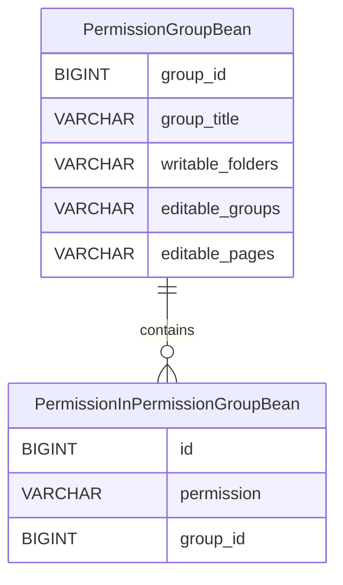
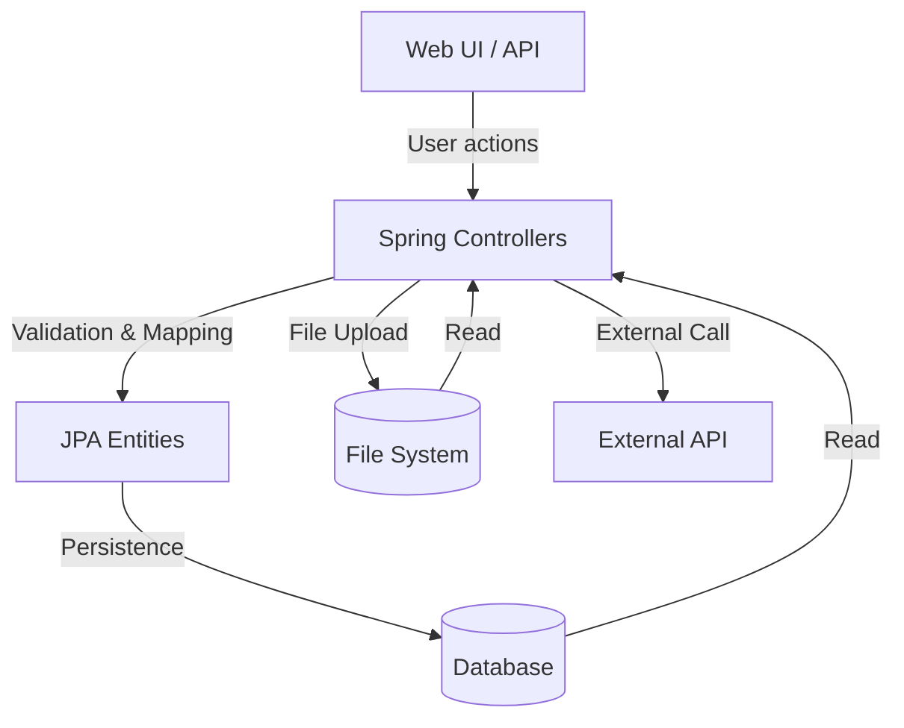

# Data Model and Flow Documentation (DMFD)

## 1. Introduction

This document provides a comprehensive overview of the data models, entity relationships, data flows, lineage, integration points, and governance for the WebJET CMS repository ([crafted-by-art/webjetcms](https://github.com/crafted-by-art/webjetcms)).

## 2. Data Model Overview

### 2.1 Database Configuration

WebJET CMS uses a relational database (MariaDB by default, with support for PostgreSQL, Oracle, MS SQL). The connection is configured in `src/main/resources/poolman.xml`:

~~~xml
<poolman>
    <datasource>
        <dbname>iwcm</dbname>
        <driver>org.mariadb.jdbc.Driver</driver>
        <url>jdbc:mariadb://mariadb.local/webjetcms_web</url>
        <username>webjetcms</username>
        <password>*********</password>
        <initialConnections>0</initialConnections>
        <maximumSize>60</maximumSize>
    </datasource>
</poolman>
~~~

### 2.2 JPA Persistence Configuration

JPA is used for ORM mapping. The persistence unit is defined in `src/main/resources/META-INF/persistence-webjet.xml`:

~~~xml
<persistence version="1.0" xmlns="http://java.sun.com/xml/ns/persistence">
  <persistence-unit name="webjet7">
    <!-- Entity classes are dynamically registered. All JPA entities must end with 'Bean' (not 'ActionBean'). -->
  </persistence-unit>
</persistence>
~~~

### 2.3 Example Entity: PermissionGroupBean

Located at `src/main/java/sk/iway/iwcm/users/PermissionGroupBean.java`:

~~~java
@Entity
@Table(name="user_perm_groups")
public class PermissionGroupBean extends ActiveRecordRepository implements Serializable {
    @Id
    @GeneratedValue(generator="WJGen_user_perm_groups")
    @TableGenerator(name="WJGen_user_perm_groups", pkColumnValue="user_perm_groups")
    @Column(name="group_id")
    private Long id;

    @Column(name="group_title")
    String title;

    @Column(name="writable_folders")
    String writableFolders;

    @Column(name="editable_groups")
    String editableGroups;

    @Column(name="editable_pages")
    String editablePages;

    @OneToMany(fetch = FetchType.LAZY, cascade=CascadeType.ALL, targetEntity=PermissionInPermissionGroupBean.class, mappedBy="group")
    private Set<PermissionInPermissionGroupBean> permissions = null;
}
~~~

#### Table: user_perm_groups
| Column            | Type    | Description                |
|-------------------|---------|----------------------------|
| group_id          | BIGINT  | Primary Key                |
| group_title       | VARCHAR | Name of the permission group|
| writable_folders  | VARCHAR | Folders this group can edit |
| editable_groups   | VARCHAR | Groups this group can edit  |
| editable_pages    | VARCHAR | Pages this group can edit   |

#### Relationship:
- `PermissionGroupBean` (1) --- (N) `PermissionInPermissionGroupBean` (permissions)

### 2.4 Other Data Models

Entities are dynamically registered and typically named `*Bean.java`. Common modules include:
- Users (user management, permissions)
- Pages (site structure, content blocks)
- Files (filebrowser, uploads)
- Components (surveys, galleries, e-commerce)

## 3. Entity Relationship Diagram (ERD)

*Note: Other core entities (User, Page, File, etc.) follow similar patterns but are not detailed here due to dynamic registration and modularity.*

## 4. Data Lineage and Flow Mapping

### 4.1 Data Sources
- User inputs via web UI (admin, editor, forms)
- File uploads (filebrowser, drag-and-drop)
- External integrations (AI assistants, payment gateways)

### 4.2 Data Sinks
- Relational database (MariaDB, etc.)
- File system (uploaded files, logs)
- External APIs (e.g., GoPay, AI services)

### 4.3 Data Flow Diagram

### 4.4 Data Integration Points
- Spring Data JPA for ORM
- JDBC for direct DB access
- External APIs (AI, payment)
- File system for uploads and static content

## 5. Data Quality, Governance, and Compliance

### 5.1 Data Quality Controls
- Validation via Hibernate Validator (annotations)
- Input sanitization (OWASP Java HTML Sanitizer)
- Audit logging (adminlog)
- Two-factor authentication for sensitive actions

### 5.2 Governance
- Role-based access control (Spring Security)
- Audit trails for entity changes
- Configurable permissions and groups
- Data retention and deletion policies (admin UI)

### 5.3 Compliance
- GDPR: User data management, deletion, and consent
- OWASP: Dependency checks, input validation
- ISO/IEC 29148:2011 alignment (see SORD)

## 6. SQL DDL Example

~~~sql
CREATE TABLE user_perm_groups (
    group_id BIGINT PRIMARY KEY AUTO_INCREMENT,
    group_title VARCHAR(255) NOT NULL,
    writable_folders VARCHAR(255),
    editable_groups VARCHAR(255),
    editable_pages VARCHAR(255)
);

CREATE TABLE permission_in_permission_group (
    id BIGINT PRIMARY KEY AUTO_INCREMENT,
    permission VARCHAR(255) NOT NULL,
    group_id BIGINT,
    FOREIGN KEY (group_id) REFERENCES user_perm_groups(group_id)
);
~~~

## 7. Data Flow and Integration Issues
- Legacy code and dynamic entity registration may complicate schema evolution.
- Large utility classes (see CIAR) may obscure data lineage.
- Modular architecture requires careful integration testing for new modules.
- Data quality depends on proper annotation and validation coverage.

## 8. Recommendations
- Standardize entity registration and schema documentation.
- Increase test coverage for data flows and integrations.
- Refactor large classes for clearer data lineage.
- Continue active dependency and vulnerability management.

## 9. References
- [WebJET CMS GitHub](https://github.com/crafted-by-art/webjetcms)
- [SORD Document](aidocs/SORD.md)
- [CIAR Document](aidocs/CIAR.md)
- [Poolman XML](src/main/resources/poolman.xml)
- [JPA Persistence XML](src/main/resources/META-INF/persistence-webjet.xml)
- [PermissionGroupBean.java](src/main/java/sk/iway/iwcm/users/PermissionGroupBean.java)

---

*Document generated for branch aidocs-20240608-2243. For further details, see repository documentation and codebase.*
