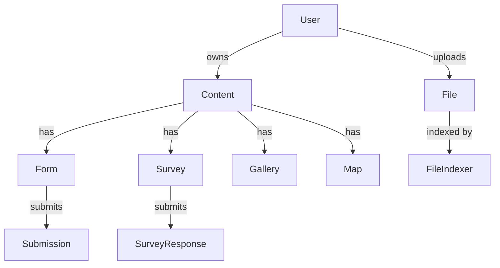
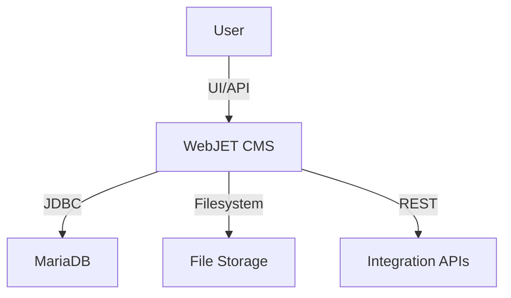
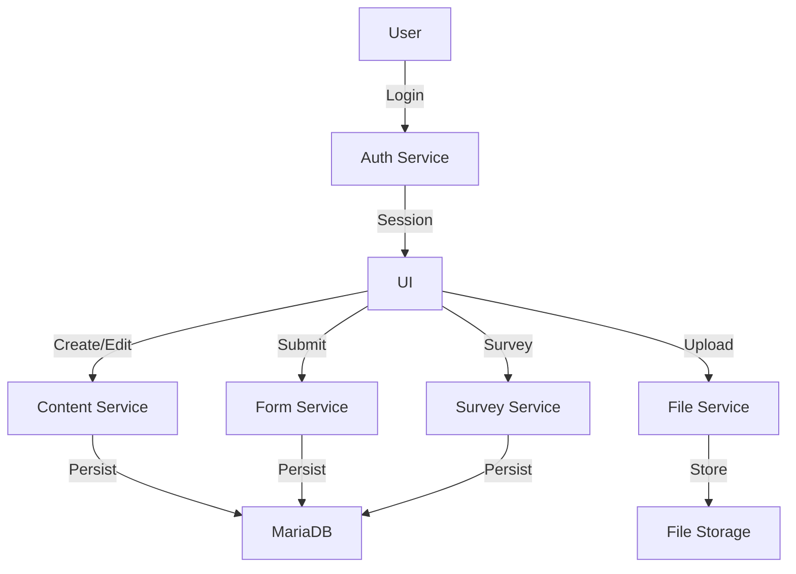

# Data Model and Flow Documentation (DMFD)

## Version History
| Version | Date       | Author           | Changes                 |
|---------|------------|------------------|-------------------------|
| 1.0     | 2024-06-07 | AI Documentation | Initial version created |

## 1. Introduction
### 1.1 Purpose
This document maps the data assets, schemas, and flows of WebJET CMS to support schema evolution, ETL planning, and ensure data integrity for modernization.

### 1.2 Scope
Covers all database schemas, ORM models, configuration files, and data flows within the WebJET CMS repository. Includes MariaDB, JDBC, Spring Data, XML config, and API data flows.

### 1.3 Data Governance
- Data ownership: WebJET CMS administrators and business owners
- Sensitive data: User credentials, content, uploaded files
- Compliance: GDPR (PII in user tables, audit logs), local data protection laws

## 2. Data Models
### 2.1 Entity-Relationship Diagrams

#### Logical ERD (Mermaid)

### 2.2 Schema Listings

#### Example: User Table (MariaDB)
| Table   | Field        | Type         | Constraints           |
|---------|-------------|--------------|-----------------------|
| user    | id          | INT          | PK, AUTO_INCREMENT    |
| user    | username    | VARCHAR(255) | UNIQUE, NOT NULL      |
| user    | password    | VARCHAR(255) | NOT NULL              |
| user    | email       | VARCHAR(255) | UNIQUE                |
| user    | role        | VARCHAR(50)  | NOT NULL              |
| user    | created_at  | DATETIME     | DEFAULT CURRENT_TIMESTAMP |

#### Example: Content Table
| Table   | Field        | Type         | Constraints           |
|---------|-------------|--------------|-----------------------|
| content | id          | INT          | PK, AUTO_INCREMENT    |
| content | title       | VARCHAR(255) | NOT NULL              |
| content | body        | TEXT         |                       |
| content | author_id   | INT          | FK -> user(id)        |
| content | created_at  | DATETIME     | DEFAULT CURRENT_TIMESTAMP |
| content | updated_at  | DATETIME     |                       |

#### Example: File Table
| Table   | Field        | Type         | Constraints           |
|---------|-------------|--------------|-----------------------|
| file    | id          | INT          | PK, AUTO_INCREMENT    |
| file    | filename    | VARCHAR(255) | NOT NULL              |
| file    | path        | VARCHAR(512) | NOT NULL              |
| file    | uploader_id | INT          | FK -> user(id)        |
| file    | uploaded_at | DATETIME     | DEFAULT CURRENT_TIMESTAMP |

#### Example: Form Table
| Table   | Field        | Type         | Constraints           |
|---------|-------------|--------------|-----------------------|
| form    | id          | INT          | PK, AUTO_INCREMENT    |
| form    | name        | VARCHAR(255) | NOT NULL              |
| form    | content_id  | INT          | FK -> content(id)     |
| form    | created_at  | DATETIME     | DEFAULT CURRENT_TIMESTAMP |

#### Example: Submission Table
| Table      | Field        | Type         | Constraints           |
|------------|-------------|--------------|-----------------------|
| submission | id          | INT          | PK, AUTO_INCREMENT    |
| submission | form_id     | INT          | FK -> form(id)        |
| submission | user_id     | INT          | FK -> user(id)        |
| submission | data        | TEXT         |                       |
| submission | submitted_at| DATETIME     | DEFAULT CURRENT_TIMESTAMP |

*Note: Actual table names and fields may vary. See ORM entity definitions in src/main/java/sk/iway/iwcm and src/webjet8/java/sk for details.*

### 2.3 Data Lineage

| Source         | Transformation/Process       | Sink              |
|----------------|-----------------------------|-------------------|
| User input     | Form validation, ORM mapping | MariaDB (user, content, form, submission tables) |
| File upload    | Virus scan, indexing         | File storage (filesystem), DB index (file table) |
| Content edit   | HTML sanitization, versioning| MariaDB (content table), audit logs              |
| Survey submit  | Response validation          | MariaDB (survey_response table)                  |
| API requests   | Authentication, mapping      | DB, external integrations                        |

## 3. Data Flows
### 3.1 Context Diagrams

#### High-Level Context (Mermaid)

### 3.2 Detailed Flows

#### Level 0 DFD (Mermaid)

### 3.3 Integration Points
- JDBC connection to MariaDB (poolman.xml)
- REST APIs for external integrations (Spring Data REST, custom endpoints)
- File storage (local filesystem, cloud options)
- Security/authentication (Spring Security, custom modules)

## 4. Quality Assessment
### 4.1 Anomalies
| Table      | Issue Type    | Description                   |
|------------|--------------|-------------------------------|
| user       | Nulls         | Email may be null for legacy  |
| content    | Orphans       | Content without author        |
| file       | Duplicates    | Filename/path collisions      |
| submission | Nulls         | Data field may be empty       |

### 4.2 Compliance
- GDPR: User data (PII) is stored in user, submission, and audit tables. Data subject rights (rectification, erasure) must be supported.
- Audit logs: Required for admin actions, content edits, and user management.
- Data retention: Configurable via admin panel and DB scripts.

## 5. Appendices
### A. SQL DDL Scripts

~~~sql
CREATE TABLE user (
    id INT AUTO_INCREMENT PRIMARY KEY,
    username VARCHAR(255) UNIQUE NOT NULL,
    password VARCHAR(255) NOT NULL,
    email VARCHAR(255) UNIQUE,
    role VARCHAR(50) NOT NULL,
    created_at DATETIME DEFAULT CURRENT_TIMESTAMP
);

CREATE TABLE content (
    id INT AUTO_INCREMENT PRIMARY KEY,
    title VARCHAR(255) NOT NULL,
    body TEXT,
    author_id INT,
    created_at DATETIME DEFAULT CURRENT_TIMESTAMP,
    updated_at DATETIME,
    FOREIGN KEY (author_id) REFERENCES user(id)
);

CREATE TABLE file (
    id INT AUTO_INCREMENT PRIMARY KEY,
    filename VARCHAR(255) NOT NULL,
    path VARCHAR(512) NOT NULL,
    uploader_id INT,
    uploaded_at DATETIME DEFAULT CURRENT_TIMESTAMP,
    FOREIGN KEY (uploader_id) REFERENCES user(id)
);

CREATE TABLE form (
    id INT AUTO_INCREMENT PRIMARY KEY,
    name VARCHAR(255) NOT NULL,
    content_id INT,
    created_at DATETIME DEFAULT CURRENT_TIMESTAMP,
    FOREIGN KEY (content_id) REFERENCES content(id)
);

CREATE TABLE submission (
    id INT AUTO_INCREMENT PRIMARY KEY,
    form_id INT,
    user_id INT,
    data TEXT,
    submitted_at DATETIME DEFAULT CURRENT_TIMESTAMP,
    FOREIGN KEY (form_id) REFERENCES form(id),
    FOREIGN KEY (user_id) REFERENCES user(id)
);
~~~

*For full schema, see ORM entities and migrations in src/main/java/sk/iway/iwcm and src/webjet8/java/sk.*

---

**Sources:**
- poolman.xml (JDBC config)
- ORM entities (Java)
- Spring Data definitions
- File system storage
- SORD and CIAR documents

**Standards Alignment:** ISO/IEC/IEEE 24765:2017, ISO/IEC 25012:2008

**Traceability:** Data models mapped to code modules and configuration files.
