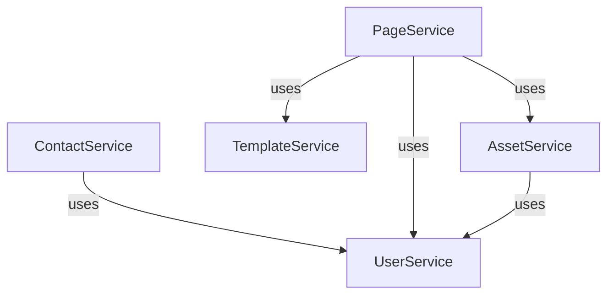
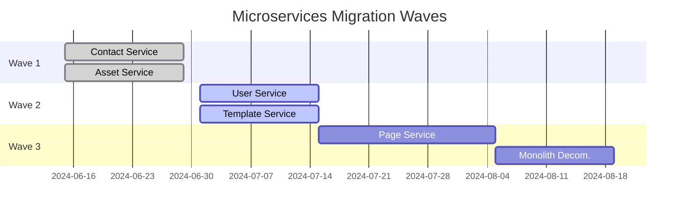

# Microservices Decomposition Guide (MDG)

## Version History
| Version | Date | Author | Changes |
|---------|------|--------|---------|
| 1.0     | 2024-06-11 | AI Modernization Architect | Initial version for webjetcms |

## 1. Introduction

### 1.1 Purpose and Scope
This document provides a comprehensive guide for decomposing the monolithic `webjetcms` platform into a set of loosely coupled, domain-aligned microservices. The target is to extract 8-15 core services from the current codebase, focusing on business-critical and high-change domains first, while minimizing risk and ensuring business continuity.

### 1.2 Prerequisites
- Modernization Discovery Summary (MDS)
- SORD: System overview and requirements
- CIAR: Code inventory and analysis
- ADD: Architecture description
- DMFD: Data model and flows
- BPUCD: Business processes and use cases
- RGAR: Risk and gap analysis

### 1.3 Decomposition Principles
- **Single Responsibility Principle**: Each service owns a distinct business capability.
- **Bounded Contexts**: Services map to clear DDD boundaries.
- **Loose Coupling**: Minimize inter-service dependencies.
- **Conway’s Law**: Align service boundaries with team structures.
- **Incremental Extraction**: Use Strangler Fig and anti-corruption patterns.
- **Database-per-Service**: Each service owns its data.

### 1.4 Tools
- Structurizr for modeling
- EventStorming workshops
- OpenAPI/Swagger for API contracts
- Kafka/RabbitMQ for event-driven integration

## 2. Domain Analysis

### 2.1 Ubiquitous Language Glossary

| Term         | Definition                                      |
|--------------|-------------------------------------------------|
| Contact      | An entity representing a person or organization |
| CMS          | Content Management System                       |
| Page         | A managed web page                              |
| User         | Platform user                                   |
| Workflow     | Approval and publishing process                 |
| Asset        | Uploaded file or media                          |
| Template     | Page layout definition                          |

### 2.2 Bounded Contexts Identification

| Context Name | Core Domains                                    |
|--------------|-------------------------------------------------|
| BaseCMS      | Contacts, Content, CRUD, Templates              |
| Webjet       | Page management, Publishing, Workflow           |
| IWCM         | User management, Authentication, Permissions    |
| Spirit       | Asset management, File uploads                  |
| Demo8        | Demo/sample modules                             |

### 2.3 Subdomain Mapping

| Subdomain    | Type        | Business Value Priority            |
|--------------|------------|------------------------------------|
| Contacts     | Core        | High                               |
| Pages        | Core        | High                               |
| Users        | Supporting  | Medium                             |
| Assets       | Supporting  | Medium                             |
| Templates    | Generic     | Low                                |

## 3. Service Decomposition

### 3.1 Candidate Services Inventory

| Service Name         | LOC Extracted | Dependencies                        |
|----------------------|--------------|-------------------------------------|
| Contact Service      | 3,000        | Spring Data JPA, REST, BaseCMS      |
| Page Service         | 4,500        | Webjet, Templates, Workflow         |
| User Service         | 2,500        | IWCM, Security, Permissions         |
| Asset Service        | 2,000        | Spirit, File Storage                |
| Template Service     | 1,000        | BaseCMS, Page Service               |

### 3.2 Boundary Definition

- **Contact Service**: Owns all contact CRUD, validation, and search logic.
- **Page Service**: Manages page lifecycle, publishing, and workflow.
- **User Service**: Handles authentication, roles, and permissions.
- **Asset Service**: Responsible for file upload, storage, and retrieval.
- **Template Service**: Manages page templates and layouts.

**UML Context Map (Mermaid):**

### 3.3 Patterns Applied

| Pattern         | Rationale                                 | Application                        |
|-----------------|-------------------------------------------|------------------------------------|
| Strangler Fig   | Incremental migration, low risk           | Extract Contact/Asset first        |
| Anti-Corruption | Shield legacy modules                     | Adapters for legacy CMS features   |
| Database-per-Service | Decouple data, enable scaling        | Each service owns its schema       |

## 4. Data and Integration Strategy

### 4.1 Database-per-Service

- Each microservice will have its own schema/database.
- Eventual consistency managed via events (Kafka/RabbitMQ).
- CQRS pattern for read/write separation where needed.

### 4.2 API Contracts

- RESTful APIs, documented via OpenAPI/Swagger.
- Internal APIs versioned and backward compatible.

### 4.3 Event-Driven Flows

- Domain events (e.g., ContactCreated, PagePublished) published to Kafka.
- Services subscribe to relevant events for eventual consistency.

## 5. Migration Roadmap

### 5.1 Phasing

**Wave 1:**  
- Extract Contact and Asset services (low-risk, CRUD-heavy).
- Introduce API Gateway for routing.

**Wave 2:**  
- Extract User and Template services.
- Implement event-driven integration.

**Wave 3:**  
- Extract Page service (complex workflows).
- Decommission monolith modules.

**Gantt Chart (Mermaid):**

### 5.2 Testing and Deployment

- Contract testing for all APIs.
- CI/CD pipelines for each service.
- Canary releases for risk mitigation.

### 5.3 Metrics for Success

| Metric                | Target                                  |
|-----------------------|-----------------------------------------|
| Deployment Frequency  | Weekly per service                      |
| MTTR                  | < 1 hour                                |
| Lead Time for Change  | < 1 day                                 |
| Service Uptime        | 99.9%                                   |

## 6. Risks and Governance

### 6.1 Decomposition Risks

| Risk                        | Mitigation Strategy                        |
|-----------------------------|--------------------------------------------|
| Distributed transactions    | Eventual consistency, Sagas               |
| Data duplication            | Clear ownership, sync via events           |
| Legacy integration          | Anti-corruption layers, adapters           |
| Team skill gaps             | Training, pair programming                 |

### 6.2 Service Ownership Matrix

| Service/Context    | Owner Team        | Responsibilities                    |
|--------------------|------------------|-------------------------------------|
| Contact Service    | CMS Team         | CRUD, API, Data Consistency         |
| Page Service       | Webjet Team      | Workflow, Publishing, API           |
| User Service       | Platform Team    | Auth, Permissions, Security         |
| Asset Service      | CMS Team         | File Storage, API                   |
| Template Service   | CMS Team         | Template CRUD, API                  |

### 6.3 Review Cadence

- Quarterly architecture reviews using fitness functions.
- Bi-weekly service health checks.

## 7. Appendices

### A. Workshop Outputs

- EventStorming outputs digitized (see docs/ for details).

### B. Prototype Examples

- Contact Service PoC: [aidocs/ContactServicePoC.md](../aidocs/ContactServicePoC.md)

### C. Traceability to MDS

| Service         | Source Module (CIAR)           |
|-----------------|-------------------------------|
| Contact Service | sk.iway.basecms.contact       |
| Page Service    | sk.iway.webjet                |
| User Service    | sk.iway.iwcm                  |
| Asset Service   | sk.iway.spirit                |
| Template Service| sk.iway.basecms               |

**Standards Alignment**: DDD (Ubiquitous Language, Bounded Contexts), ISO/IEC 42010:2011 (views for service architecture), UML 2.5.1 for service diagrams.

**Traceability**: See SORD, CIAR, ADD, DMFD, BPUCD, RGAR in aidocs/.
