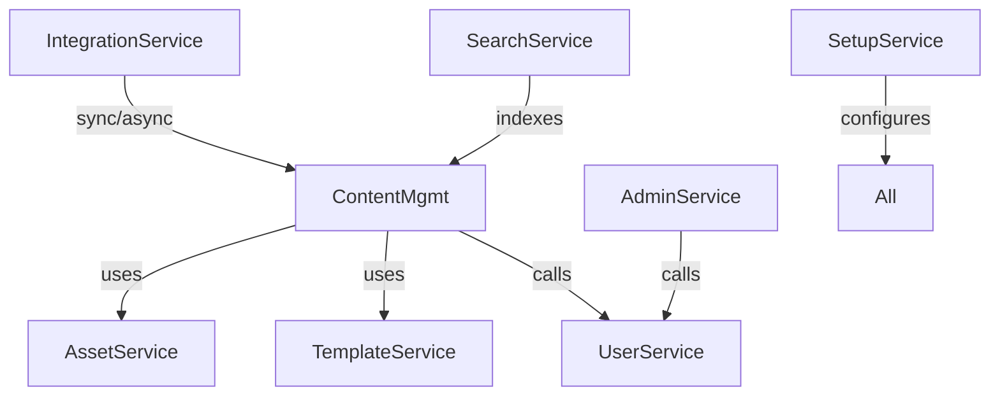
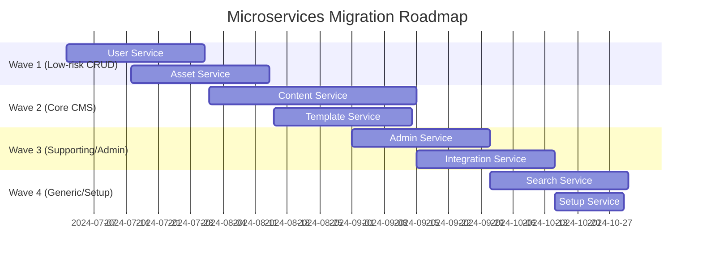

# Microservices Decomposition Guide (MDG)

## Version History
| Version | Date       | Author         | Changes                         |
|---------|------------|----------------|----------------------------------|
| 1.0     | 2024-06-04 | AI Microservices Architect | Initial version |

## 1. Introduction

### 1.1 Purpose and Scope
This guide details the decomposition of the WebJET CMS monolithic codebase (https://github.com/crafted-by-art/webjetcms) into a microservices architecture. The target is to extract 12–20 core services from ~500K LOC, focusing on content management, user management, admin, and integration domains.

### 1.2 Prerequisites
- Access to modernization analysis docs (SORD, CIAR, ADD, DMFD, BPUCD, RGAR)
- Source code access and build tools
- EventStorming outputs and domain models

### 1.3 Decomposition Principles
- Single Responsibility per service
- Bounded Contexts via DDD
- Loose Coupling (Conway’s Law)
- Database-per-service
- API-first contracts
- Incremental migration (Strangler Fig)
- Event-driven integration where feasible

### 1.4 Tools
- Structurizr for context mapping
- EventStorming for domain discovery
- OpenAPI/Swagger for API contracts
- CI/CD: GitHub Actions, Docker, Kubernetes

---

## 2. Domain Analysis

### 2.1 Ubiquitous Language Glossary

| Term         | Definition                                  |
|--------------|---------------------------------------------|
| Page         | Content entity managed by CMS               |
| User         | System actor with roles/permissions         |
| Component    | Modular UI/content block                    |
| Admin        | Management interface for CMS                |
| Workflow     | Content approval and publishing process     |
| Asset        | File or media managed by CMS                |
| Template     | Layout definition for pages/components      |
| Permission   | Access control rule                         |
| Group        | Collection of users for RBAC                |
| Event        | System or business event (e.g. publish)     |

### 2.2 Bounded Contexts Identification

| Context Name      | Core Domains                              |
|-------------------|-------------------------------------------|
| Content Management| Page, Component, Asset, Template          |
| User Management   | User, Group, Permission                   |
| Administration    | Admin, Workflow, Audit                    |
| Integration       | External APIs, Import/Export, SSO         |
| Search/Indexing   | Search, Findexer, Tags                    |
| System/Setup      | Configuration, Setup, System Events       |

### 2.3 Subdomain Mapping

| Subdomain         | Type        | Business Priority |
|-------------------|-------------|-------------------|
| Content Management| Core        | High              |
| User Management   | Core        | High              |
| Administration    | Supporting  | Medium            |
| Integration       | Supporting  | Medium            |
| Search/Indexing   | Generic     | Low               |
| System/Setup      | Generic     | Low               |

---

## 3. Service Decomposition

### 3.1 Candidate Services Inventory

| Service Name           | LOC Extracted | Dependencies                      |
|------------------------|---------------|------------------------------------|
| content-service        | ~90K          | iwcm.page, iwcm.components, assets |
| user-service           | ~40K          | iwcm.users, iwcm.groups            |
| admin-service          | ~30K          | iwcm.admin, audit, workflow        |
| asset-service          | ~20K          | iwcm.filebrowser, assets           |
| template-service       | ~15K          | iwcm.templates                     |
| search-service         | ~15K          | iwcm.search, iwcm.findexer         |
| integration-service    | ~25K          | aceintegration, external APIs      |
| setup-service          | ~10K          | iwcm.setup, system                 |

### 3.2 Boundary Definition

#### UML Context Map (Mermaid Syntax)

- Anti-corruption layers: Legacy modules (iwcm.*, basecms.*) wrapped with adapters during migration.

### 3.3 Patterns Applied

| Pattern         | Rationale                               | Application                       |
|-----------------|-----------------------------------------|-----------------------------------|
| Strangler Fig   | Incremental extraction, low risk        | Extract CRUD services first       |
| Anti-Corruption | Protect new services from legacy issues | Adapters for legacy DB/API        |
| Event Sourcing  | Decouple write/read, eventual consistency| Content publishing, audit logs    |
| CQRS            | Separate query/update models            | Search, reporting                 |

---

## 4. Data and Integration Strategy

### 4.1 Database-per-Service
- Each service owns its schema (PostgreSQL recommended)
- Legacy DB access via anti-corruption layer during transition
- Eventual consistency via events (Kafka/RabbitMQ)
- CQRS for search and reporting

### 4.2 API Contracts
- OpenAPI 3.0 for all service interfaces
- Example: `/users`, `/pages`, `/assets`
- JSON over HTTP; gRPC for internal high-throughput flows

### 4.3 Event-Driven Flows
- Kafka topics for: `content.published`, `user.created`, `asset.uploaded`
- RabbitMQ for workflow and admin notifications

---

## 5. Migration Roadmap

### 5.1 Phasing

#### Gantt Chart (Mermaid Syntax)

### 5.2 Testing and Deployment
- Contract testing with Pact
- CI/CD pipelines per service (GitHub Actions)
- Canary releases, blue/green deployments

### 5.3 Metrics for Success

| Metric                  | Target Value      |
|-------------------------|------------------|
| Deployment Frequency    | >2/week/service  |
| MTTR (Mean Time to Repair)| <2h           |
| Lead Time for Change    | <1 day           |
| Service Uptime          | >99.9%           |

---

## 6. Risks and Governance

### 6.1 Decomposition Risks

| Risk                        | Mitigation                              |
|-----------------------------|-----------------------------------------|
| Distributed Transactions    | Saga pattern, eventual consistency      |
| Legacy DB Coupling          | Anti-corruption layer, phased cutover   |
| Data Migration Complexity   | Automated scripts, dual-write period    |
| Service Ownership Drift     | Clear RACI matrix, regular reviews      |
| API Contract Breakage       | Contract testing, versioning            |

### 6.2 Service Ownership Matrix

| Service/Context     | Owner Team         | Responsibilities                  |
|---------------------|--------------------|-----------------------------------|
| content-service     | CMS Core Team      | Page/component CRUD, publishing   |
| user-service        | Identity Team      | User/group management, RBAC       |
| admin-service       | Admin Team         | Admin UI, workflow, audit         |
| asset-service       | CMS Core Team      | File/media management             |
| template-service    | CMS Core Team      | Layouts, templates                |
| search-service      | Platform Team      | Indexing, search APIs             |
| integration-service | Platform Team      | External API, SSO, import/export  |
| setup-service       | Platform Team      | System configuration              |

### 6.3 Review Cadence
- Quarterly architecture fitness reviews
- Monthly service ownership check-ins

---

## 7. Appendices

### A. Workshop Outputs
- EventStorming sticky notes digitized (see docs/eventstorming.md)
- Key domain events: `PagePublished`, `UserRegistered`, `AssetUploaded`

### B. Prototype Examples
- PoC: `user-service` extracted as Spring Boot microservice (see aidocs/user-service-poc.md)

### C. Traceability to MDS

| Service Name      | Source Module (CIAR)         |
|-------------------|-----------------------------|
| content-service   | iwcm.page, iwcm.components  |
| user-service      | iwcm.users, iwcm.groups     |
| admin-service     | iwcm.admin, audit           |
| asset-service     | iwcm.filebrowser, assets    |
| template-service  | iwcm.templates              |
| search-service    | iwcm.search, iwcm.findexer  |
| integration-service| aceintegration, external   |
| setup-service     | iwcm.setup, system          |

**Standards Alignment**: DDD (Ubiquitous Language, Bounded Contexts), ISO/IEC 42010:2011, UML 2.5.1 for diagrams.

**Traceability**: See docs/aidocs for SORD, CIAR, ADD, DMFD, BPUCD, RGAR.

---

# Previous Documents (Context)
- SORD: {{sord_document}}
- CIAR: {{ciar_document}}
- ADD: {{add_document}}
- DMFD: {{dmfd_document}}
- BPUCD: {{bpucd_document}}
- RGAR: {{rgar_document}}
