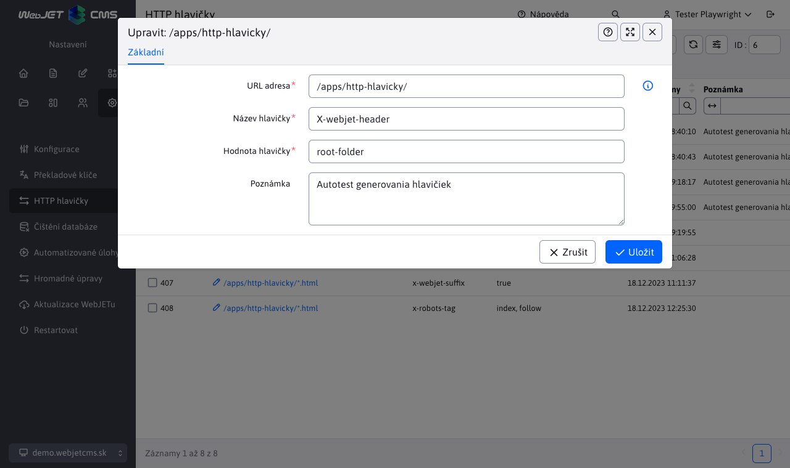

# Hlavičky HTTP

Aplikace Hlavičky HTTP v sekci Nastavení umožňuje definovat hlavičky odpovědi HTTP (`HTTP Response Header`) na základě adres URL zobrazené stránky. Hlavičky jsou odděleny podle domén, nastavují se pro každou doménu zvlášť.

Pokud existuje více hlaviček se stejným názvem, použije se hlavička s nejdelší shodou v adrese URL. V příkladu můžete vidět různé hodnoty hlavičky `X-webjet-header` pro adresy URL `/apps/http-hlavicky/` a `/apps/http-hlavicky/podpriecinok/`. Hodnota pro stránku `/apps/http-hlavicky/podpriecinok/stranka.html` se použije na základě nejdelší shody URL, což znamená, že bude mít hodnotu `sub-folder`.

## Editor

Editor záhlaví obsahuje pole:
- **Adresa URL** určuje, pro které adresy URL je záhlaví definováno. Podporován je následující zápis:
  - `/folder/subfolder/` - hlavička je generována pro všechny adresy URL, které začínají zadanou hodnotou.
  - `^/path/subpath/$` - hlavička je generována pro přesnou shodu adresy URL.
  - `/path/subpath/*.pdf` nebo `/path/subpath/*.pdf,*.jpg` - hlavička je generována pro adresy URL začínající na `/path/subpath/` a končí na `.pdf` nebo v druhém případě také pro `.jpg`.
- **Název záhlaví** určuje název samotné přidávané hlavičky.
- **Hodnota záhlaví** určuje hodnotu záhlaví set.
- **Poznámka** další informace, např. kdo a kdy požádal o nastavení záhlaví. Hodnota se zobrazuje pouze v administraci.

Jako příklad použijte obrázek výše s editorem již vytvořeného záznamu. Tyto hodnoty určují, že pro každou adresu URL, která začíná znakem `/apps/http-hlavicky/`, je vygenerována hlavička HTTP `x-webjet-header` s hodnotou `root-folder`.

Makro můžete použít jak v názvu, tak v hodnotě. `{HTTP_PROTOCOL}, {SERVER_NAME}/{DOMAIN_NAME}/{DOMAIN_ALIAS}, {HTTP_PORT}`, která bude nahrazena hodnotou získanou na serveru. `SERVER_NAME` je název domény z `request.getServerName()`, `DOMAIN_NAME` a `DOMAIN_ALIAS` jsou hodnoty domény nebo aliasu nastavené na webové stránce. Hodnota `{INSTALL_NAME}` představuje název instalace. Hodnota `{HEADER_ORIGIN}` obsahuje hodnotu hlavičky HTTP `origin`.

Upozornění: některé hlavičky se nastavují přímo pomocí konfiguračních proměnných a někdy mohou změnit nastavenou hodnotu (např. `x-robots-tag` pro stránku s vypnutým procházením), viz seznam pro [Bezpečnostní testy](../../../sysadmin/pentests/README.md#hlavičky-http).

## Webové stránky

Při zobrazení webové stránky se automaticky nastaví hlavička HTTP. `Content-Language` podle složky/jazyka šablony. Pokud v aplikaci záhlaví nastavíte jinou hodnotu, použije se nastavená hodnota bez ohledu na jazyk složky/šablony.

## Nastavení pro soubory

Pro adresy URL začínající na `/files,/images,/shared` hlavička HTTP se nastaví automaticky `Content-Language` podle základního jazyka správy v konf. proměnné `defaultLanguage`. Kromě toho jsou nastaveny podle následujících pravidel:
- pokud adresa URL obsahuje `/en/` je nastaven `en-GB`
- pokud adresa URL obsahuje `/de/` je nastaven `de-DE`
- pokud adresa URL obsahuje `/cz/` je nastaven `cs-CZ`
- pokud adresa URL obsahuje `/sk/` je nastaven `sk-SK`

Země na základě jazyka se získá z proměnné conf. `countryForLng`, pokud není zadána, použije se jako země stejná hodnota jako požadovaný jazyk.
