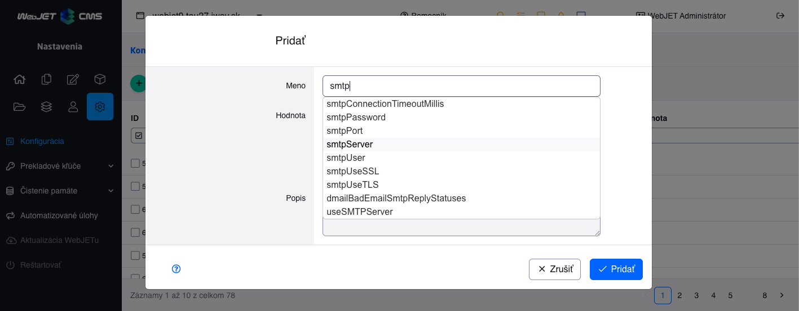

# Automatické dokončování

V editoru lze snadno přidat **"našeptávač" pro textová pole** pro uživatelsky přívětivější načtení zapsané hodnoty:



## Konfigurace

Pole automatického dokončování se aktivuje nastavením atributů editoru pomocí anotace `@DataTableColumnEditorAttr`:

```java
@DataTableColumn(
    inputType = DataTableColumnType.TEXT,
    editor = {
        @DataTableColumnEditor(attr = {
            @DataTableColumnEditorAttr(key = "data-ac-url", value = "/admin/v9/settings/configuration/autocomplete")
        })
    }
)
```

Podporovány jsou pouze následující povinné atributy `data-ac-url`:
- `data-ac-url` - Adresa URL služby REST, která vrací pole/seznam. `String` hodnoty.
- `data-ac-click` - název funkce, která se zavolá po kliknutí na možnost v automatickém dokončování (pro nastavení dalších polí). Nastavení na hodnotu `fireEnter` při výběru hodnoty se spustí událost stisknutí klávesy. `Enter`.
- `data-ac-name` - název parametru URL, ve kterém je zapsaná hodnota odeslána službě REST (výchozí termín).
- `data-ac-min-length` - minimální počet znaků pro volání služby REST (výchozí 1).
- `data-ac-max-rows` - maximální počet zobrazených řádků (výchozí 30).
- `data-ac-params` - seznam selektorů polí, jejichž hodnoty se přidají do adresy URL volání služby REST, např. `#DTE_Field_templateInstallName,#DTE_Field_templatesGroupId`.
- `data-ac-select` - při nastavení na `true` v automatickém dokončování se chová podobně jako výběrové pole - po kliknutí myší do vstupního pole se načtou a zobrazí všechny možnosti.
- `data-ac-collision` - umístění načtených možností vzhledem k zadávacímu poli. Výchozí `flipfit` pro automatické umístění, pro možnost `select` je přednastavena na hodnotu `none` pro přesné umístění pod vstupní pole.
- `data-ac-render-item-fn` - název funkce, která konkrétně generuje prvek seznamu dat.

Příklad služby REST, která vrací data, je uveden v dokumentu [ConfigurationController.getAutocomplete](../../../../src/main/java/sk/iway/iwcm/components/configuration/ConfigurationController.java), implementace je jednoduchá - na základě zadaného `term` parametr vrací seznam `List<String>` odpovídající záznamy:

```java
@GetMapping("/autocomplete")
public List<String> getAutocomplete(@RequestParam String term) {
    List<String> ac = new ArrayList<>();
    //na zaklade termu prehladaj zaznamy a do listu dopln len vyhovujuce
    if (...contains(term)) ac.add(...);
    return ac;
}
```

Vzhledem k tomu, že vyhledávání pomocí LIKE se obvykle používá na zadní straně, je možné do vyhledávání zadat znak. `%` zobrazit všechny výsledky. To je však pro uživatele netypické, takže při zadávání mezery nebo znaku `*` hodnota je vložena do hledání znaku `%` zobrazit všechny záznamy.

## Použití mimo datovou tabulku

`Autocompleter` lze použít i mimo datovou tabulku jednoduchým nastavením `data-ac` atributy a třídy CSS `autocomplete`. Inicializace se automaticky aktivuje v [app-init.js](../../../../src/main/webapp/admin/v9/src/js/app-init.js) všem `input` prvky s třídou CSS `autocomplete`. Příklad:

```html
<div id="docIdInputWrapper" class="col-auto col-pk-input">
    <label for="tree-doc-id">Doc ID: </label>
    <input type="text" autocomplete="off" class="js-tree-doc-id__input autocomplete" id="tree-doc-id" data-ac-name="docid" data-ac-url="/admin/skins/webjet6/_doc_autocomplete.jsp" data-ac-click="fireEnter"/>
</div>
```

## Poznámky k implementaci

Automatické dokončování používá [jQuery-ui-autocomplete](https://api.jqueryui.com/autocomplete/) funkce. Vnitřně je zapouzdřena ve třídě JavaScriptu [AutoCompleter](../../../../src/main/webapp/admin/v9/src/js/autocompleter.js). Tato verze je upravena oproti původní verzi ve WebJET 8, měla by být zpětně kompatibilní (ve WebJET 8 je také možné použít URL původních služeb automatického dokončování).

Funkce je přidána `autobind()`, který přebírá nastavení z datových atributů zadaného vstupního prvku. Inicializace automatického dokončování je implementována v index.js v kódu:

```javascript
//nastav autocomplete
$('#'+DATA.id+'_modal input.form-control[data-ac-url]').each(function() {
    var autocompleter = new AutoCompleter('#'+$(this).attr("id")).autobind();
    $(this).closest("div.DTE_Field").addClass("dt-autocomplete");
});
```

přičemž, jak je vidět `div.DTE_Field` prvku je také nastavena třída CSS `dt-autocomplete` pro budoucí stylování prvku.

Nastavení funkce prostřednictvím `click` parametr je volán se zpožděním 100 ms, aby se nejprve nastavila hodnota v poli, kterou lze poté načíst a použít.

## Speciální generování prvků seznamu

Použití parametru `data-ac-render-item-fn` lze nastavit název funkce, která konkrétně generuje prvek v seznamu dat. Aby to fungovalo, musí být splněno :
- generovaný prvek musí být `li` prvek (co v něm je, záleží na vás)
- tento vygenerovaný prvek musí být vložen do listu `ul`
- zadanou funkci v `data-ac-render-item-fn` musí být definovány pomocí `window` a musí mít vstupní parametry `ul` a `item`

Příklad vlastní funkce

```java
    @DataTableColumnEditorAttr(key = "data-ac-render-item-fn", value = "disableDeletedEnum")
```

příklad implementace takové funkce

```js
//Don't forget to add fn into windows AND use correct input params
window.disableDeletedEnum = function(ul, item) {
    var deletedPrefix = WJ.translate("enum_type.deleted_type_mark.js");
    if(deletedPrefix !== undefined && deletedPrefix !== null && deletedPrefix !== "" && item.label.startsWith(deletedPrefix)) {
        //Special element generation - with added "disabled" class
        return $("<li>")
            .append($("<div>").append(item.label))
            .appendTo(ul).addClass("disabled");
    }

    //Classic element generation
    return $("<li>")
        .append($("<div>").append(item.label))
        .appendTo(ul);
}
```

V tomto příkladu jsme přidali třídu prvků, když je splněna podmínka. `disabled`. Automatické dokončování jsme nastavili tak, aby data (prvky) označená třídou `disabled` jsou barevně zvýrazněny a nelze je vybrat.
