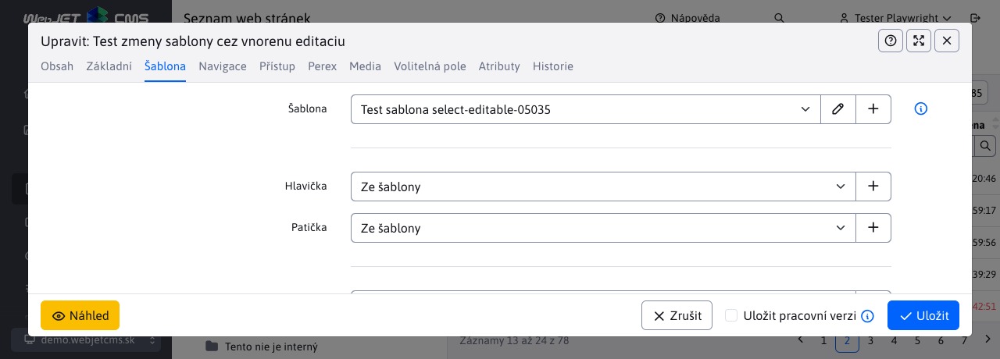

# Výběrové pole s úpravami

Do kódových polí je možné přidat ikonu pro editaci nebo přidání nového záznamu. Pole se zobrazí jako standardní výběrové pole, ale obsahuje ikonu  pro úpravu vybraného záznamu nebo ikona  přidat nový záznam.

Ukázka je z editace webových stránek, kde je možné vybrat šablonu ve výběrovém poli. **Šablona webových stránek**.



Někdy je však nutné v šabloně něco zkontrolovat/upravit, proto je vhodné mít možnost načíst vybranou šablonu přímo z webové stránky do editoru. Výsledkem je vnořené dialogové okno s úpravou např. šablony:


## Použití anotace

Pole se aktivuje nastavením atributů editoru pomocí anotace `@DataTableColumnEditorAttr`:

```java
@Column(name = "temp_id")
@DataTableColumn(
        inputType = DataTableColumnType.SELECT,
        editor = {
                @DataTableColumnEditor(attr = {
                        @DataTableColumnEditorAttr(key = "data-dt-edit-url", value = "/admin/v9/templates/temps-list/?tempId={id}"),
                        @DataTableColumnEditorAttr(key = "data-dt-edit-perms", value = "menuTemplates")
                })
        }
)
private Integer tempId;
```

Podporovány jsou pouze následující povinné atributy `data-dt-edit-url`, ale vždy doporučujeme nastavit pole `data-dt-edit-perms`:
- `data-dt-edit-url` - URL webové stránky pro editaci záznamu, až do hodnoty `{id}` přenese se aktuálně vybraná hodnota ve výběrovém poli.
- `data-dt-edit-perms` - název práva, pokud uživatel toto právo nemá, možnost editace záznamu se nezobrazí (pole se zobrazí jako standardní výběrové pole).
- `data-dt-edit-title` - (nepovinné) překladový klíč popisku okna, pokud není uveden, použije se název pole z editoru.

Při volání webové stránky lze zadat speciální značky pro url adresu, která otevře kartu Systém nebo Koš:

```java
@DataTableColumnEditorAttr(key = "data-dt-edit-url", value = "/admin/v9/webpages/web-pages-list/?groupid=SYSTEM&docid={id}")
...
@DataTableColumnEditorAttr(key = "data-dt-edit-url", value = "/admin/v9/webpages/web-pages-list/?groupid=TRASH&docid={id}")
...
```

## Poznámky k implementaci

Implementace je v souboru `/admin/v9/npm_packages/webjetdatatables/field-type-select-editable.js` a prostřednictvím výzvy `$.fn.dataTable.Editor.fieldTypes.select.create` upravuje původní pole typu `select` z Editoru datových tabulek. Úprava spočívá v přidání tlačítek pro editaci a přidání záznamu. Kliknutím na jedno z těchto tlačítek se vyvolá funkce `openIframeModal` otevřít dialogové okno iframe.

V případě `onload` je přidáno naslouchání události pro otevření a zavření okna editoru ve vnořeném dialogu. Pro událost `WJ.DTE.close` (tj. zavření okna editoru), dialogové okno iframe se zavře a vyvolá se aktualizace datové tabulky. Tím dojde také k obnovení hodnot ve výběrových polích.

V případě `WJ.DTE.open` vnořený editor nastaví titulek okna podle zadaného atributu `data-dt-edit-title`, nebo podle názvu pole v editoru.

Otevření příslušného záznamu pro editaci zajišťuje [datatable-opener.js](../libraries/datatable-opener.md) který pro záznam s `?id=-1` vyvolá kliknutí na tlačítko přidat záznam.

Po uložení se data datové tabulky obnoví voláním `EDITOR.TABLE.wjUpdateOptions();`. Volá rozhraní REST `/all` pro získání `json.options` údaje výběrových polí.

### Způsob zobrazení

Ve vnořeném dialogovém okně nechceme zobrazovat datovou tabulku ani navigační možnosti, ale pouze samotný editor. To zajišťují styly CSS:
- v `app-init.js` třída CSS je nastavena pro okno iframe `in-iframe` na adrese `html` Odznak. Nastavuje se pomocí parametru URL `showOnlyEditor=true` který se automaticky přidá do adresy URL při otevření dialogového okna. Dialogové okno nastavuje třídu CSS pro ostatní případy `in-iframe-show-table`, čímž se datová tabulka rovněž zobrazí. Parametr `showEditorFooterPrimary=true` je možné zobrazit zápatí s aktivním primárním tlačítkem (pokud se ukládání neprovádí vnořeným způsobem).
- po inicializaci je vyvolána událost `WJ.iframeLoaded`, který poté provede kód funkce `onload`, [iframe dialogu](../frameworks/webjetjs.md?id=iframe-dialóg).

V souboru `src/main/webapp/admin/v9/src/scss/3-base/_modal.scss` je nastaven na zobrazení v režimu `html.in-iframe` která skrývá celou `.ly-page-wrapper` který obsahuje datovou tabulku a celé grafické uživatelské rozhraní.

Protože však načítání může chvíli trvat, prvek se zobrazí. `#modalIframeLoader` (který je ve výchozím nastavení skrytý) a skrývá se po příkazu `onload` události. Uživatel tak ví, že se načítá něco jiného (editor je inicializován).
