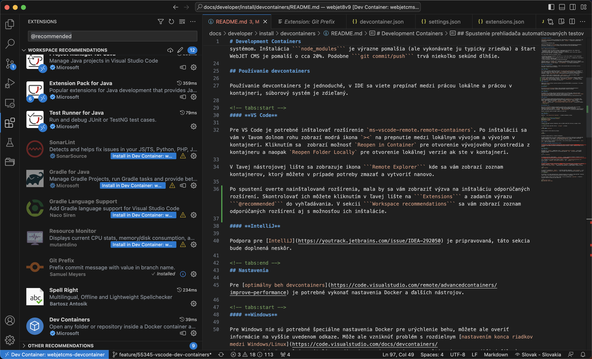
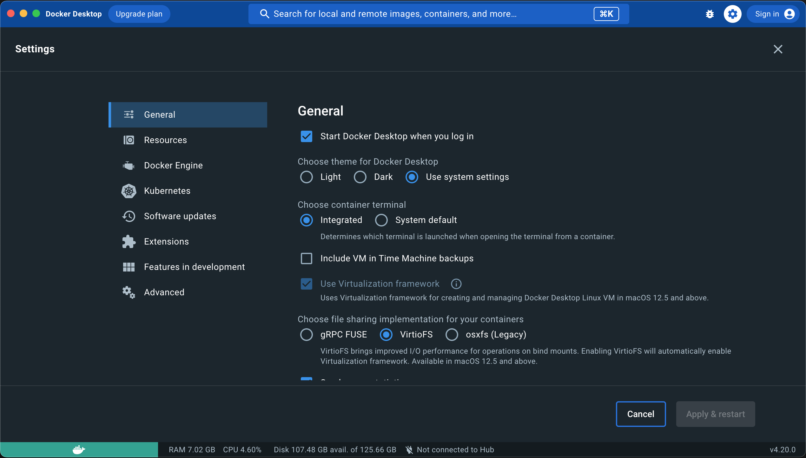
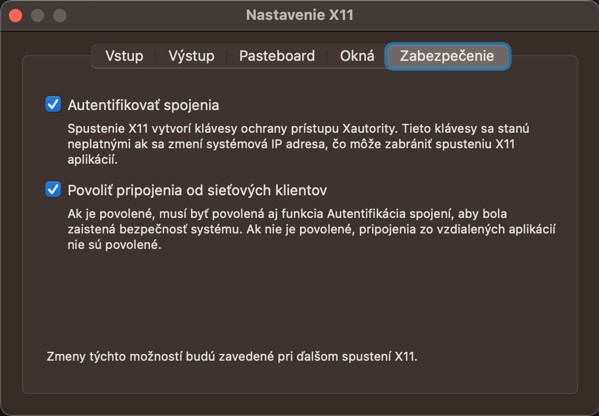

# Development Containers

[Development Containers](https://containers.dev) (devconatiners) je metoda vývoje v kontejnerech. Grafické rozhraní vývojového prostředí běží na vašem počítači, ale jeho `backend` a úplné spuštění kódu v kontejnerech.


V současné době je podporována v [Kód VS](https://code.visualstudio.com/docs/devcontainers/containers), podpora pro [IntelliJ](https://youtrack.jetbrains.com/issue/IDEA-292050).

## Výhody používání devcontainerů

Hlavní výhody používání devcontainerů jsou:
- Vyžaduje pouze, aby byl na počítači nainstalován Docker (nemusíte mít nainstalovanou Javu, NodeJS atd.).
- Zjednodušuje celkovou instalaci prostředí v počítači vývojáře.
- Sjednocuje prostředí mezi vývojáři - kontejner je nainstalován s přesnou verzí Javy, NodeJS a dalších nástrojů jako například v produkčním prostředí.

Je proto vhodný zejména pro následující scénáře:
- Pracujete na více projektech, z nichž každý používá jinou verzi Javy, NodeJS a je obtížné koordinovat verze na vašem počítači.
- Občas se stane, že potřebujete pracovat na zastaralém projektu, který využívá technologie, jež již nejsou podporovány a je obtížné je v počítači udržovat.
- Potřebujete projekt rychle spustit, otestovat, ověřit a otestovat.

Vývoj má samozřejmě i své nevýhody - běh v kontejneru je o něco pomalejší, zejména práce se souborovým systémem. Instalace `node_modules` je výrazně pomalejší (ale obvykle jej provádíte jen zřídka) a spuštění systému WebJET CMS je asi o 20 % pomalejší. Podobně `git commit/push` trvá o několik sekund déle.

Při spuštění projektu v kontejneru jsou standardní porty HTTP 80,443,8080 namapovány na místní počítač, takže ve výchozím nastavení uvidíte WebJET spuštěný z kontejneru v prohlížeči stejně, jako kdybyste projekt spouštěli na vlastním počítači.

Informace o vypuštění z kontejneru jsou uvedeny vlevo dole, kde je modrý text. `Dev Container: meno`.


## Použití kontejnerů devcontainers

Používání devcontainerů je snadné, v IDE můžete přepínat mezi lokální prací a prací v kontejneru, souborový systém je sdílený.

<!-- tabs:start -->

#### **Kód VS**

Pro VS Code je třeba nainstalovat rozšíření `ms-vscode-remote.remote-containers`. Po instalaci se v levém dolním rohu zobrazí modrá ikona. `><` přepínat mezi místním vývojem a vývojem v kontejneru. Kliknutím zobrazíte možnost `Reopen in Container` otevřít vývojové prostředí z kontejneru a naopak. `Reopen Folder Locally` otevřít místní verzi, pokud se nacházíte v kontejneru.

Na levém panelu nástrojů se zobrazí ikona `Remote Explorer` kde se zobrazí seznam kontejnerů, které můžete v případě potřeby odstranit a znovu vytvořit.

Po spuštění ověřte nainstalovaná rozšíření, měli byste být vyzváni k instalaci doporučených rozšíření. Můžete je zkontrolovat kliknutím v levém postranním panelu na položku `Extensions` a zadáním výrazu `@recommended` ve vyhledávání. V části `Workspace recommendations` se zobrazí seznam doporučených rozšíření a možnost jejich instalace.



Při prvním otevření projektu se mohou zobrazit chyby kompilace. `Mapper` ale stačí třídu otevřít, provést změnu (mezera, odstranit mezeru) a soubor uložit a chyba bude odstraněna.

#### **IntelliJ**

Podpora pro [IntelliJ](https://youtrack.jetbrains.com/issue/IDEA-292050) se připravuje, tato část bude doplněna později.

<!-- tabs:end -->

## Nastavení

Pro [optimální provoz kontejnerů devcontainers](https://code.visualstudio.com/remote/advancedcontainers/improve-performance) Je třeba provést nastavení nástroje Docker a dalších nástrojů.

<!-- tabs:start -->

#### **Windows**

V případě systému Windows není pro zrychlení běhu potřeba žádné speciální nastavení nástroje Docker, ale informace si můžete ověřit na výše uvedeném odkazu. Může však nastat problém s různými [nastavení konce řádků mezi systémy Windows/Linux](https://code.visualstudio.com/docs/devcontainers/tips-and-tricks#_resolving-git-line-ending-issues-in-containers-resulting-in-many-modified-files).

#### **macOS**

Pro systém macOS je třeba optimalizovat nastavení nástroje Docker pro. [rychlejší práce s diskem](https://www.docker.com/blog/speed-boost-achievement-unlocked-on-docker-desktop-4-6-for-mac/). Klikněte na ikonu Docker na panelu nabídek a vyberte možnost `Settings`, v tabulkách `General` vyberte možnost `VirtioFS` v sekci `Choose file sharing implementation for your containers`. Grafy `Advanced` vyberte možnost `Allow the default Docker socket to be used` a klikněte na `Apply & Restart`.



<!-- tabs:end -->

V kontejneru můžete použít záznam DNS `host.docker.internal` k připojení k počítači (např. k místnímu databázovému serveru).

## Klíče Gitlab/SSH

Aby připojení k serveru gitlab pomocí klíčů SSH fungovalo i v kontejneru, je třeba nakonfigurovat. [sdílení klíčů](https://code.visualstudio.com/remote/advancedcontainers/sharing-git-credentials) přes `ssh-agent` mezi počítačem a kontejnerem. Technicky vzato byste mohli klíč SSH zkopírovat přímo do složky. `/home/vscode/.ssh` ale není to ideální řešení.

Nejprve je třeba spustit ssh-agenta (jednorázová operace):

<!-- tabs:start -->

#### **Windows**

Spustit `local Administrator PowerShell` a zadejte následující příkazy:

```sh
# Make sure you're running as an Administrator
Set-Service ssh-agent -StartupType Automatic
Start-Service ssh-agent
Get-Service ssh-agent
```

#### **macOS**

V systému macOS je agent SSH spuštěn ve výchozím nastavení, mělo by stačit přidat klíče SSH podle následujícího postupu.

<!-- tabs:end -->

A pak přidejte klíče SSH do `ssh-agent` příkaz:

```sh
ssh-add $HOME/.ssh/id_rsa
```

Chcete-li zobrazit seznam přidaných klíčů, použijte příkaz:

```sh
ssh-add -l
```

Tuto informaci pak můžete ověřit v kontejnerovém terminálu.

Po restartování devcontainers byste se měli být schopni připojit ke git/gitlab stejně jako na svém počítači. Výše uvedená nastavení jsou také ve skriptu `.devcontainer/localInit.sh` který se spustí před každým spuštěním kontejneru, takže tyto příkazy nemusíte provádět ručně.

Pokud máte problém s připojením k serveru git, můžete vždy přepnout na místní verzi a `pull/push` operace se provádí lokálně.

## Spuštění Automatizovaného prohlížeče testů

Pokud potřebujete zobrazit prohlížeč pro automatické testy, musíte nastavit. [Předávání XServer/X11](https://www.oddbird.net/2022/11/30/headed-playwright-in-docker/) (správce oken pro Linux) v počítači.


<!-- tabs:start -->

#### **Windows**

V systému Windows je `XServer` podporované v rámci `Windows Subsystem for Linux/WSL` a měla by být ve výchozím nastavení k dispozici v systému Windows 10 i 11. `WSL` přes nabídku Start a zadejte následující příkaz:

```sh
ls -a -w 1 /mnt/wslg
```

ve výpisu by se měla zobrazit hodnota `.X11-unix`. Pokud ne, přejděte do obchodu a stáhněte si [aktuální verze WSL](https://www.microsoft.com/store/productId/9P9TQF7MRM4R).

Bohužel v konfiguraci je rozdíl mezi systémy Windows a macOS, v souboru `.devcontainer/devcontainer.json` upravit hodnotu `"DISPLAY": "host.docker.internal:0"` na adrese `"DISPLAY": ":0"`.

#### **macOS**

V systému macOS je třeba nejprve nainstalovat [XQuartz](https://www.xquartz.org). Po instalaci a restartu přejděte do aplikace `XQuartz` na `Preferences -> Security` a zaškrtněte možnost `Allow connections from network clients`.



Restartujte počítač a poté zadejte příkaz do terminálu:

```sh
xhost +localhost
```

umožnit připojení k `XQuartz` z místního počítače. Nastavení `xhost +localhost` je také ve scénáři `.devcontainer/localInit.sh`, která se provádí před každým spuštěním kontejneru, abyste na ni nezapomněli.

<!-- tabs:end -->

Po nastavení se zobrazí okno kontejnerového systému Linux přímo v počítači. Technicky lze v tomto režimu spustit jakoukoli aplikaci s grafickým uživatelským rozhraním nainstalovanou v kontejneru.

Při prvním spuštění testů se může objevit chyba, že není nainstalován. `playwright`, v kontejnerovém terminálu spusťte příkazy pro instalaci:

```sh
npx playwright install
npx playwright install-deps
```

## Ukázkové soubory

Následuje seznam ukázkových souborů, které můžete použít jako základ pro svůj projekt. Všechny jsou umístěny ve složce `.devcontainer`:

`devcontainer.json` - samotná konfigurace `devcontainer`:

```json
// For format details, see https://aka.ms/devcontainer.json. For config options, see the
// README at: https://github.com/devcontainers/templates/tree/main/src/alpine
{
	"name": "webjetcms-devcontainer",
	// Or use a Dockerfile or Docker Compose file. More info: https://containers.dev/guide/dockerfile
	"image": "mcr.microsoft.com/devcontainers/base:ubuntu",
	"features": {
		//https://github.com/devcontainers/features/tree/main/src/java
		"ghcr.io/devcontainers/features/java:1": {
			"version": "8",
			"jdkDistro": "open",
			"installAnt": true,
			"antVersion": "1.10.12"
		},
		//https://github.com/devcontainers/features/tree/main/src/node
		"ghcr.io/devcontainers/features/node:1": {
			"nodeGypDependencies": true,
			"version": "16"
		}
	},
    "runArgs": [
		//publish ports
		"--publish=80:80",
		"--publish=443:443",
		"--publish=8080:8080"
    ],

	"initializeCommand" : ".devcontainer/localInit.sh || true",
	"postCreateCommand": ".devcontainer/postCreateCommand.sh",
	"postStartCommand": ".devcontainer/postStartCommand.sh",

	//https://www.oddbird.net/2022/11/30/headed-playwright-in-docker/
	"containerEnv": {
        "DISPLAY": "host.docker.internal:0"
    },

	// Use 'forwardPorts' to make a list of ports inside the container available locally.
	//"forwardPorts": []

	// Configure tool-specific properties.
	"customizations": {
		"extensions": [
			"SonarSource.sonarlint-vscode",
			"vscjava.vscode-gradle",
			"naco-siren.gradle-language",
			"mutantdino.resourcemonitor",
			"srmeyers.git-prefix"
		],
		"settings": {
			"window.title": "${activeEditorMedium}${separator}${rootName}",
			"editor.stickyScroll.enabled": true,
			"java.debug.settings.showStaticVariables": true
		}
	}

	// Uncomment to connect as root instead. More info: https://aka.ms/dev-containers-non-root.
	// "remoteUser": "root"
}
```

`localInit.sh` - Skript je spuštěn na místním počítači před vytvořením kontejneru:

```sh
#!/bin/sh

#enable MacOS Xquartz connection
xhost +localhost

#add local SSH key to ssh-agent
ssh-add $HOME/.ssh/id_rsa
ssh-add -l
```

`postCreateCommand.sh` - skript je spuštěn po vytvoření kontejneru již uvnitř kontejneru, což umožňuje instalaci dalších programů:

```sh
#!/bin/sh
sudo apt update
sudo apt install iputils-ping
sudo apt -y install imagemagick
```

`postStartCommand.sh` - skript se spustí při každém spuštění kontejneru, protože pomalý překlad `.local` domény přidané do `/etc/hosts` potřebné záznamy DNS:

```sh
#!/bin/sh

#set local DNS
sudo -- sh -c "echo '#LOCAL DNS FOR WEBJET' >> /etc/hosts"
sudo -- sh -c "echo '127.0.0.1    iwcm.interway.sk iwcm.iway.sk cms.iway.sk docs.interway.sk' >> /etc/hosts"
sudo -- sh -c "echo '1.2.3.4   gitlab.web.iway.local' >> /etc/hosts"
```
