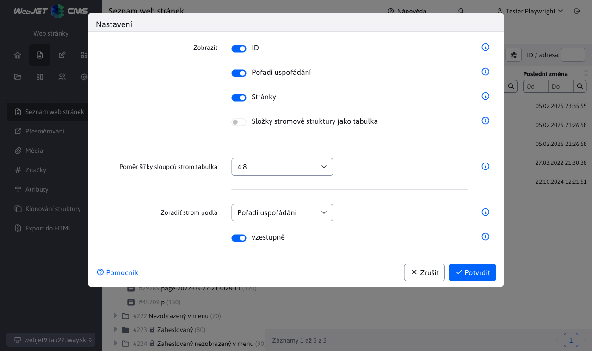

# jsTree

Knihovna [jsTree](https://www.jstree.com/) je jquery `plugin`, který zobrazuje stromové struktury v aplikaci WebJET.

<!-- @import "[TOC]" {cmd="toc" depthFrom=2 depthTo=6 orderedList=false} -->

<!-- code_chunk_output -->
- [jsTree](#jstree)
  - [Základní inicializace ve spolupráci se Spring REST](#základní-inicializace-ve-spolupráci-s-pružinovým-odpočinkem)
  - [Konfigurace](#Konfigurace)
    - [Vytvoření nového řadiče REST](#vytvoření-nového-řadiče-odpočinku)
    - [Vlastní typy objektů](#vlastní-typy-objektů)
    - [Nastavení displeje](#nastavení-displeje)
    - [Změna adresy URL služby REST](#změnit-url-adresu-služby-rest)
  - [Ikony a třídy CSS](#ikony-a-třídy-css)
    - [Jak používat ikony](#jak-používat-ikony)

<!-- /code_chunk_output -->

## Základní inicializace ve spolupráci se Spring REST

Implementace jsTree ve WebJETu se konfiguruje pomocí objektu JSON ve formátu `app.js`.

Základní příklad:

```javascript
script.
    let jstree = $('#SomStromcek').jstree({
            'core' : {
                'check_callback' : function (operation, node, parent, position, more) {
                    if (operation === 'copy_node') {
                        return false;
                    }

                    if(operation === 'move_node') {
                        if(parent.id === '#') {
                            return false; // prevent moving a child above or below the root
                        }
                    }

                    return true; // allow everything else
                },
                'data' : function(obj, callback) {
                    let jsTreeParamValue;
                    if (jsTreeParamName === 'url') {
                        jsTreeParamValue = '/images';
                        if (obj.id !== '#' && typeof obj.original !== 'undefined') {
                            jsTreeParamValue = obj.original.virtualPath;
                        }
                    }
                    else {
                        jsTreeParamValue = 0;
                        if (obj.id !== '#') {
                            jsTreeParamValue = obj.id;
                        }
                    }

                    let data = {};
                    data[jsTreeParamName] = jsTreeParamValue;

                    if (typeof window.treeInitialJson != undefined && window.treeInitialJson != null) {
                        let items = window.treeInitialJson;
                        window.treeInitialJson = null;
                        callback.call(this, items);
                    }
                    else {
                        $.ajax({
                            url: WJ.urlAddPath(getJstreeUrl(), "/tree"),
                            method: 'post',
                            contentType: 'application/json',
                            data: JSON.stringify(data),
                            success: function (data) {
                                if (!data.result) {
                                    WJ.notifyError(data.error);
                                    return;
                                }
                                //WJ.log("calling callback, items=", data.items);
                                callback.call(this, data.items);
                            }
                        });
                    }
                }
            },
            "plugins" : [
                "dnd"
            ],
            "types" : {
                "#" : {
                    "max_children" : 1,
                    "max_depth" : 4,
                    "valid_children" : ["root"]
                },
                "root" : {
                    "icon" : "/static/3.3.8/assets/images/tree_icon.png",
                    "valid_children" : ["default"]
                },
                "default" : {
                    "valid_children" : ["default","file"]
                },
                "file" : {
                    "icon" : "glyphicon glyphicon-file",
                    "valid_children" : []
                }
            }
        }).on("move_node.jstree", function(e, data) {
            //console.log("Drop node " + data.node.id + " to " + data.parent);
            //console.log("Data", data);
            delete(data.node.children);
            //console.log("Data", data);
            let json = {
                node: data.node,
                old_parent: data.old_parent,
                old_position: data.old_position,
                parent: data.parent,
                position: data.position
            };

            $.ajax({
                url : jsTreeUrl + "/move",
                method: 'post',
                dataType: 'json',
                contentType: 'application/json',
                data: JSON.stringify(json),
                success: function(response) {
                    //console.log("response", response);
                    if (!response.result) {
                        toastr.error(response.error);

                        return;
                    }

                    // LPA: bez refreshu parenta jstree hadzalo internu chybu
                    jstree.jstree(true).refresh(data.parent);
                }
            })
        });
```

```html
<div id="SomStromcek"
    data-rest-url="/admin/rest/components/gallery/tree"
    data-rest-param-name="url">
</div>
```

## Konfigurace

Adresa volané služby REST se konfiguruje pomocí atributů HTML. `data-rest-url` a `data-rest-param-name` (název parametru odeslaného službě REST).

V objektu `window.treeInitialJson` je možné nastavit inicializační data JSON pro počáteční zobrazení stromové struktury. První zobrazení tak bude rychlejší, protože není třeba volat službu REST. Předávání dat do backendu je popsáno v části [thymeleaf](../frameworks/thymeleaf.md#vkládání-vlastních-objektů-do-modelu).

### Vytvoření nového řadiče REST

Nový řadič by měl rozšířit třídu [JsTreeRestController](../../../src/main/java/sk/iway/iwcm/admin/jstree/JsTreeRestController.java), implementovat abstraktní metody stromu (položky nabídky), `move` (implementace přenosu položek BE) a `checkAccessAllowed` (kontrola uživatelských práv na vyžádání).

### Vlastní typy objektů

K objektu `JsTreeItem` byl přidán `String customType`, pro definování vlastního typu v zákaznických implementacích. Použití je stejné jako v případě `Type` kde můžeme porovnat `Enumy`, pouze v tomto případě porovnáváme `Stringy`, metodou `equals`.

Typ použití

```java
if (original.getType() == JsTreeItemType.GROUP) {
    // vlastny kod pre dany type
}
```

Použijte `customType`

```java
if ("custom-jstree-item".equals(original.getCustomType())) {
    // vlastny kod pre dany custom type
}
```

### Nastavení displeje

Před zobrazením stromové struktury je objekt JS otestován. `window.jstreeCustomizeData`. Pokud existuje, nazývá se. Před zobrazením může přijatá data upravit.

Příkladem je zobrazení ID a pořadí uspořádání v seznamu webových stránek implementovaném v systému `src/js/pages/web-pages-list/jstreesettings.js`:

```javascript
    jstreeCustomizeData(data) {
        //console.log("Customize data: ", data);

        if (data==null || typeof data == "undefined" || data.length < 1 ) return;

        const idShow = window.jstreeSettings.isIdShow();
        const priorityShow = window.jstreeSettings.isPriotityShow();

        data.forEach(function(item) {
            //console.log(item);
            if (typeof item.groupDetails != "undefined") {
                if (idShow) item.text = `<span class="id">#${item.groupDetails.groupId}</span> ${item.text}`;
                if (priorityShow) item.text = `${item.text} <span class="sortPriority">(${item.groupDetails.sortPriority})</span>`;
            } else if (typeof item.docDetails != "undefined") {
                if (idShow) item.text = `<span class="id">#${item.docDetails.docId}</span> ${item.text}`;
                if (priorityShow) item.text = `${item.text} <span class="sortPriority">(${item.docDetails.sortPriority})</span>`;
            }
        });
    }
```



### Změna adresy URL služby REST

Adresa URL služby REST se získá z atributu data `data-rest-url`, pokud ji potřebujete dynamicky měnit, můžete vytvořit funkci JavaScriptu. `window.getJstreeUrl`, která se použije místo hodnoty v atributu data:

```JavaScript
var somStromcek = null;

const queryString = window.location.search;
const urlParams = new URLSearchParams(queryString);
let dir = urlParams.get('dir')

window.getJstreeUrl = function() {
    if (somStromcek==null) somStromcek = $('#SomStromcek');
    let url = somStromcek.data("rest-url");
    if (dir != null) url = WJ.urlAddParam(url, "dir", dir);
    return url;
}
```

## Ikony a třídy CSS

Ikona se nastavuje pomocí [FontAwesome](https://fontawesome.com/icons?d=gallery) CSS voláním [JsTreeItem.setIcon](../../../src/main/java/sk/iway/iwcm/admin/jstree/JsTreeItemState.java). Hodnota je například `ti ti-folder-filled` nebo `ti ti-map-pin`.

Rozhraní API poskytuje metody pro nastavení atributů HTML pro prvky LI a A pomocí atributů [li\_attr a a\_attr](https://www.jstree.com/docs/json/). Pro snadné přidávání tříd CSS poskytuje rozhraní API metody `JsTreeItem.addLiClass` a `JsTreeItem.addAClass`. Můžete tedy nastavit stavy CSS `is-not-public` nebo `fa-is-internal`.

JsTree neumožňuje zobrazit více ikon za sebou, což potřebujeme pro zobrazení stavu adresářů a webových stránek, přidáme je jako HTML kód do textu pomocí metody `JsTreeItem.addTextIcon`.

Příklady jsou ve třídách [GroupsJsTreeItem](../../../src/main/java/sk/iway/iwcm/doc/GroupsJsTreeItem.java) a [DocumentsJsTreeItem](../../../src/main/java/sk/iway/iwcm/doc/DocumentsJsTreeItem.java).

### Jak používat ikony

Používání ikon má následující pravidla:
- <i class="ti ti-folder-filled" role="presentation" ></i> / <i class="ti ti-map-pin" role="presentation" ></i> celá stránka a ikona složky = zobrazí se v nabídce
- <i class="ti ti-folder" role="presentation" ></i> / <i class="ti ti-map-pin-off" role="presentation" ></i> prázdná stránka a ikona složky = nezobrazuje se v nabídce
- <i class="ti ti-lock" role="presentation" ></i> zámek = k dispozici pouze pro přihlášeného návštěvníka
- <span style="color: #FF4B58">červená barva</span> = nedostupné pro veřejnost (interní adresář) nebo stránku s vypnutým zobrazením (v DT je možné použít CSS třídu is-not-public na řádek).
- **tučné písmo** = hlavní stránka adresáře (v DT je možné použít CSS třídu `is-default-page`)
- <i class="ti ti-external-link" ></i> šipka ven = stránka je přesměrována
- <i class="ti ti-eye-off" ></i> přeškrtnuté oko = stránku nelze prohledávat.
