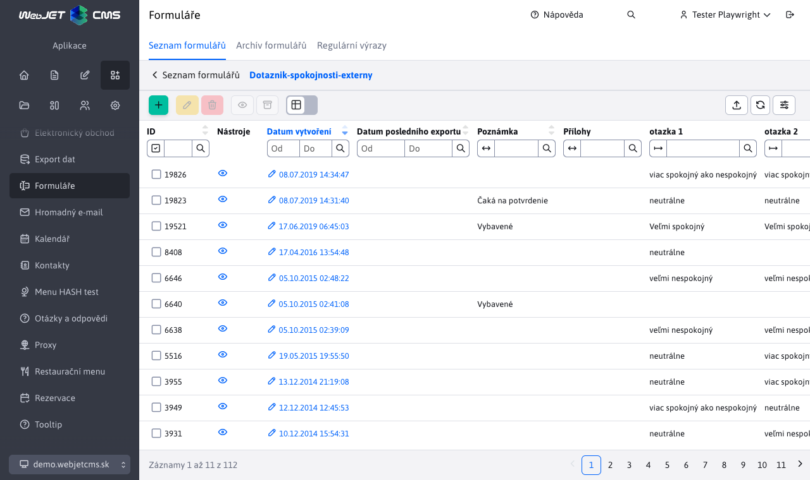
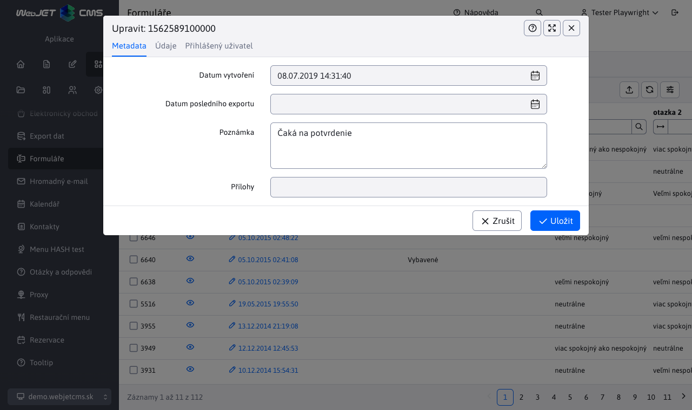
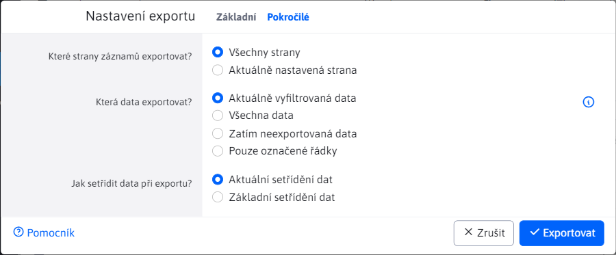
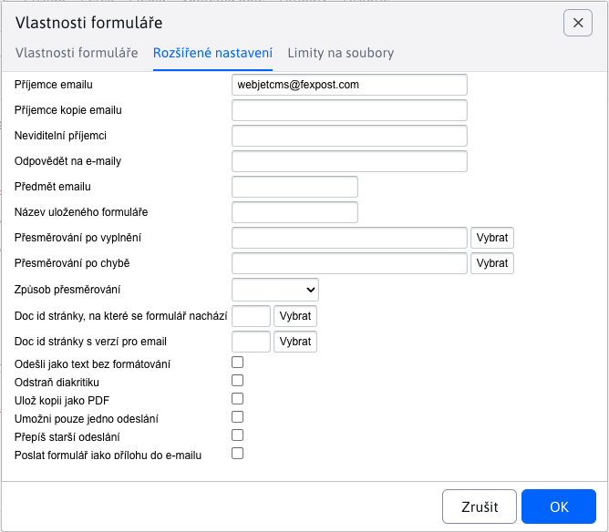

# Seznam formulářů

Aplikace formuláře slouží k pokročilé správě vyplněných formulářů. Každá webová stránka může obsahovat formulář, který návštěvník vyplní. Může se jednat o žádosti o zaměstnání, žádosti o podrobnější informace apod.

Formuláře lze odeslat na e-mailovou adresu a formulář vypadá v e-mailové zprávě stejně jako na webu, lze jej vytisknout a dále zpracovat.

Všechny formuláře jsou navíc uloženy v databázi a můžete se k nim kdykoli vrátit v administrační oblasti Web JET. Položky ve formulářích lze třídit podle libovolného sloupce a exportovat do MS Excel.



Kliknutím na ikonu oka zobrazíte formulář tak, jak je zobrazen na webové stránce, a vytisknete jej.

V úpravách formuláře můžete změnit pole poznámky (kam můžete zaznamenat zpracování/stav formuláře). Jednotlivá vyplněná pole jsou určena pouze pro čtení, po odeslání je nelze měnit. Záložka data obsahuje jednotlivá pole vyplněného formuláře, záložka přihlášený uživatel obsahuje údaje o uživateli, který formulář odeslal (pokud byl při odeslání přihlášen).



## Export dat

Záznamy formuláře lze exportovat do formátu `xlsx` a `csv`. Na kartě Upřesnit lze nastavit následující možnosti exportu:
- Aktuálně filtrovaná data - pokud máte data filtrovaná podle určitého sloupce v tabulce, exportují se pouze tato data.
- Všechna data - exportují se všechna data bez ohledu na filtr nastavený v zobrazené tabulce.
- Dosud neexportovaná data - exportují se pouze data, která dosud nebyla exportována (mají prázdnou hodnotu ve sloupci Datum posledního exportu). Můžete tedy jednoduše exportovat pouze nově přidaná data jedno po druhém.
- Pouze vybrané řádky - exportují se pouze vybrané řádky tabulky.

Po exportu se sloupec Datum posledního exportu automaticky nastaví na aktuální datum a čas.



## Možnosti pokročilého nastavení

Formuláři je možné nastavit některé skryté hodnoty, které ovlivní jeho zpracování. Ve výchozím nastavení není nutné žádnou z těchto hodnot konkrétně nastavovat.

- `recipients` - seznam příjemců e-mailu. Může obsahovat více příjemců oddělených čárkou.
  - **Varování:** zabránit odesílání e-mailů prostřednictvím systému na zahraniční adresy (`mail relay server`), systém zkontroluje, zda se zadaná cílová e-mailová adresa nachází v těle původní stránky. Pokud tedy e-mailovou adresu dynamicky změníte, musí být v těle stránky.
- `ccEmails` - seznam e-mailových adres oddělených čárkou, na které má být zaslána kopie e-mailu.
- `bccEmails` - seznam e-mailových adres oddělených čárkou, na které má být odeslána skrytá kopie e-mailu.
- `subject` - předmět e-mailu. Pokud není vyplněn automaticky, použije se podle webové stránky.
- `email / e-mail` - pole určující e-mailovou adresu odesílatele e-mailu. Pokud se jedná o kontaktní formulář, je ideální, když se pole, do kterého návštěvník zadává e-mail, jmenuje takto.
- `name / firstname / lastname / meno / priezvisko / jmeno / prijmeni` - pole určující jméno odesílatele e-mailu. Pokud se jedná o kontaktní formulář, je ideální, když se takto nazývá pole, do kterého návštěvník zadává své jméno.
- `savedb` - název, pod kterým je formulář uložen v databázi.
- `forward` - url adresa, na kterou se po uložení formuláře přesměruje. Pokud není zadána, dojde k přesměrování na původní stránku.
- `forwardFail` - url adresa, na kterou se má přesměrovat, pokud se formulář nepodaří odeslat. Pokud není zadána, použije se stejná hodnota, jakou má `forward`.
- `forwardType` - typ přesměrování po zpracování formuláře.
  - Pokud hodnota není zadána, formulář se zpracuje a poté se provede přesměrování na zadanou stránku s nastaveným parametrem stavu odeslání (např.` formSend=true`).
  - Hodnota `forward` znamená, že se provede interní přesměrování na cílovou stránku. Cílová stránka pak může přistupovat ke stejným parametrům jako formulář a provést další akci. Protože se jedná o interní přesměrování, hodnota zůstane v adresním řádku prohlížeče. `/formmail.do`.
  - Hodnota `addParams` provede přesměrování na cílovou stránku s přidáním jednotlivých parametrů do adresy URL. V tomto případě prohlížeč provede přesměrování a adresa cílové stránky zůstane v adresním řádku. Protože se však parametry přidávají do adresy URL, je jejich počet omezen délkou adresy URL, která je ve výchozím nastavení 2048 znaků.
- `useFormDocId` - ID dokumentu stránky, na které se formulář nachází. Ve výchozím nastavení se systém snaží určit tuto stránku na základě `refereru` nebo poslední zobrazenou stránku v `session`. Pro přesné určení lze tuto hodnotu zadat. Pokud není zadána, WebJET ji automaticky doplní při zobrazení formuláře.
- `useFormMailDocId` - ID dokumentu stránky s verzí pro e-mail. Systém potřebuje stránku, aby mohl vygenerovat verzi pro e-mail. Pokud je zadána hodnota none, určení webové stránky pro e-mail se nepoužije. Není-li hodnota zadána vůbec, použije se hodnota určená parametrem `useFormDocId`. Tato hodnota je užitečná, pokud máte jeden kontaktní formulář vložený na všech stránkách, např. v zápatí. Při generování e-mailu se jako kód použije kód samotné stránky, ale formulář se v ní nenachází. Tímto způsobem můžete říci, aby se pro e-mail použila jiná stránka.
- `forceTextPlain` - pokud parametr existuje, je e-mail odeslán jako `text/plain` jinak je odeslána jako `multipart`.
- `formMailEncoding` - typ kódování znaků e-mailu. Ve výchozím nastavení je použito stejné kódování jako na webové stránce. Pokud je jako hodnota nastaveno ASCII, je z textu odstraněna diakritika.
- `fieldsEmailHeader` - pokud má generovaný e-mail obsahovat speciální hlavičku, je možné do tohoto pole zadat čárkou oddělený seznam názvů polí, jejichž hodnoty se nastaví do hlavičky.
- `formmail_overwriteOldForms` - pokud je uživatel přihlášen a toto pole je nastaveno na hodnotu `true`, pokud uživatel již formulář odeslal, bude jeho hodnota přepsána novou verzí. Tímto způsobem se formulář v databázi od jednoho uživatele objeví pouze jednou.
- `formmail_allowOnlyOneSubmit` - pokud je uživatel přihlášen a toto pole je nastaveno na hodnotu `true` pokud uživatel již formulář odeslal, systém mu nedovolí jej odeslat znovu. Tímto způsobem se formulář v databázi od jednoho uživatele objeví pouze jednou.
- `formmail_sendUserInfoDocId` - pokud je nastavena na `docId` webové stránky se po úspěšném uložení formuláře odešle na e-mail návštěvníka (z pole e-mail / email) e-mail s textem webové stránky. Může se jednat například o poděkování za vyplnění formuláře nebo o další pokyny, jak postupovat.
- `isPdfVersion` - pokud je nastavena na hodnotu true, systém po uložení formuláře do adresáře vygeneruje také jeho verzi ve formátu PDF. `/WEB-INF/formfiles/ID_FORMULARU_pdf.pdf`, kde hodnota `ID_FORMULARU` Je `id` v databázi.

## Potvrzení nastavení e-mailové adresy

Formulář lze nastavit **potvrzení e-mailové adresy** ( `double opt-in` ). Odeslání formuláře můžete potvrdit kliknutím na odkaz v e-mailu, a tím. **Ověřit** že návštěvník, který vyplnil formulář, zadal **platnou e-mailovou adresu**.

Chcete-li povolit potvrzení e-mailové adresy, musíte nastavit:

1. Ve vlastnostech formuláře, konkrétně v pokročilém nastavení.  je třeba vybrat možnost **Vyžadovat potvrzení souhlasu e-mailem**. 

2. Vytvoření stránky pro potvrzení souhlasu, aplikace musí být vložena do ní. `!INCLUDE(sk.iway.iwcm.components.form.DoubleOptInComponent)!`, který potvrdí souhlas na základě parametrů v databázi. Stránka může být použita pro několik různých formulářů, může mít adresu URL např. `/potvrdenie-double-optin/`.

3. Vytvořte stránku s textem e-mailu, např. "Pro potvrzení e-mailové adresy klikněte na následující odkaz", a vložte odkaz na stránku, kde bude souhlas potvrzen. Odkaz musí obsahovat parametry `!FORM_ID!,!OPTIN_HASH!`, např. `/potvrdenie-double-optin/?formId=!FORM_ID!&hash=!OPTIN_HASH!`. Nastavte ID této stránky v poli `Doc ID` oznámení pro uživatele.

Po kliknutí na odkaz v e-mailu se ve formuláři nastaví pole Datum potvrzení souhlasu, takže můžete identifikovat formuláře, u kterých byl souhlas potvrzen. Zároveň se červeně zobrazí formuláře, které nemají potvrzený souhlas.


## Událost odeslání formuláře

Po odeslání formuláře pomocí AJAXu je zveřejněna událost. `WJ.formSubmit` které je možné poslouchat, např. jako:

```javascript
    window.addEventListener("WJ.formSubmit", function(e) { console.log("DataLayer, submitEvent: ", e); dataLayer.push({"formSubmit": e.detail.formDiv, "formSuccess": e.detail.success}); });
```

## Možné konfigurační proměnné

- `formmailAllowedRecipients` - Seznam e-mailových adres, na které lze zasílat formuláře, například: `@interway.sk,podpora@demo.webjet.sk`. Ve výchozím nastavení je formulář prázdný, což znamená, že může být odeslán na libovolnou adresu.
- `formMailEncoding` - znakovou sadu pro odesílání e-mailů z formulářů. Výchozí hodnota je prázdná, což znamená, že se použije stejné kódování znaků, jaké je nastaveno pro webové stránky.
- `spamProtection` - pokud je nastavena na `true`, bude ve formulářích povolena ochrana proti spamu. Ve výchozím nastavení nastaveno na `true`.
- `spamProtectionJavascript` - pokud je nastavena na `all` (všechny formuláře budou chráněny) nebo `formmail` (chráněny budou pouze formuláře zaslané na e-mail), formuláře budou chráněny `javascriptom`, pro deaktivaci funkce je třeba zadat. `none`. Výchozí nastavení je `all`.
- `spamProtectionSendInterval` - doba v sekundách, po kterou nelze formulář znovu odeslat na e-mail. Ve výchozím nastavení nastaveno na 30.
- `spamProtectionDisabledIPs` - seznam začátků IP adres oddělený čárkou (nebo znakem `*` pro všechny), pro které je ochrana proti spamu vypnutá.
- `formMailSendPlainText` - pokud je nastavena na `true` e-mail z formuláře je odeslán jako prostý text (nikoli ve formátu HTML).
- `formMailRenderRadioCheckboxText` - pokud je nastavena na `true` zobrazí výběr a zaškrtávací políčka jako text `[X]` nebo `[ ]`.
- `formMailCropForm` - pokud je nastavena na `true` pouze část zabalená do `tagov` Forma.
- `formmailHttpsDomains` - Seznam domén oddělených čárkou, pro které budou formuláře vždy odesílány přes zabezpečené připojení httpS.
- `checkFormValidateOnInit` - Nastavení validace formuláře při jeho inicializaci, pokud je nastavena na hodnotu `false` celý formulář se při zobrazení nevaliduje, pokud je nastaven na hodnotu `true` je ověřena.
- `formMailFixedSenderEmail` - Pokud je nastavena na e-mailovou adresu, bude použita jako pevná hodnota e-mailu odesílatele. Na rozdíl od adresy `emailProtectionSenderEmail` nenastaví původní e-mail v poli `reply-to` aby odesílatel nebyl informován o chybném doručení (což může být někdy nutné z bezpečnostních důvodů).
- `formmailShowClassicErrorMessage` - Pokud je nastavena na `true` zobrazí klasickou zprávu o ověření formuláře v horní části formuláře namísto zprávy vedle každého pole.
- `formmailScrollTopAfterSend` - Pokud je nastavena na `true` po odeslání přetočí stránku na začátek formuláře (aby se zobrazila zpráva o odeslání).
- `formmailResetFormAfterSend` - Pokud je nastavena na `true` po úspěšném odeslání se formulář vymaže.
- `formmailSendUserInfoSenderName` - Bude odesláno jako jméno odesílatele v e-mailu při odesílání stránky podle zadané hodnoty. `formmail_sendUserInfoDocId`. Pokud je prázdný, je odesláno jméno autora stránky, jejíž obsah je odesílán do e-mailu.
- `formmailSendUserInfoSenderEmail` - Bude odeslán jako e-mail odesílatele v e-mailu při odesílání stránky podle zadané hodnoty. `formmail_sendUserInfoDocId`. Pokud je prázdná, je e-mail odeslán autorovi stránky, jejíž obsah je odeslán do e-mailu.
