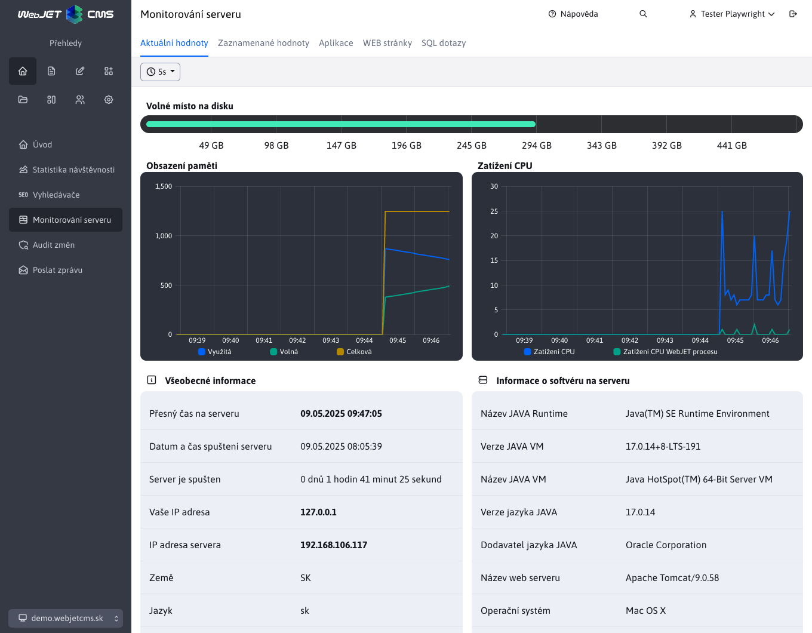
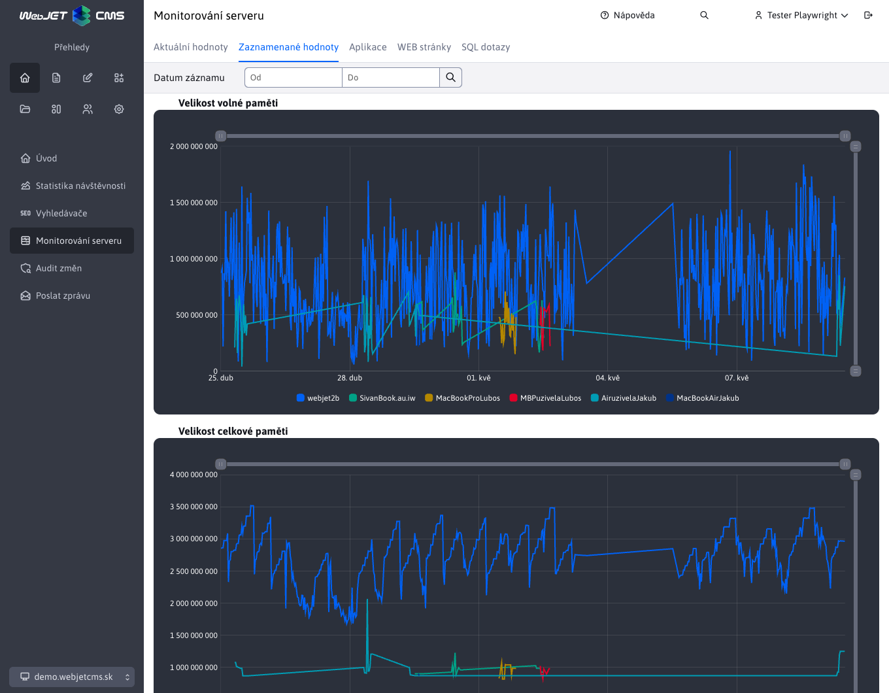

# Monitorování serveru

## Interní monitorování

Analýzu výkonu a zatížení serveru, jednotlivých aplikací, databázových dotazů i samotných stránek lze sledovat přímo v aplikaci Server Monitoring (v administraci WebJET v sekci Přehled).

Modul nabízí následující možnosti:
- **Aktuální hodnoty** - aktuální zatížení serveru, paměť a počet databázových připojení.

- **Zaznamenané hodnoty** - výpis historických zaznamenaných hodnot využití paměti, `sessions`, mezipaměti a připojení k databázi. Pro ukládání historických hodnot je nutné nastavit konf. proměnnou `serverMonitoringEnable` na hodnotu `true`.

Po nastavení konfigurační proměnné `serverMonitoringEnablePerformance` na adrese `true` jsou také k dispozici:
- **Aplikace** - statistiky o provádění jednotlivých aplikací. Zobrazuje počet spuštění, průměrnou dobu spuštění, počet spuštění z paměti cache a nejpomalejší spuštění.
- **WEBové stránky** - statistiky zobrazení jednotlivých webových stránek. Zobrazuje počet zobrazení, průměrnou dobu zobrazení, nejpomalejší a nejrychlejší zobrazení.

Po nastavení konfigurační proměnné `serverMonitoringEnableJPA` na adrese `true` je také k dispozici:
- **Dotazy SQL** - Statistiky rychlosti provádění dotazů SQL. Zobrazuje počet provedení, průměrnou dobu provedení, nejpomalejší a nejrychlejší provedení a samotný dotaz SQL.

**Varování:** Aktivace monitorování ovlivňuje výkon serveru a zatížení paměti. Kromě možnosti zaznamenávat hodnoty má zapnutí monitorování vliv na výkon serveru. Všechna data s výjimkou sekce zaznamenaných hodnot jsou uchovávána pouze v paměti serveru, takže se po restartování serveru opět začnou zaznamenávat.

**Varování:** modulární možnosti **Aplikace**, **WEBové stránky** a **Dotazy SQL** používají jedinečnou společnou logiku, která je podrobněji popsána v části [Sledování serveru podle vybraného uzlu](nodes-logic.md)

## Vzdálené monitorování běhu serveru

Pokud potřebujete sledovat stav WebJETu prostřednictvím [Nagios](http://www.nagios.org) /[Zabbix](https://www.zabbix.com) nebo jinou službu, kterou WebJET poskytuje na adrese URL. `/components/server_monitoring/monitor.jsp` váš stav. Odpovědi HTTP **stav 200, pokud je vše v pořádku**, nebo **se stavem 500** (Chyba vnitřního serveru), pokud **nejsou splněny všechny kontroly**.

Tuto adresu URL lze volat také v jednosekundových intervalech a doporučujeme ji používat v rámci clusteru ke sledování dostupnosti jednotlivých uzlů.

**Povolené IP adresy**pro které monitor.jsp správně reaguje, jsou nastaveny v konfigurační proměnné `serverMonitoringEnableIPs`.

Komponenta monitoruje následující části:
- **Inicializace WebJET**, včetně jeho `preheating` (čekání na inicializaci objektů mezipaměti nebo úloh na pozadí). Doba předehřívání se nastavuje v konfigurační proměnné monitoringPreheatTime (výchozí hodnota 0). WebJET odpovídá textem `NOT INITIALISED` pokud není správně inicializován (např. při spuštění není vůbec žádné připojení k databázi nebo má neplatnou licenci). Text `TOO SHORT AFTER START` reaguje v době předehřívání (začlenění do clusteru by mělo počkat na dokončení načítání mezipaměti objektů/úloh na pozadí).
- Monitorování **dostupnost připojení k databázi** - SQL select se provádí z tabulky `documents` (konkrétně `SELECT title FROM documents WHERE doc_id=?`), zatímco v konfigurační proměnné `monitorTestDocId` je docid testované stránky. Pokud dotaz SQL selže, odpoví textem `DEFAULT DOC NOT FOUND`.
- **Dostupnost šablon** - pokud je seznam inicializovaných šablon menší než 3, odpoví textem `NOT ENOUGHT TEMPLATES`.
- **Zaznamenávání statistických údajů** - ověří, zda v zásobníku pro zápis statistik není podezřele mnoho záznamů (počet záznamů je nastaven v konfigurační proměnné `statBufferSuspicionThreshold`, výchozí 1000). Pokud zásobník pro zápis statistik obsahuje větší množství dat k zápisu, znamená to buď problém s výkonem SQL Serveru, nebo problém s úlohami na pozadí. Pokud je počet záznamů překročen, reaguje textem `STAT BUFFER SUSPICION`.
- Pokud se vyskytne **jiná chyba** odpovědi s textem `EXCEPTION: xxxx`.

WebJET je možné používat i ručně **přepnutí do servisního režimu** nastavením konfigurační proměnné `monitorMaintenanceMode` skutečně. Pak monitor.jsp odpoví textem `UNAVAILABLE`.

Pokud je vše v pořádku, odpoví textem `OK`. Pro sledování **stačí sledovat stav HTTP** odpovědi, text má pouze informativní charakter pro přesnější určení problému.

## Konfigurační proměnné

- `serverMonitoringEnable` - pokud je nastavena na `true`, začne monitorovat server každých 30 sekund a zapíše tyto hodnoty do tabulky `monitoring`
- `appendQueryStringWhenMonitoringDocuments` - zachycení parametrů SQL během monitorování `?`
- `monitorTestDocId` - ID stránky, jejíž připojení k databázi (načítání názvu) se v komponentě testuje. `/components/server_monitoring/monitor.jsp` které může dohledový SW testovat (výchozí hodnota: 1)
- `serverMonitoringEnablePerformance` - pokud je nastavena na `true`, spouštěče urychlují monitorování dotazů SQL, webových stránek a aplikací (výchozí: false).
- `serverMonitoringEnableJPA` - pokud je nastavena na `true`, spustí sledování rychlosti provádění dotazů SQL pro JPA, ale vede ke zvýšení zatížení paměti serveru (výchozí: false).
- `serverMonitoringEnableIPs` - Seznam IP adres, ze kterých je součást dostupná `monitor.jsp` pro sledování serveru (výchozí: 127.0.0.1,192.168.,10.,62.65.161.,85.248.107.,195.168.35.)
- `monitoringPreheatTime` - Počet sekund potřebných k zahřátí webu (načtení mezipaměti) po restartu, během kterých se web zahřeje. `monitor.jsp` komponenta vracející nedostupnost uzlu clusteru (výchozí: 0)
