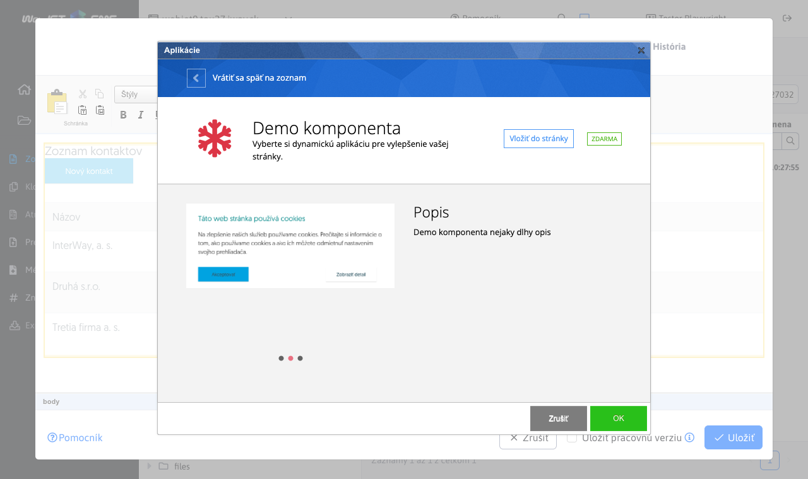
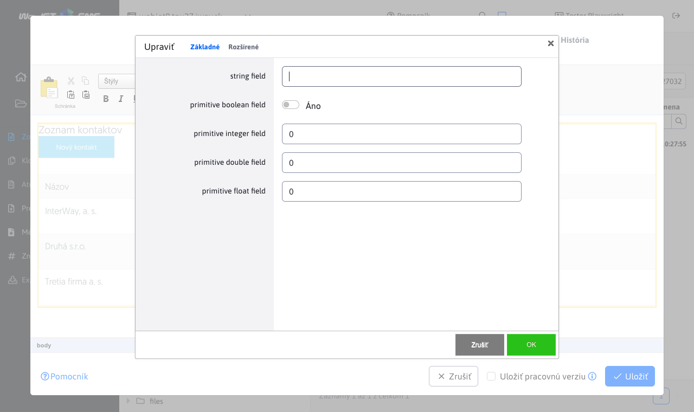

# Zobrazenie v zozname aplikácií

Ak máte vytvorenú aplikáciu môžete ju jednoducho zobraziť v zozname aplikácií v editore. Na fotke obrazovky vidno aplikácie Kontakty a Demo komponenta, čo sú aplikácie pre WebJET napísane v [Spring](../spring-mvc/README.md).


<div class="video-container">
    <iframe width="560" height="315" src="https://www.youtube.com/embed/2r6-0zk5ZNQ" title="YouTube video player" frameborder="0" allow="accelerometer; autoplay; clipboard-write; encrypted-media; gyroscope; picture-in-picture" allowfullscreen></iframe>
</div>

## Použitie anotácie

Aby sa aplikácia zobrazila v zozname je potrebné aby jej trieda mala anotáciu ```@WebjetAppStore```, príklady:

```java
@WebjetComponent("sk.iway.demo8.DemoComponent")
@WebjetAppStore(nameKey = "Demo komponenta", descKey = "Demo komponenta nejaky dlhy opis", imagePath = "fa fa-snowflake text-danger", galleryImages = "/components/map/screenshot-1.jpg,/components/gdpr/screenshot-2.png,/components/gallery/screenshot-3.jpg")
public class DemoComponent extends WebjetComponentAbstract {
	...
}

@WebjetComponent("sk.iway.basecms.contact.ContactApp")
@WebjetAppStore(nameKey = "Kontakty", descKey = "Ukazkova aplikacia so zoznamom kontaktov", imagePath = "fas fa-address-card", galleryImages = "/components/map/screenshot-1.jpg,/components/gdpr/screenshot-2.png,/components/gallery/screenshot-3.jpg")
public class ContactApp extends WebjetComponentAbstract {
	...
}
```

Anotácia má nasledovné parametre:

- ```nameKey``` - prekladový kľúč **mena aplikácie** (v príkladoch je priamo text, odporúčame ale použiť prekladový kľúč), napr. ```components.DemoComponent.title```.
- ```descKey``` - prekladový kľúč **opisu aplikácie**, ak nie je zadaný hľadá sa prekladový kľúč zadaný ako ```nameKey.desc``` (ak ```nameKey``` končí na ```.title``` nahradí sa ```.title``` za ```.desc```).
- ```imagePath``` - cesta k obrázku **ikony** aplikácie. Môže sa jednať o súbor, alebo môže byť zadaná CSS trieda pre ikonu [FontAwesome](https://fontawesome.com/v5/search?s=solid%2Cbrands) ako ```fa fa-meno-ikony```.
- ```galleryImages``` - čiarkou oddelený zoznam obrázkov, ktoré sa zobrazia v opise aplikácie, napr. ```/components/map/screenshot-1.jpg,/components/gdpr/screenshot-2.png```.
- ```domainName``` - ak máte multi doménovú inštaláciu môžete obmedziť zobrazenie aplikácie len na zadanú doménu. Môžete zadať viac domén oddelených čiarkou.



Anotácia je prehľadávaná v nasledovných packages (vrátane pod packages):

- ```sk.iway.iwcm``` - štandardné aplikácie WebJET CMS.
- ```sk.iway.INSTALL_NAME``` - aplikácie podľa mena inštalácie (konf. premenná ```installName```), tu by ste mali mať štandardné zákaznícke aplikácie.
- ```sk.iway.LOG_INSTALL_NAME``` - aplikácie podľa mena logovania inštalácie (konf. premenná ```logInstallName```), používa sa ak máte zákaznícku aplikáciu ale nasadenú vo viacerých variantoch, alebo prostrediach.
- packages definované v konf. premennej ```springAddPackages``` - dodatočné packages pre Spring aplikácie, používa sa ak je aplikácia naprogramovaná mimo WebJET CMS, alebo používa iný prefix ako ```sk.iway```.

Aplikácie s package začínajúcim na ```sk.iway.iwcm``` sú umiestnené na koniec zoznamu aplikácií, ostatné sú umiestnené na jej začiatok. Predpokladá sa, že zákaznícke aplikácie chcete mať zobrazené na začiatku zoznamu aplikácií.

Ak chcete umiestniť aplikáciu aj do promo zoznamu (v hornej časti) upravte konf. premennú ```appstorePromo```, ktorá obsahuje zoznam kľúčov promo aplikácií.

## Parametre aplikácie

Každá aplikácia môže mať nastaviteľné parametre. Tie sú definované priamo v triede ako jej atribúty:

```java

@WebjetComponent("sk.iway.demo8.DemoComponent")
@WebjetAppStore(nameKey = "Demo komponenta", descKey = "Demo komponenta nejaky dlhy opis", imagePath = "fa fa-snowflake text-danger", galleryImages = "/components/map/screenshot-1.jpg,/components/gdpr/screenshot-2.png,/components/gallery/screenshot-3.jpg")
public class DemoComponent extends WebjetComponentAbstract {

	private String stringField;
	private Boolean booleanField;
	private Float floatField;
	...

}
```

tieto atribúty sú napojené na značku ```!INCLUDE(... stringField=hodnota, booleanField=false)!``` a používajú sa na [parametrizovanie zobrazenia aplikácie](../spring-mvc/README.md#používanie-parametrov-aplikácie).

WebJET podporuje zobrazenie nastavenia parametrov v dialógovom okne pomocou ```@DataTableColumn``` anotácií rovnako ako pre [editor štandardný datatabuliek](../../developer/datatables-editor/datatable-columns.md). Podporované sú aj karty nastavené atribútom ```tab``` anotácie. Hľadaný je prekladový kľúč s názvom ```editor.tab.MENO```.

Okrem primitívnych/základných dátových typov a ```java.util.Date``` je podporovaná konverzia objektov typu ```DocDetails/GroupDetails``` vrátane ```List``` pomocou typu poľa ```DataTableColumnType.JSON```.

Príklad použitia:



```java
package sk.iway.demo8;

import org.springframework.ui.Model;

import lombok.Getter;
import lombok.Setter;
import sk.iway.iwcm.Logger;
import sk.iway.iwcm.components.WebjetComponentAbstract;
import sk.iway.iwcm.doc.DocDetails;
import sk.iway.iwcm.doc.GroupDetails;
import sk.iway.iwcm.system.annotations.DefaultHandler;
import sk.iway.iwcm.system.annotations.WebjetAppStore;
import sk.iway.iwcm.system.annotations.WebjetComponent;
import sk.iway.iwcm.system.datatable.DataTableColumnType;
import sk.iway.iwcm.system.datatable.annotations.DataTableColumn;

import java.math.BigDecimal;
import java.util.Date;
import java.util.List;

@WebjetComponent("sk.iway.demo8.DemoComponent")
@WebjetAppStore(nameKey = "Demo komponenta", descKey = "Demo komponenta nejaky dlhy opis", imagePath = "fa fa-snowflake text-danger", galleryImages = "/components/map/screenshot-1.jpg,/components/gdpr/screenshot-2.png,/components/gallery/screenshot-3.jpg")
@Getter
@Setter
public class DemoComponent extends WebjetComponentAbstract {

	@DataTableColumn(inputType = DataTableColumnType.TEXT, tab = "basic")
	private String stringField;

	@DataTableColumn(inputType = DataTableColumnType.CHECKBOX, tab = "basic")
	private boolean primitiveBooleanField;

	@DataTableColumn(inputType = DataTableColumnType.TEXT_NUMBER, tab = "basic")
	private int primitiveIntegerField;

	@DataTableColumn(inputType = DataTableColumnType.TEXT_NUMBER, tab = "basic")
	private double primitiveDoubleField;

	@DataTableColumn(inputType = DataTableColumnType.TEXT_NUMBER, tab = "basic")
	private float primitiveFloatField;


	@DataTableColumn(inputType = DataTableColumnType.TEXT_NUMBER, tab = "advanced")
	private BigDecimal bigDecimalField;

	@DataTableColumn(inputType = DataTableColumnType.CHECKBOX, tab = "advanced")
	private Boolean booleanField;

	@DataTableColumn(inputType = DataTableColumnType.TEXT_NUMBER, tab = "advanced")
	private Integer integerField;

	@DataTableColumn(inputType = DataTableColumnType.TEXT_NUMBER, tab = "advanced")
	private Double doubleField;

	@DataTableColumn(inputType = DataTableColumnType.TEXT_NUMBER, tab = "advanced")
	private Float floatField;

	@DataTableColumn(inputType = DataTableColumnType.DATETIME, title = "date", tab = "advanced")
    private Date date;


	@DataTableColumn(inputType = DataTableColumnType.JSON, title = "groupDetails", tab = "json", className = "dt-tree-group")
    private GroupDetails groupDetails;

    @DataTableColumn(inputType = DataTableColumnType.JSON, title = "docDetails", tab = "json", className = "dt-tree-page")
    private DocDetails docDetails;

    @DataTableColumn(inputType = DataTableColumnType.JSON, title = "groupDetailsList", tab = "json", className = "dt-tree-group-array")
    private List<GroupDetails> groupDetailsList;

    @DataTableColumn(inputType = DataTableColumnType.JSON, title = "docDetailsList", tab = "json", className = "dt-tree-page-array")
    private List<GroupDetails> docDetailsList;

    @DataTableColumn(inputType = DataTableColumnType.JSON, title = "dirSimple", tab = "json", className = "dt-tree-dir-simple")
    private String dirSimple;


	@DefaultHandler
	public String render(Model model)
	{
		Logger.debug(this.getClass(), "groupDetails="+groupDetails+" docDetails="+docDetails+" groupDetailsList="+groupDetailsList+" docDetailsList="+docDetailsList+" dirSimple="+dirSimple+" date="+date);

        model.addAttribute("test", "Toto je test");
		model.addAttribute("demoComponent", this);

		return "/components/aceintegration/demo-component/view";
	}

	/**
	 * To call this method there should be URL parameter ?save (value is not important) OR page parameter !INCLUDE(... ,defaultHandler=save)!
	 * @param model
	 * @return
	 */
	public String save(Model model)
	{
		Logger.debug(this.getClass(), "groupDetails="+groupDetails+" docDetails="+docDetails+" groupDetailsList="+groupDetailsList+" docDetailsList="+docDetailsList+" dirSimple="+dirSimple+" date="+date);

        model.addAttribute("test", "This is save method");
		model.addAttribute("demoComponent", this);

		return "/components/aceintegration/demo-component/view";
	}

	@Override
	public void init()
	{
		//There should be initialization of component
		Logger.debug(this.getClass(), "DemoComponent init");
	}

	@Override
	public String getViewFolder()
	{
		return null;
	}
}
```

Ukážkový HTML kód ```/components/aceintegration/demo-component/view.html```:

```html
<p>
    Demo component view, params:
    <br/>
    test1: <span data-th-utext="${test}"></span>
    <br/>
    stringField: <span data-th-utext="${demoComponent.stringField}"></span>
    <br/>
    primitiveBooleanField: <span data-th-utext="${demoComponent.primitiveBooleanField}"></span>
    <br/>
    primitiveIntegerField: <span data-th-utext="${demoComponent.primitiveIntegerField}"></span>
    <br/>
    primitiveDoubleField: <span data-th-utext="${demoComponent.primitiveDoubleField}"></span>
    <br/>
    primitiveFloatField: <span data-th-utext="${demoComponent.primitiveFloatField}"></span>
</p>

<p>date: <span data-th-text="${T(sk.iway.iwcm.Tools).formatDateTimeSeconds(demoComponent.date)}"></span></p>

<p>dirSimple: <span data-th-utext="${demoComponent.dirSimple}"></span></p>

<p>groupDetails: <span data-th-text="${demoComponent.groupDetails}"></span></p>

<p>docDetails: <span data-th-text="${demoComponent.docDetails}"></span></p>

<p>groupDetailsList:</p>
<ul data-th-each="grp : ${demoComponent.groupDetailsList}">
    <li data-th-text="${grp}">GroupDetails</li>
</ul>

<p>docDetailsList:</p>
<ul data-th-each="doc : ${demoComponent.docDetailsList}">
    <li data-th-text="${doc}">DocDetails</li>
</ul>
```


Príklad nastavenia [výberového poľa](../../developer/datatables-editor/datatable-columns.md#možnosti-výberového-poľa) v aplikácii Kontakty. Všimnite si aj možnosti ```@JsonIgnore``` nastavenej nad repozitárom. Inak by sa do JSON objektu pre editáciu parametrov aplikácie serializoval aj samotný repozitár, čo spôsobuje JSON chybu.


```java
package sk.iway.basecms.contact;

import javax.servlet.http.HttpServletRequest;
import javax.servlet.http.HttpServletResponse;
import javax.validation.Valid;

import com.fasterxml.jackson.annotation.JsonIgnore;

import org.springframework.beans.factory.annotation.Autowired;
import org.springframework.ui.Model;
import org.springframework.validation.BindingResult;
import org.springframework.web.bind.annotation.ModelAttribute;
import org.springframework.web.bind.annotation.RequestParam;

import lombok.Getter;
import lombok.Setter;
import sk.iway.iwcm.Logger;
import sk.iway.iwcm.PathFilter;
import sk.iway.iwcm.components.WebjetComponentAbstract;
import sk.iway.iwcm.system.annotations.DefaultHandler;
import sk.iway.iwcm.system.annotations.WebjetAppStore;
import sk.iway.iwcm.system.annotations.WebjetComponent;
import sk.iway.iwcm.system.datatable.DataTableColumnType;
import sk.iway.iwcm.system.datatable.annotations.DataTableColumn;
import sk.iway.iwcm.system.datatable.annotations.DataTableColumnEditor;
import sk.iway.iwcm.system.datatable.annotations.DataTableColumnEditorAttr;

/**
 * <p>Príkladová trieda pre komponentu - http://docs.webjetcms.sk/v2022/#/custom-apps/spring-mvc/</p>
 * <p>Trieda musí byt anotovaná @WebjetComponent, pre názov v anotácii sa musí použiť celý názov triedy aj s package</p>
 * <p>Príklad include:</p>
 * <code>!INCLUDE(sk.iway.basecms.contact.ContactApp, country="sk")!</code>
 *
 * Anotacia @WebjetAppStore zabezpeci zobrazenie aplikacie v zozname aplikacii v editore (v AppStore)
 *
 * V pripade, ze nejaka metoda ma byt dostupna len pre prihlaseneho pouzivatela, admina, prip. nejaku pouzivatelsku skupinu mozeme pouzit anotacie:
 * @PreAuthorize("@WebjetSecurityService.isLogged()") - prihalseny pouzivatel
 * @PreAuthorize("@WebjetSecurityService.isAdmin()") - admin
 * @PreAuthorize("@WebjetSecurityService.isInUserGroup('nazov-skupiny')") - patri do skupiny
 * @see sk.iway.iwcm.system.spring.services.WebjetSecurityService
 */
@WebjetComponent("sk.iway.basecms.contact.ContactApp")
@WebjetAppStore(nameKey = "Kontakty", descKey = "Ukazkova aplikacia so zoznamom kontaktov", imagePath = "fas fa-address-card", galleryImages = "/components/map/screenshot-1.jpg,/components/gdpr/screenshot-2.png,/components/gallery/screenshot-3.jpg")
@Getter
@Setter
public class ContactApp extends WebjetComponentAbstract {

    //Spring DATA repozitar
    @JsonIgnore
    private ContactRepository contactRepository;

    /**
     * Privatne vlastnosti s get/set-rami slúžia na prenesenie parametrov pageParams z !INCLUDE()! do triedy
     * Pomocou anotacie @DataTableColumn vytvarame pole pre nastavenie aplikacie
     */
    @DataTableColumn(inputType = DataTableColumnType.SELECT, tab = "basic", editor = {
        @DataTableColumnEditor(
            options = {
                //klasicky option tag
                //@DataTableColumnEditorAttr(key = "Slovensky", value = "sk"),

                //ukazka ziskania zoznamu krajin volanim statickej metody, vo value su mena property pre text a hodnotu option pola
                @DataTableColumnEditorAttr(key = "method:sk.iway.basecms.contact.ContactRestController.getCountries", value = "label:value")

                //ukazka napojenia na ciselnik, mozne je zadat meno alebo ID ciselnika, vo value su mena property pre text a hodnotu option pola
                //@DataTableColumnEditorAttr(key = "enumeration:Okresne Mestá", value = "string1:string2")
            }
        )
    })
    private String country;

    @Autowired
    public ContactApp(ContactRepository contactRepository) {
        this.contactRepository = contactRepository;
    }

    /**
     * metoda init sa vola po vytvoreni objektu a nastaveni parametrov,
     * je volana pred kazdym view volanim a umozni nastavit pripadne atributy
     * @param request
     * @param response
     */
    @Override
    public void init(HttpServletRequest request, HttpServletResponse response) {
        Logger.debug(ContactApp.class, "Init call, request.getHeader(User-Agent)="+request.getHeader("User-Agent"));
    }

    /**
     * Metóda anotovaná @DefaultHandler sa vykoná, ak v requeste nie je žiaden parameter, ktorý by sa zhodoval s názvom inej metódy v triede
     * Metóda môže mať ľubovolný názov
     * @param model
     * @param request
     * @return String URL adresa súboru ktorý bude v contente renderovaný namiesto !INCLUDE()!
     */
    @DefaultHandler
	public String view(Model model, HttpServletRequest request)
	{
        model.addAttribute("contants", contactRepository.findAllByCountry(country, null));
		return "/apps/contact/mvc/list";
	}

    /**
     * Metóda edit slúži na zobrazenie formuláru pre úpravu existujúceho záznamu
     * @param id
     * @param model
     * @param request
     * @return
     */
    public String edit(@RequestParam("id") long id, Model model, HttpServletRequest request) {
        ContactEntity contact = contactRepository.getById(id);
        model.addAttribute("entity", contact);

        //pridaj do modelu moznosti pre select country
        model.addAttribute("countries", ContactRestController.getCountries());

        return "/apps/contact/mvc/edit";
    }

    /**
     * Metóda edit slúži na zobrazenie formuláru pre úpravu existujúceho záznamu
     * @param model
     * @param request
     * @return
     */
    public String add(Model model) {
        ContactEntity contact = new ContactEntity();
        //tu mozete nastavit nejake default hodnoty
        contact.setCountry("sk");

        model.addAttribute("entity", contact);
        return "/apps/contact/mvc/edit";
    }

    /**
     * Metóda saveForm slúži na validáciu a uloženie úpravy existujúceho záznamu
     * @param entity
     * @param result
     * @param model
     * @param request
     * @return
     */
    public String saveForm(@Valid @ModelAttribute("entity") ContactEntity entity, BindingResult result, Model model, HttpServletRequest request) {
        if (!result.hasErrors()) {
            contactRepository.save(entity);
            return "redirect:" + PathFilter.getOrigPath(request);
        }
        model.addAttribute("error", result);
        model.addAttribute("entity", entity);
        return "/apps/contact/mvc/edit";
    }

}
```

## Implementačné detaily

- Datatabuľka je vložená cez ```/admin/v9/views/pages/webpages/component.pug```
- Logika pre zobrazenie administrácie je v ```/admin/skins/webjet8/ckeditor/dist/plugins/webjetcomponents/dialogs/webjetcomponet.jsp```, zobrazuje buď klasický ```editor_component.jsp```, tento automatický editor cez anotácie, alebo zoznam aplikácií.
- Pridaná metóda pre získanie zoznamu kariet z anotácie vlastností ```sk.iway.iwcm.system.datatable.DataTableColumnsFactory```
- Vytvorený nový dátový objekt pre karty ```sk.iway.iwcm.system.datatable.json.DataTableTab```
- Rest controller pre dáta aplikácie ```sk.iway.iwcm.editor.rest.ComponentsRestController```
- Nový dátový ```request``` objekt pre získanie dát aplikácie ```sk.iway.iwcm.editor.rest.ComponentRequest```
- Zoznam aplikácií sa z anotácií hľadá v ```sk.iway.iwcm.editor.appstore.AppManager.scanAnnotations```.