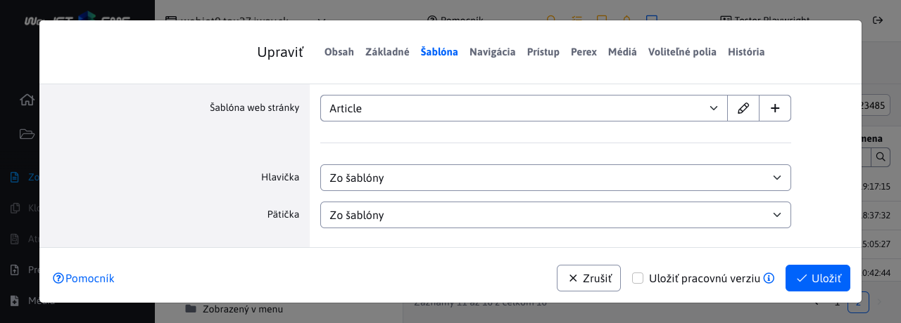
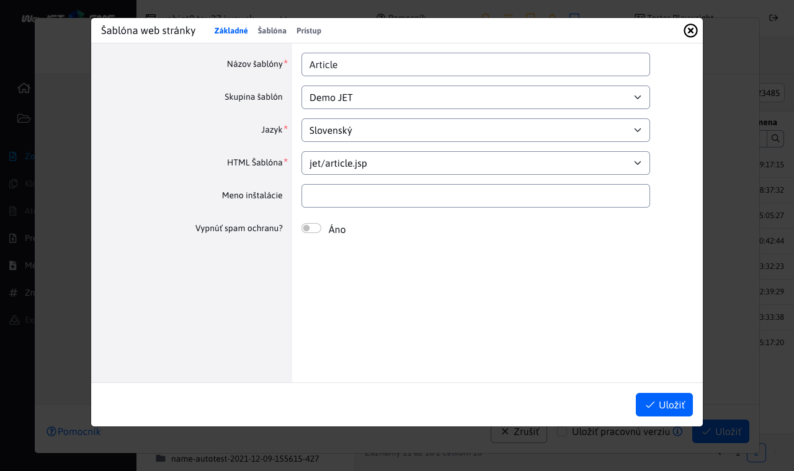

# Výberové pole s možnosťou editácie

Pre číselníkové polia je možné doplniť ikonu pre editáciu alebo pridanie nového záznamu. Pole sa zobrazuje ako štandardné výberové pole, ale obsahuje ikonu  pre editáciu zvoleného záznamu, alebo ikonu  pre pridanie nového záznamu.

Ukážka je z editácie web stránok, kde je možné vybrať šablónu vo výberovom poli **Šablóna web stránky**.



Niekedy je ale potrebné v šablóne niečo skontrolovať/upraviť, preto možnosť priamo z web stránky načítať do editora zvolenú šablónu je výhodné. Výsledkom je načítanie vnoreného dialógového okna s editáciou napr. šablóny:



## Použitie anotácie

Pole sa aktivuje nastavením atribútov editora pomocou anotácie ```@DataTableColumnEditorAttr```:

```java
@Column(name = "temp_id")
@DataTableColumn(
        inputType = DataTableColumnType.SELECT,
        editor = {
                @DataTableColumnEditor(attr = {
                        @DataTableColumnEditorAttr(key = "data-dt-edit-url", value = "/admin/v9/templates/temps-list/?tempId={id}"),
                        @DataTableColumnEditorAttr(key = "data-dt-edit-perms", value = "menuTemplates")
                })
        }
)
private Integer tempId;
```

Podporované sú nasledovné atribúty, povinné je len ```data-dt-edit-url```, vždy ale odporúčame nastaviť aj pole ```data-dt-edit-perms```:

- ```data-dt-edit-url``` - URL adresa web stránky pre editáciu záznamu, do hodnoty ```{id}``` sa prenesie aktuálne zvolená hodnota vo výberovom poli.
- ```data-dt-edit-perms``` - meno práva, ak používateľ toto právo nemá, možnosť editácie záznamu sa nezobrazí (pole sa zobrazí ako štandardné výberové pole).
- ```data-dt-edit-title``` - (nepovinné) prekladový kľúč titulku okna, ak nie je zadané použije sa názov poľa z editora.

Pri volaní web stránky je pre url možné zadať špeciálne značky pre otvorenie karty Systém, alebo Kôš:

```java
@DataTableColumnEditorAttr(key = "data-dt-edit-url", value = "/admin/v9/webpages/web-pages-list/?groupid=SYSTEM&docid={id}")
...
@DataTableColumnEditorAttr(key = "data-dt-edit-url", value = "/admin/v9/webpages/web-pages-list/?groupid=TRASH&docid={id}")
...
```

## Poznámky k implementácii

Implementácia je v súbore ```/admin/v9/npm_packages/webjetdatatables/field-type-select-editable.js``` a cez volanie ```$.fn.dataTable.Editor.fieldTypes.select.create``` upravuje pôvodné pole typu ```select``` z Datatables Editora. Úprava spočíva v pridaní tlačidiel pre editáciu a pridanie záznamu. Kliknutie na jedno z týchto tlačidiel volá funkciu ```openIframeModal``` pre otvorenie iframe dialógu.

V udalosti ```onload``` sa pridá počúvanie udalosti na otvorenie a zatvorenie okna editora vo vnorenom dialógovom okne. Pri udalosti ```WJ.DTE.close``` (čiže zatvorenie okna editora) sa zatvorí iframe dialóg a vyvolá sa obnovenie údajov datatabuľky. To spôsobí aj obnovenie hodnôt vo výberových poliach.

Pri udalosti ```WJ.DTE.open``` sa vnorenému editoru nastaví titulok okna podľa zadaného atribútu ```data-dt-edit-title```, alebo podľa mena pola v editore.

Otvorenie príslušného záznamu na editáciu zabezpečuje [datatable-opener.js](../libraries/datatable-opener.md), ktorý pre záznam s ```?id=-1``` vyvolá kliknutie na tlačidlo pridania záznamu.

Po uložení sa vykoná obnovenie údajov datatabuľky volaním ```EDITOR.TABLE.wjUpdateOptions();```. To volá na REST rozhraní ```/all``` pre získanie ```json.options``` údajov výberových polí.

### Spôsob zobrazenia

Vo vnorenom dialógovom okne nechceme zobrazovať datatabuľku, ani navigačné možnosti, ale iba samotný editor. To je zabezpečené pomocou CSS štýlov:

- v ```app-init.js``` je pre prípad okna v iframe nastavená CSS trieda ```in-iframe``` na ```html``` značke. Nastavuje sa podľa URL parametra ```showOnlyEditor=true``` ktorý sa pridáva pri otvorení dialógu k URL automaticky. Dialóg pre ostatné prípady nastavuje CSS triedu ```in-iframe-show-table```, ktorá ponechá zobrazenú aj datatabuľku.
- po inicializácii je vyvolaná udalosť ```WJ.iframeLoaded```, ktorá následne spustí kód funkcie ```onload``` [iframe dialógu](../frameworks/webjetjs.md?id=iframe-dialóg).

V súbore ```src/main/webapp/admin/v9/src/scss/3-base/_modal.scss``` je nastavené zobrazenie v režime ```html.in-iframe```, ktoré schová celý ```.ly-page-wrapper``` v ktorom je datatabuľka a celé GUI.

Keďže ale načítanie môže chvíľu trvať zobrazuje sa element ```#modalIframeLoader``` (ktorý je štandardne skrytý) a schová sa po vykonaní ```onload``` udalosti. Takto používateľ vie, že sa ešte niečo načítava (inicializuje sa editor).