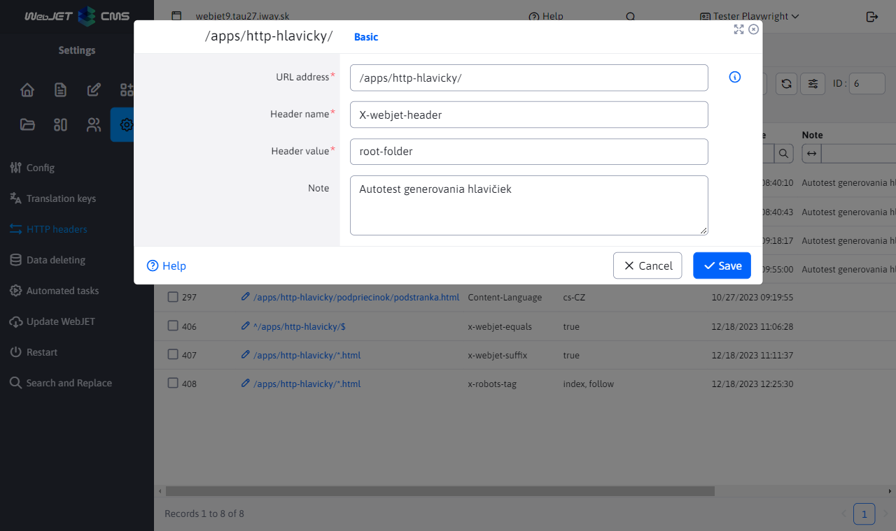

# HTTP headers

The HTTP Headers application in the Settings section allows you to define HTTP response headers (`HTTP Response Header`) based on the URLs of the displayed page. The headers are separated by domain, they are set separately for each domain.

If there are multiple headers with the same name, the header with the longest match in the URL is used. In the example you can see the different values for the header `X-webjet-header` for URLs `/apps/http-hlavicky/` a `/apps/http-hlavicky/podpriecinok/`. Value for the page `/apps/http-hlavicky/podpriecinok/stranka.html` will be used based on the longest URL match, which means it will have the value `sub-folder`.

## Editor

The header editor contains fields:
- **URL address** specifies for which URLs the header is defined. The following notation is supported:
  - `/folder/subfolder/` - header is generated for all URLs that start with the specified value.
  - `^/path/subpath/$` - header is generated for an exact URL match.
  - `/path/subpath/*.pdf` or `/path/subpath/*.pdf,*.jpg` - header is generated for URLs starting with `/path/subpath/` and ending at `.pdf` or, in the latter case, also for `.jpg`.
- **Header name** specifies the name of the header itself that is being added.
- **Header value** specifies the value of the set header.
- **Note** additional information, e.g. who requested the setting of the header and when. The value is displayed only in the administration.

As an example, use the image above with the editor of an already created record. These values specify that for each URL that starts with `/apps/http-hlavicky/`, an HTTP header is generated `x-webjet-header` with value `root-folder`.

You can use a macro in both the name and the value `{HTTP_PROTOCOL}, {SERVER_NAME}/{DOMAIN_NAME}/{DOMAIN_ALIAS}, {HTTP_PORT}`, which will be replaced by the value obtained on the server. `SERVER_NAME` is a domain name from `request.getServerName()`, `DOMAIN_NAME` a `DOMAIN_ALIAS` are the domain or alias values set in the website. The value of `{INSTALL_NAME}` represents the name of the installation. Value `{HEADER_ORIGIN}` contains the HTTP header value `origin`.

Warning: some headers are set directly via configuration variables and can sometimes change the set value (e.g. `x-robots-tag` for a page with crawling disabled), see the list for [Safety tests](../../../sysadmin/pentests/README.md#http-headers).

## Web pages

When a web page is displayed, the HTTP header is automatically set `Content-Language` by folder/template language. If you set a different value in the header application, the set value is used regardless of the folder/template language.

## Settings for files

For URLs starting with `/files,/images,/shared` the HTTP header is automatically set `Content-Language` according to the basic language of administration in the conf. variable `defaultLanguage`. In addition, they are set according to the following rules:
- if the URL contains `/en/` is set `en-GB`
- if the URL contains `/de/` is set `de-DE`
- if the URL contains `/cz/` is set `cs-CZ`
- if the URL contains `/sk/` is set `sk-SK`

Country based on language is obtained from the conf. variable `countryForLng`, if not specified, the same value as the requested language is used as the country.
