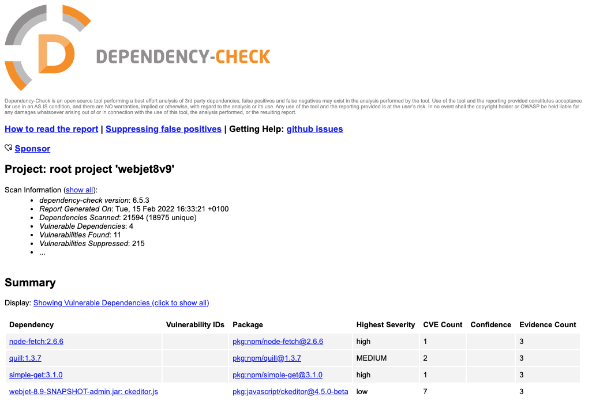

# Security

## Vulnerability scanning in libraries

The project integrates a tool [OWASP Dependency-Check](https://jeremylong.github.io/DependencyCheck/index.html) that can check for vulnerabilities in both Java and JavaScript libraries. To run the vulnerability check, run the following command:

```sh
gradlew --info dependencyCheckAnalyze
```

which creates a report in HTML format to a file `build/reports/dependency-check-report.html`. You can easily open this report in a web browser. We recommend checking it before each `release` new version.



The analysis may contain false positives. There are the following files in which exceptions are set:
- `/dependency-check-suppressions.xml` - file contains exceptions for standard WebJET CMS, never modify the file.
- `dependency-check-suppressions-project.xml` - you can add exceptions to the file for your project. There is a button directly in the report `suppress` which when clicked will display the XML code of the exception. Simply copy it to a file inside the tag `suppressions`.

The control can also be performed directly over the generated `war` archive using [cli versions](../../sysadmin/dependency-check/README.md).

## Dangerous HTML code

If you have a field on your frontend that allows HTML formatting, potentially dangerous code can be inserted into it. In a datatable, for example, a field of type `DataTableColumnType.QUILL`. By default, when retrieving a JPA object from a database, HTML tags such as `<, >` converted to HTML entities of type `&lt;, &gt;`. This is ensured by the class `XssAttributeConverter` that has the attribute set `@Converter(autoApply = true)`.

If you need to work with HTML code you need to annotate the attribute:
- `@javax.persistence.Convert(converter = AllowHtmlAttributeConverter.class)` - allows all HTML code, we recommend to use it minimally, or only when the HTML code is actually supposed to include JavaScript or other potentially dangerous code.
- `@javax.persistence.Convert(converter = AllowSafeHtmlAttributeConverter.class)` - allows only basic HTML formatting as recommended [OWASP](https://owasp.org/www-project-java-html-sanitizer/). We recommend to use this converter for all inputs where a simple WYSIWYG editor is used. `DataTableColumnType.QUILL`.
