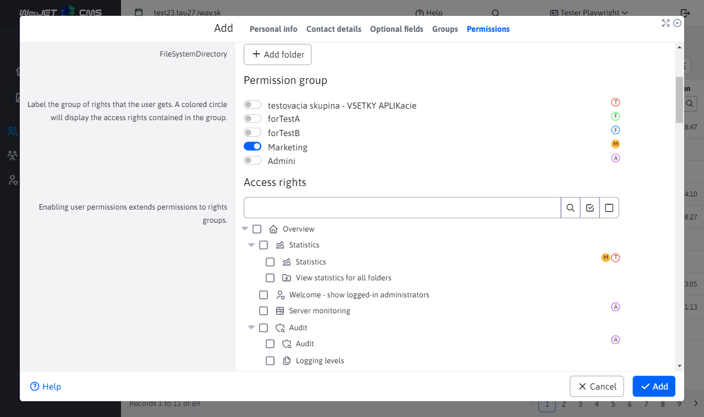

# Array jsTree - tree structure

The jsTree data field integrates the tree structure view in the editor. The tree structure allows you to use the selection field `checkbox` mark individual leaves of the tree structure.

The view is visible in the users in the Rights tab:



## Use of annotation

Annotation is used as `DataTableColumnType.JSTREE`, and the following attributes can be set:
- `data-dt-field-jstree-name` - object name with tree structure, the object must be stored as `window.name`

Full annotation example:

```java
@DataTableColumn(inputType = DataTableColumnType.JSTREE, title = "components.user.righrs.user_group_rights", tab = "rightsTab", visible = false, editor = {
    @DataTableColumnEditor(attr = {
            @DataTableColumnEditorAttr(key = "data-dt-field-jstree-name", value = "jstreePerms") }) })
private String[] enabledItems;
```

The object needs to be prepared in the model and then set to `window` object:

```java
package sk.iway.iwcm.components.users;

import com.fasterxml.jackson.core.JsonProcessingException;

import org.springframework.context.event.EventListener;
import org.springframework.stereotype.Component;
import org.springframework.ui.ModelMap;

import sk.iway.iwcm.JsonTools;
import sk.iway.iwcm.admin.ThymeleafEvent;
import sk.iway.iwcm.admin.layout.MenuService;
import sk.iway.iwcm.system.spring.events.WebjetEvent;

/**
 * Vygeneruje data do modelu pre zobrazenie zoznamu pouzivatelov
 */
@Component
public class UserDetailsListener {

    @EventListener(condition = "#event.clazz eq 'sk.iway.iwcm.admin.ThymeleafEvent' && event.source.page=='users' && event.source.subpage=='user-list'")
    private void setInitalData(final WebjetEvent<ThymeleafEvent> event) {
        try {
            setInitialDataImpl(event.getSource().getModel());
        } catch (Exception ex) {
            Logger.error(UserDetailsListener.class, ex);
        }
    }

    private static void setInitialDataImpl(ModelMap model) throws JsonProcessingException {
        model.addAttribute("jstreePerms", JsonTools.objectToJSON(MenuService.getAllPermissions()));
    }
}
```

and the settings in the pug file:

```javascript
window.jstreePerms = [(${jstreePerms})];
```

## Notes on implementation

The field is implemented in a file [field-type-jstree.js](../../../src/main/webapp/admin/v9/npm_packages/webjetdatatables/field-type-jstree.js).

Generates HTML code containing a search field with the option to un/select all selection fields. When the search is active, an icon to cancel the search is also displayed in the toolbar next to the search field. The search is activated either by clicking on the magnifying glass icon or by pressing `Enter` keys.

Here we had a problem in that pressing `Enter` captured by the vue component `webjet-dte-jstree.vue`, we solved it by changing the annotation from `<button @click="toggleModals"` at `<button @mouseup="toggleModals"`.

The name of the JSON object with the tree structure is obtained from the data attribute `data-dt-field-jstree-name` and then the JSON object itself is retrieved by calling `let jstreeJsonData = window[objName];`.

Setting the selected selection fields `checkbox` shall be performed in the capacity of `set(conf, val)`. First, the search is cancelled (so that no settings are left between closing and opening the window), all selection fields are unchecked and the tree is completely opened by calling `conf._tree.jstree('open_all');`.

The selected values are expected in the field to be `iteruje` and by calling `conf._tree.jstree('select_node', v)` the associated selection field by name is checked. The values need to be unique to avoid duplication on the page (they are the IDs of the tree structure elements), so we recommend using a unique prefix for the names. In a Java object they are passed as an array, e.g. `private String[] enabledItems;`.

Retrieving the selected values when sending is done in the function `get(conf)` where API call is used `conf._tree.jstree('get_selected')` to get an array of selected values.

The field is in `index.js` inserted and initialized with the following code:

```javascript
...
import * as fieldTypeJsTree from './field-type-jstree';
...
$.fn.dataTable.Editor.fieldTypes.jsTree = fieldTypeJsTree.typeJsTree();
```

In the file `_modal.css` are CSS stylesheets, they modify the default CSS stylesheets for the jsTree library by forcing the use of `Font Awesome` Icons.
