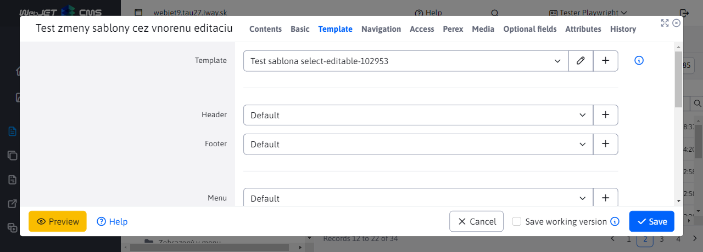

# Selection field with editing

It is possible to add an icon for editing or adding a new record to the code fields. The field appears as a standard selection field, but includes an icon  to edit the selected record, or the icon  to add a new record.

The sample is from editing web pages, where it is possible to select a template in the selection box **Website template**.



But sometimes it is necessary to check/edit something in the template, so the possibility to load the selected template directly from the web page into the editor is convenient. As a result, a nested dialog with editing e.g. the template is loaded:


## Use of annotation

The field is activated by setting the editor attributes using the annotation `@DataTableColumnEditorAttr`:

```java
@Column(name = "temp_id")
@DataTableColumn(
        inputType = DataTableColumnType.SELECT,
        editor = {
                @DataTableColumnEditor(attr = {
                        @DataTableColumnEditorAttr(key = "data-dt-edit-url", value = "/admin/v9/templates/temps-list/?tempId={id}"),
                        @DataTableColumnEditorAttr(key = "data-dt-edit-perms", value = "menuTemplates")
                })
        }
)
private Integer tempId;
```

The following attributes are supported, only mandatory `data-dt-edit-url`, but we always recommend to set the field `data-dt-edit-perms`:
- `data-dt-edit-url` - URL of the web page for editing the record, up to the value `{id}` the currently selected value in the selection field is transferred.
- `data-dt-edit-perms` - the name of the right, if the user does not have this right, the option to edit the record will not be displayed (the field will be displayed as a standard selection field).
- `data-dt-edit-title` - (optional) translation key of the window caption, if not specified the field name from the editor is used.

When calling a web page, special tags can be specified for the url to open the System or Trash tab:

```java
@DataTableColumnEditorAttr(key = "data-dt-edit-url", value = "/admin/v9/webpages/web-pages-list/?groupid=SYSTEM&docid={id}")
...
@DataTableColumnEditorAttr(key = "data-dt-edit-url", value = "/admin/v9/webpages/web-pages-list/?groupid=TRASH&docid={id}")
...
```

## Notes on implementation

The implementation is in the file `/admin/v9/npm_packages/webjetdatatables/field-type-select-editable.js` and through the call `$.fn.dataTable.Editor.fieldTypes.select.create` modifies the original type field `select` from Datatables Editor. The modification consists in adding buttons for editing and adding a record. Clicking on one of these buttons calls the function `openIframeModal` to open the iframe dialog.

In the event `onload` event listening is added to open and close the editor window in a nested dialog. For the event `WJ.DTE.close` (i.e. closing the editor window), the iframe dialog is closed and the datatable data refresh is invoked. This will also cause the values in the selection fields to be refreshed.

In an event `WJ.DTE.open` the nested editor sets the window title according to the specified attribute `data-dt-edit-title`, or by field name in the editor.

Opening the relevant record for editing is provided by [datatable-opener.js](../libraries/datatable-opener.md), which for the record with `?id=-1` will trigger a click on the add record button.

After saving, the datatable data is restored by calling `EDITOR.TABLE.wjUpdateOptions();`. It calls the REST interface `/all` for obtaining `json.options` the data of the selection fields.

### Display method

In the nested dialog, we do not want to display the datatable or navigation options, but only the editor itself. This is provided by CSS styles:
- v `app-init.js` the CSS class is set for the iframe window `in-iframe` at `html` Badge. It is set by the URL parameter `showOnlyEditor=true` which is added to the URL automatically when the dialog is opened. The dialog sets the CSS class for other cases `in-iframe-show-table`, which will also leave the datatable displayed. The parameter `showEditorFooterPrimary=true` it is possible to display a footer with an active primary button (if the save is not performed in a nested manner).
- after initialization the event is fired `WJ.iframeLoaded`, which then executes the function code `onload`, [iframe of the dialogue](../frameworks/webjetjs.md?id=iframe-dialóg).
In the file `src/main/webapp/admin/v9/src/scss/3-base/_modal.scss` is set to display in mode `html.in-iframe`that hides the whole `.ly-page-wrapper` which contains the datatable and the whole GUI.

However, since it may take a while to load, the element is displayed `#modalIframeLoader` (which is hidden by default) and hides after the `onload` events. This way the user knows that something else is being loaded (the editor is initialized).
