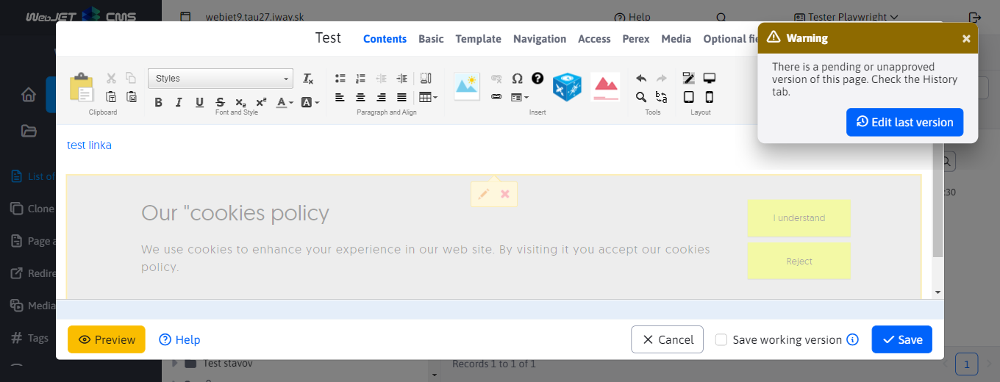

# Notifications

When working with the editor, it is possible to send a notification from the REST service that is displayed to the user.



Currently, the following operations are supported to display the notification:
- `/all` - obtaining all records
- `/{id}` - getting an entry into the editor (when using the `fetchOnCreate/fetchOnEdit`)
- `/editor` - saving the record in the editor
- `/action/{action}` - execution [server actions](../datatables/README.md#button-to-perform-a-server-action) in the table

You simply add the notification in your REST service:

```java
addNotify(new NotifyBean(prop.getText("text.warning"), prop.getText("editor.notify.checkHistory"), NotifyBean.NotifyType.WARNING, 15000));

NotifyBean notify = new NotifyBean(prop.getText("editor.approve.notifyTitle"), getProp().getText("editor.approveRequestGet")+": "+notifyText, NotifyBean.NotifyType.INFO, 60000);
addNotify(notify);
```

constructor [NotifyBean](../../../javadoc/sk/iway/iwcm/system/datatable/NotifyBean.html) class has the following parameters:
- `String title` - notification headline
- `String text` - notification text
- `NotifyType type` - notification type (`SUCCESS, INFO, WARNING, ERROR`)
- `long timeout` - number of ms for automatic closing of the notification, or 0 for disabling automatic closing

## Adding a button

A button can be added to the notification to perform an action (e.g. retrieve the last page from history). Using the API method [NotifyBean.addButton](../../../javadoc/sk/iway/iwcm/system/datatable/NotifyBean.html) you can add a button (object type [NotifyButton](../../../javadoc/sk/iway/iwcm/system/datatable/NotifyButton.html)). When the button is clicked, the specified JavaScript function is executed (it is inserted as an attribute `onlick` on the button). You must implement the definition of the called function directly in the page.

Example:

```java
NotifyBean notify = new NotifyBean(prop.getText("text.warning"), prop.getText("editor.notify.checkHistory"), NotifyBean.NotifyType.WARNING, 15000);
notify.addButton(new NotifyButton(
    prop.getText("editor.notify.editFromHistory"), //text tlacidla
    "btn btn-primary", //CSS trieda
    "ti ti-pencil", //TablerIcons ikona
    "editFromHistory("+history.get(0).getDocId()+", "+history.get(0).getHistoryId()+")") //onclick funkcia
);
addNotify(notify);
```

## Implementation details

### Backend

Notifications are stored in the REST service while it is running. `ThreadLocal` object `ThreadBean` so that they can be added at any time. They are then generated into an output JSON object:
- For `DatatableResponse` the list of notifications is added as `if(hasNotify()) response.setNotify(getThreadData().getNotify());`
- for the returned entity to `BaseEditorFields` object as `addNotifyToEditorFields(T entity);`, actual only when calling `getOne`

### Frontend

Notification display is implemented directly in `index.js` in 2 places:
- `EDITOR.on('submitSuccess', function (e, json, data, action)` - called when saved in the editor, notifications are retrieved from `json.notify`
- `_executeAction(action, ids)` - called when a server action is executed in the table, notifications are obtained from `json.notify`
- `refreshRow(id, callback)` - this call is used when `fetchOnCreate/fetchOnEdit`, notifications are obtained from `json.editorFields.notify` object

The notification display itself is implemented in the function `showNotify(notifyList)` which for each element of the notification list calls the display via [WJ.notify](../frameworks/webjetjs.md#notifications)
