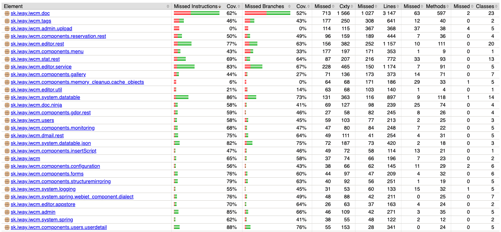

# Code coverage

> The code coverage measurement by tests expresses the percentage of code that is executed during test scenarios. The greater the percentage of code coverage by test scenarios, the lower the chance that the code contains undetected software bugs.

<div class="video-container">
  <iframe width="560" height="315" src="https://www.youtube.com/embed/vJkto5AcQeA" title="YouTube video player" frameborder="0" allow="accelerometer; autoplay; clipboard-write; encrypted-media; gyroscope; picture-in-picture; web-share" allowfullscreen></iframe>
</div>

WebJET includes an integrated library [jacoco](https://github.com/jacoco/jacoco) which keeps track of which part of the code is executed during runtime and then generates a detailed report in HTML format. In it, you can drill down through each package down to the level of java classes and methods, highlighting in detail which parts of the code were executed during the tests and which were not.

Specificity is tracking code coverage by both tests and **during the standard application server runtime**, coverage is therefore measured during normal working hours and therefore **during the execution of automated e2e tests**.

For the part of the code that did not execute during the tests, we recommend adding additional test scenarios.



You can see [last generated test coverage status](http://docs.webjetcms.sk/latest/codecoverage-report/index.html).

## Use

In standard use in VS Code, it is automatically executed after the tasks `appStart` generates a report to `./build/jacoco/report/index.html`. If it is not generated (e.g. if you stop the task via `CTRL+C`) start `gradlew generateJacocoReport` to generate the report. For the task `appStartDebug` Is `jacoco` disabled because HotSwap wasn't working, but you can decide what's more important to you.

In the terminal, you will see a link to open the report in a browser. This way you can easily see how well you are doing in covering the code of the respective services with tests while you are writing the tests.

A script is also prepared `./ant/codecoverage.sh` for complete report generation. The script runs standard JUnit tests but also automated e2e tests. The task is used `appBeforeIntegrationTest` which starts the application server in the background so that automated tests can continue. The application server is stopped using the task `appAfterIntegrationTest`, which will also trigger the generation of HTML reports.

```shell
#!/bin/sh

echo ">>>>>>>>>>> Compiling project"
cd ..
gradlew clean
gradlew compileJava
gradlew npminstall
gradlew npmbuild

echo ">>>>>>>>>>> Executing JUnit test"
gradlew test

echo ">>>>>>>>>>> Starting app server"
gradlew appBeforeIntegrationTest

echo ">>>>>>>>>>> Executing e2e/codeceptjs tests"
cd src/test/webapp
npm run singlethread
npm run parallel8
cd ../../..

sleep 30

echo ">>>>>>>>>>> Stopping app server"
gradlew appAfterIntegrationTest
```

The result is a set of `build/jacoco/test.exec` with JUnit test results and `build/jacoco/appBeforeIntegrationTest.exec` with the results of the e2e/codeceptjs tests. The report is generated by combining the results from all `.exec` files in the folder `build/jacoco`.

## Implementation details

Extension of `jacoco` is added in `build.gradle` and is set for use in tests, but also for standard application server startup. Slightly increases the load on the CPU and memory, if necessary you can disable the extension by setting the attribute `enabled` at `false` v `tasks.appStart` a `tasks.appStartDebug`.

But such a setup has the advantage that during the developer's normal work a code coverage report is continuously generated and can be checked after each application server stop using the setup `finalizedBy tasks.generateJacocoReport`. To stop the application server by default, use `gradlew appStop`. If you stop the application server e.g. by `CTRL+C` you can generate the report manually by calling `gradlew generateJacocoReport`.

Version used [jacoco](https://github.com/jacoco/jacoco/releases) is set in the variable `toolVersion`, by setting it to `+` the latest available version is automatically used.

```groovy
plugins {
    ...
    id 'jacoco'
}

jacoco {
    //set latest version
    toolVersion = "+"
}
gretty {
    ...
    afterEvaluate {
        tasks.appStart {
            file("${rootDir}/build/jacoco/appStart.exec").delete()
            jacoco {
                enabled = true
            }
            finalizedBy tasks.generateJacocoReport
        }
        tasks.appStartDebug {
            file("${rootDir}/build/jacoco/appStartDebug.exec").delete()
            jacoco {
                //enabled = true
            }
            //finalizedBy tasks.generateJacocoReport
        }
        tasks.appAfterIntegrationTest {
            finalizedBy tasks.generateJacocoReport
        }
    }
}

task('generateJacocoReport', type: JacocoReport) {

  executionData fileTree(project.rootDir.absolutePath).include("**/build/jacoco/*.exec")

  sourceDirectories.setFrom project.files(project.sourceSets.main.allSource.srcDirs)
  classDirectories.setFrom project.sourceSets.main.output

  def reportDir = project.reporting.file("${rootDir}/build/jacoco/report")
  reports {
    html.destination = reportDir
  }
  doLast {
    System.out.println "Jacoco report for server created: file://${reportDir.toURI().path}/index.html"
  }
}
```

The key is the setting `afterEvaluate` for gretty. This activates `jacoco` also for tasks `appStart` and possibly also for `appStartDebug` because [the standard is jacoco](https://gretty-gradle-plugin.github.io/gretty-doc/Code-coverage-support.html) active only for the task `appBeforeIntegrationTest`.

Task `generateJacocoReport` generates HTML report to the folder `./build/jacoco/report`. The terminal displays a link to open the file in the browser:

```groovy
gradlew generateJacocoReport

> Task :generateJacocoReport
Jacoco report for server created: file:///Users/xxx/Documents/workspace/webjet/build/jacoco/report/index.html
```

in the browser, you just need to open the above link `file:///Users/xxx/Documents/workspace/webjet/build/jacoco/report/index.html` to view the generated report.
