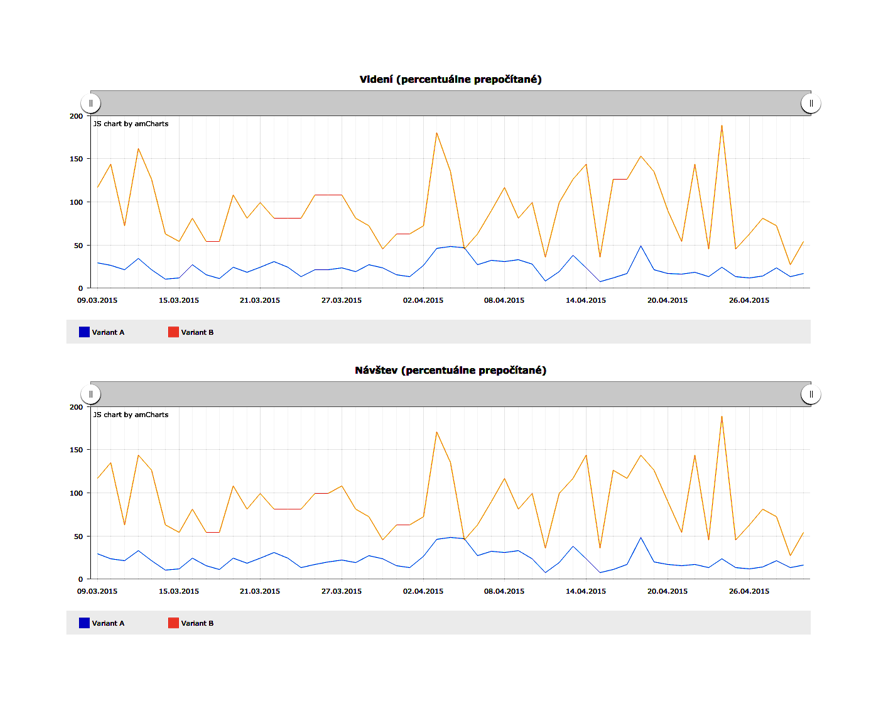

# AB testing

The AB Testing application allows you to perform AB testing of a site version. It is possible to create a B version of the page by clicking the Save as AB test button. A copy of the page will be created with a modified URL in which you can test the B version of the page. WebJET will then automatically ensure that the A and B versions of the page are displayed at the original URL in the defined ratio. Thus, the visitor still sees the original URL but is automatically shown the B version of the page instead of the A version.

## What is AB testing

- comparison of one major change
- we measure the conversion of an action
- recommended sufficient sample of at least 1000 visitors/images
- `split` test = testing a complex change

**Advantages:**
- the test is simple and quick
- identifies important objects for us
- is easily measurable
**Disadvantages:**
- can often disappoint
- it is necessary to properly design what we are testing and what should be the result
- we will test the big change step by step for longer

## How to prepare the test

Prepare a hypothesis that should improve the condition

- take advantage of statistics (high dropout page)
- brainstorming
- Survey
**What is appropriate to test:**
- header (pages, buttons)
	- concise vs descriptive
	- feature or benefit oriented
- Pictures
	- smiling people vs product photo
	- colour scheme, size
	- video
- page text
	- under headings, word highlighting
	- bullets vs paragraphs
	- benefits vs features
- colour
	- buttons, links, headings
- forms
	- number of fields
	- compulsory vs optional
	- splitting into multiple steps
- `CTA` elements (elements that the visitor clicks on to perform an action)
	- text, colour, position, method of action
- change the layout of objects
- usability
	- which will be better?
- let's not forget about the page after conversion
	- let's get more from the visitor
	- social icons, newsletter
	- bonus offer
## Creating a test

To create a B version of the page, select the original version of the page and click on the icon <i class="fas fa-restroom" /> Save as AB test. You will then create a copy of the page, which will display an icon in the Status column <i class="fas fa-restroom" />. In version B, you can edit the text of the page to test the impact of the changes.

It is also possible to test the so-called. `split` Tests. The visitor will be generated on first access `cookie` which determines what version of the page is displayed to him. If the B version is generated, all following pages that have a B version will also be displayed in the B version. This allows the visitor to navigate between multiple B version pages.

In the AB Testing application it is possible to set the ratio between A and B version, technical URL names `suffixu` and the name of the cookie, the validity of the cookie and, most importantly, AB testing is switched on and off.

## Measurement of results

- we measure page/action after conversion
- split test will enable B version of thank you page
- before the test, let's be clear about what we are going to measure and how we are going to measure it
- even a reduction in conversion is a test success
In the AB Testing application, the table displays a list of sites that have version B with the option to display a version comparison chart. If you do not have a 50:50 AB version ratio WebJET will also automatically perform a ratio recalculation of visits to each version so that the numbers can be compared.

## Possible configuration variables

- `ABTesting` (default `false`) - after setting to `true` AB website testing is activated
- `ABTestingRatio` (default `50:50`) - ratio of page generation between version A and B
- `ABTestingName` (default `abtestvariant`) - a name that is added to the URL of the B version of the page to distinguish it - also used to trace the B version of the page
- `ABTestingCookieName` (default `wjabtesting`) - name `cookie` used to remember the version of the test when `split` tests - if the display decides for option B, it is remembered in `cookie` with this name and accordingly the B versions of the pages will be provided hereafter
- `ABTestingCookieDays` (default `30`) - number of days to remember the selected version in AB testing - cookie expiration time
