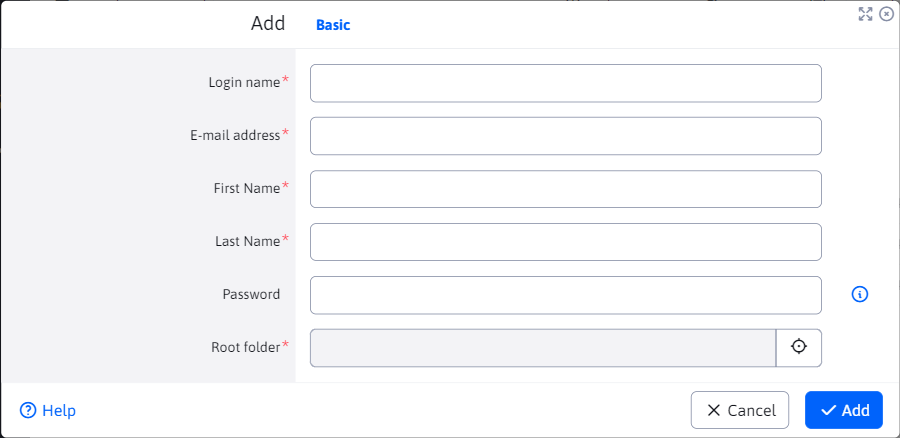

# Blogger Management

The Blogger List section is used to create and manage users of type **blogger**.

Access to this section is restricted to **administrators of bloggers**. The blogger administrator must have the Manage Bloggers right and should not belong to a user group **Blog**. In the process of creating a blogger, a new user with the necessary rights to create articles is created.

In addition, there must be [user group](../../../admin/users/user-groups.md) called `Blog`. If it doesn't exist, create it before adding the first blogger.

!>**Warning:** admin bloggers do not add to the Blog user group.

If you want the blogger administrator to also have the ability to interfere with the structure and articles of individual bloggers ([List of articles](./README.md)) must also have the Blog/Article List right.

## Adding and editing a blogger

The blogger is added directly through the editor, it contains the following fields:
- Login name - this name must be unique among all users (not just bloggers).
- Email address - email address of the blogger.
- Name.
- Last name.
- Password - for a newly created user, leave the password blank, WebJET will generate the password and send it to the email. You can edit the email text by setting the page ID with the email text in the Blog user group.
- Root folder - parent (or `root`) folder, where blogger folders will be added, e.g. `/Blog`. A folder is then created for the newly created user `/Blog/LOGIN`.



You can edit the created Blogger, but you can no longer change the Website Directory and Login Name values.

If you want to see/set more information about the blogger, you can do so in the [List of users](../../../admin/users/README.md) where it is **blogger** is treated like any other user.

For security reasons, a blogger can only be deleted in the Users section as a standard user and then his articles must also be deleted.

### Basic settings

- In addition to using basic information such as First Name, Last Name, Password ... the blogger is automatically set as **Approved user**.
- As this is a user type **blogger**, is added to the User Group **Blog**.
- Gets rights to enter the admin section (web site administration).
- Gets rights to Upload files to directories
  - `/images/blog/LOGIN`
  - `/files/blog/LOGIN`
  - `/images/gallery/blog/LOGIN`
- Gets access rights, such as some rights to web pages and directories. In particular, it needs these rights to work with articles. You can read more about articles in [List of articles](./README.md).
- Bonus rights can be added if you edit the constant before creating the blogger `bloggerAppPermissions` about the rights you want it to be allowed after creation.

### The structure of a blogger

For each new user type created **blogger** will automatically create a folder structure where it can add new articles or expand this structure further.

The folder where this structure is created was given by the Root Folder parameter when creating the blogger. In this folder, a sub-folder will be created with a name corresponding to the value of the Login name of the given blogger. Since each user must have a unique login name (`login`), there cannot be a situation with a collision of folder names. For each such folder created, another sub-folder/section called **Uncategorized**.

Example:

If as **Root folder** was elected `/Aplikácie/Blog/` so after creating a blogger with a login name `bloggerPerm`, such a structure will be created in the web page section:

```
- /Aplikácie/Blog/
  - /Aplikácie/Blog/bloggerPerm
    - /Aplikácie/Blog/bloggerPerm/Nezaradené
```

In these folders will be automatically created 3 web pages (articles).2 will have the same name as the folders in which they will be created with the addition that they will contain an application for listing articles in that section, one page is a sample blog article.

On the main page of each folder there is an application with a list of articles, which is technically [news list](../news/README.md). Standard parameters can be adjusted in [Translation keys](../../../admin/settings/translation-keys/README.md) with key `components.blog.atricles-code`.

### Rights to directories and pages

Since the blogger must be able to see the directories and articles that have been created for him, he automatically gains the right to his main folder. This means that he will be able to see and edit the existing structure that has been created for him, but he will not be able to get elsewhere. His main folder is the one whose name is the same as his login name.

Read more about the structure adjustment and the article here [List of articles](./README.md).

### Enter the Discussion section

Each blogger user is also allowed to enter the section [Discussion](../forum/README.md) to manage the discussion under individual articles.

## Template settings

Individual articles are created in the standard tree structure of web pages. We recommend preparing a separate template for the blog. If you also want to use the discussion, put it in the template in an available field/footer so that the discussion appears in each article.

Enter the following code in the discussion page:

```html
!INCLUDE(/components/forum/forum.jsp, type=open, noPaging=true, sortAscending=true, isBlog=true)!
```

Parameter `isBlog=true` disables the discussion for the folder's main page (where the list of articles in the folder is typically located).

In the header page, you can use the code to generate a menu offset from the root folder with the parameter `startOffset`:

```html
!INCLUDE(/components/menu/menu_ul_li.jsp, rootGroupId=1, startOffset=1, maxLevel=1, menuIncludePerex=false, classes=basic, generateEmptySpan=false, openAllItems=false, onlySetVariables=false, rootUlId=menu, menuInfoDirName=)!
```

this will cause the menu to be generated with an offset of the specified number of folders, so only the sections/folders for the currently displayed blog will be displayed in the menu.

In the Blog section, the Template tab is not displayed when editing an article, so the blogger cannot change/set the template by default. The default one for the root folder is used.
