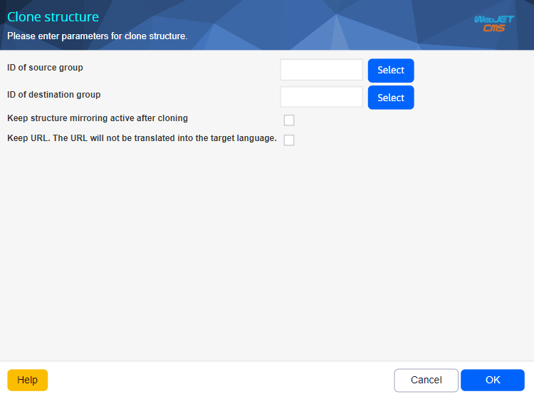
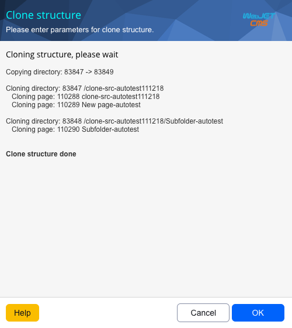

# Cloning structure

Using Structure Cloning, we can clone the entire contents of a directory in pages to another directory without having to recreate the entire directory structure. This option is available in the **Website** Like **Cloning structure**. When you select this option, the cloning action window appears. It is typically used to create a new language version of a web site from an existing version. The language is taken from the source and destination folder settings.

To perform the cloning action, you need to specify the source folder ID (which folder to clone) and the destination folder ID (where to clone the source folder to). You can specify the folder IDs directly if you remember them, or you can use the `Vybrať`, which opens a new window with a tree structure of folders, where you can select a specific folder by clicking on its name.

Cloning itself uses [Mirroring the structure](../docmirroring/README.md) a [Automatic translation](../../../admin/setup/translation.md). This means that when you start cloning, the selected folders (if they are not already) are automatically linked by the configuration variable `structureMirroringConfig`. From the source folder, all sub-folders (and all their nestings) and web pages are cloned into the destination folder, with the original and cloned folders/pages being linked together. The language is taken from the settings of the source and destination folders. Also, these folders/pages are also automatically translated if a translator is set up.

## Site disconnection

If you are using cloning to create a copy of a web site for a subsidiary or subordinate organization, for example, it is undesirable that changes are transferred between these versions. In this case, just edit the conf. variable after creating the clone `structureMirroringConfig` from which you delete the row with the set folder IDs.
