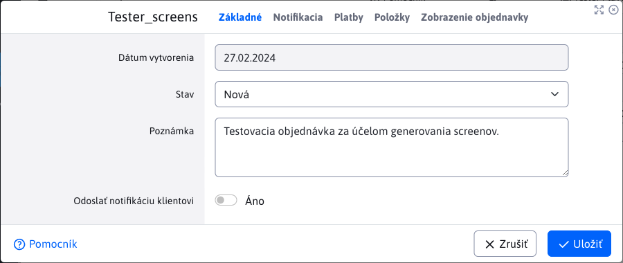
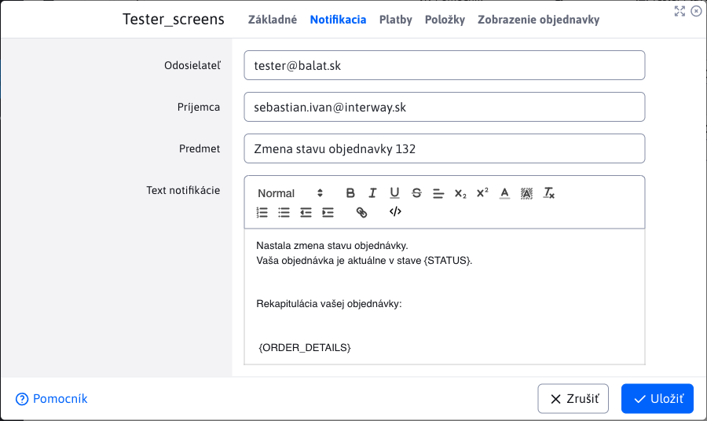
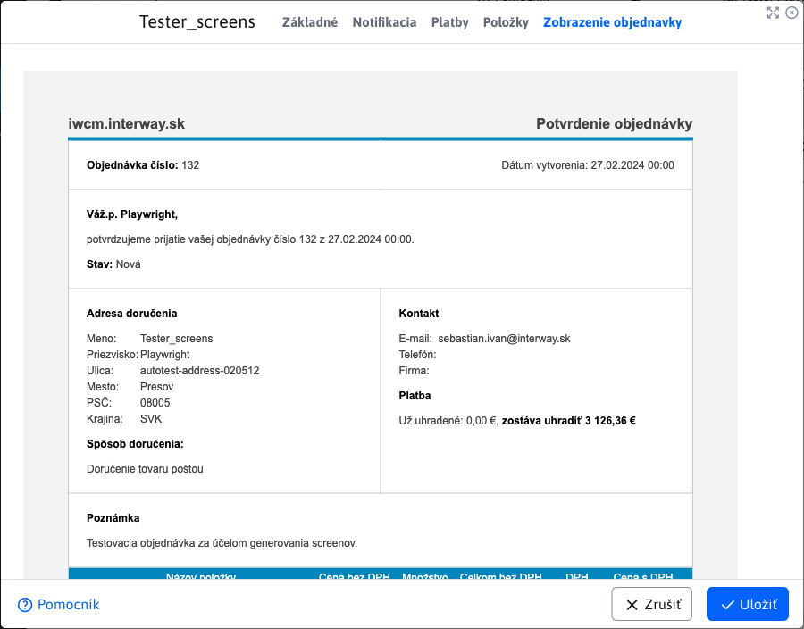

# List of orders

The Order List application provides an overview of all orders created using the e-commerce, with the possibility of managing them.

The application does not allow adding new orders by create/duplicate/import. Only edit/delete/export actions are allowed.

## Order modification

The order edit window consists of tabs:
- Basic
- Notification
- Payments
- Items
- View orders

### Tab - Basic

Provides basic order information.

The important parameter is **Status** which indicates the current status of the order it is currently in.

The displayed states are automatically available. If you wish to add new states, you can do so using the configuration variable `basketInvoiceBonusStatuses`. Add the new status as id\_status|translation\_key.

!>**Warning:** the id\_status value must be equal to or greater than 10. Added statuses with a value less than 10 will be un-ignored.

If you choose the option **Send notification to client**, a notification will be sent when the edited order is saved (see the next chapter for an overview of notifications).

### Tab - Notification

Provides a preview of the email notification to the customer, with the option to change the text. Notification will be sent only if the option is selected **Send notification to client** in the Basic tab.

**Sender** - auto-populated value with the email of the currently logged in user. It serves as the email of the sender of the notification and it is possible to change this address.

**Recipient** - the value is obtained from the form when creating an order in the e-shop. The recipient's email can also be changed.

**Subject** - auto filled value with text **Change order status (order id)**. It serves as the subject of the sent email (notification) and can be changed.

**Notification text** - body/text of the sent email. Value `{STATUS}` will be replaced by the current order status when shipped. Value `{ORDER_DETAILS}` on will be replaced by the total order summary, which can be found in the [Tab - View Order](#order-display-tab).

### Card - Payments

Provided by [overview of all payments](payments.md) to this order (in the form of a nested table) and the ability to manage payments.

### Card - Items

Provides an overview [all items of the order](items.md) and the option to manage items.

### Tab - View Order

Provides an overall overview of the order, including payments and items. This overview **cannot be edited**, is for information purposes only. It is also inserted in the sent [notifications](#notification-tab) to the user, as a replacement value `{ORDER_DETAILS}`.

When changing the values [payments](#card-payments) or values [items](#item-card) this order overview is refreshed and thus always provides up-to-date information.

## Change order status

If a payment (or multiple payments) has been added to the order that **does not cover the total amount of the order** to be paid, the background order status is automatically set to **Partially paid**.

If a payment (or multiple payments) has been added to the order that **covers the total amount of the order** to be paid, the background order status is automatically set to **Paid**.

## Order deletion

To delete an order, you must first change the status to **Cancelled**. After deletion, the related payments and order items are automatically deleted.
