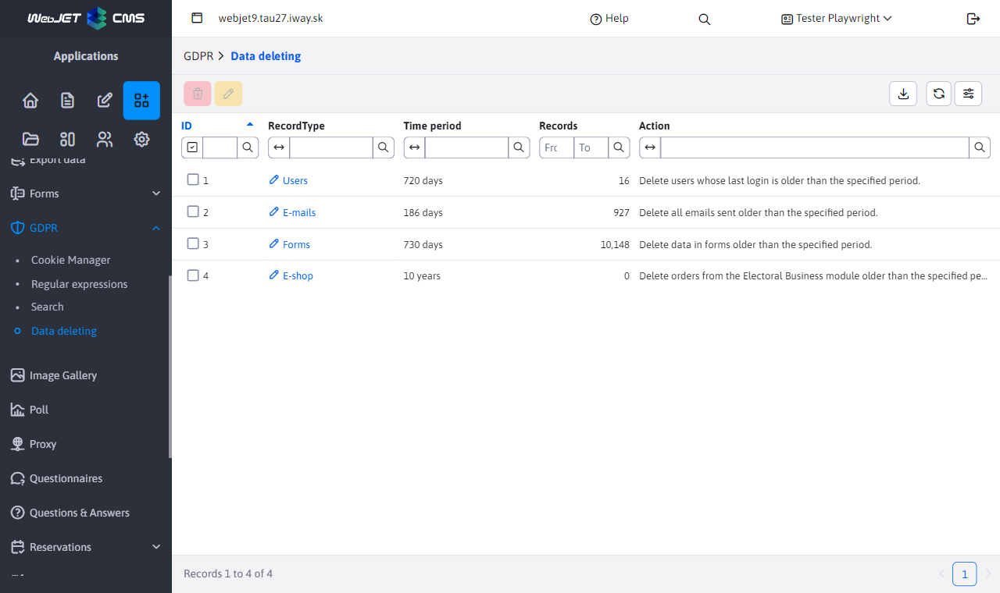

# Data deletion

The GDPR application includes a "Delete Data" node, which is used to remove old data from the database.

Allows you to lubricate:
- Accounts **inactive users** (those who have not logged in for the last X days, base set at 730days = 2years)
- **forms** (records older than X days, base set to 730days = 2years
- **orders from e-commerce** (records older than X days, base set to 10 years)
- **emails** (deleting data from bulk emailing, base set to 186 days)

It is not possible to create new records in the data table, their number is fixed by the WebJET CMS functionality. When editing, only the numeric value can be changed **Period**which indicates over what period the values will be given when the action is executed **Delete data** Deleted.

All WebJET user actions when deleting data are audited (type `GDPR_DELETE_*`) and it is possible to get information about what the operation ID was, who, when and how much data was deleted.
