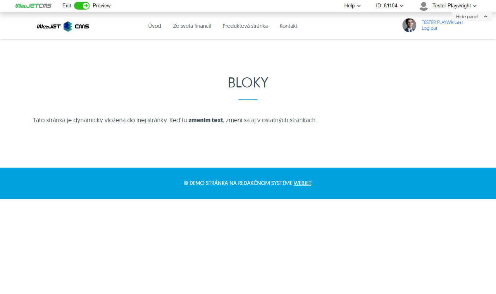

# Pre-prepared blocks

The page editor offers the possibility to insert preset blocks (`HTML` objects) per page. E.g. table, text, contact form, etc. You can also insert the content of another page into the current page (e.g. a repeating form).

To view the blocks, click on the icon  in the page editor, which displays a dialog box with block categories.

## Card - Yours

In the tab **Yours** pages generated from the directory **System** -> **Templates**. Each directory in the directory **Templates** represents a single list in the module selection field. The content can be inserted dynamically or statically. If dynamically inserted, then when the content (one page) is edited later, the change will be reflected in all the places where the content was inserted dynamically. When inserted statically, the content is duplicated and inserted as a copy, which is always edited only at a specific place in the web page.

The Your tab will appear as selected when opened if the folder contains System->Templates under folders or there are more than 2 pages in the folder.

### Application settings - OTHER

The list of available blocks is read from the Templates folder (by default in the System sub-folder, the folder ID is set in the conf. variable `tempGroupId`)
- Dynamic block - HTML code of the block is inserted by dynamic link, if the content of the block is modified it is automatically changed in all inserted parts
- Static block - HTML code of the block is inserted directly into the page as a copy, changing the original block does not affect the inserted version
- Page selection
  - A list of available blocks is displayed, e.g. Normal page, Page with title and 2 columns, etc.

### Application settings - ANOTHER PAGE with `DocID`

Allows you to select any web page for embedding

- Method of insertion
  - Directly into the page - a copy of the selected web page text is inserted
  - Dynamic link - the HTML code of the block is inserted by dynamic link, if the content of the block is modified it is automatically changed in all inserted parts
- `DocID` - selecting the page ID to insert

### Folders

If the System/Templates folder in the web pages contains subfolders, the folder names will be displayed in the selection box, i.e. in addition to Other/Other page with DocID, the individual folders with prepared blocks will be displayed in the selection box.

## Card - General

In the tab **General** contains all pre-made elements and modules that the editor cannot change or add - remove. It is a pre-prepared list containing the content elements of the web page, which are available to the editor of the web site.

### Application settings

Displaying blocks prepared by the web site designer, read from files in the folder `/components/INSTALL_NAME/htmlbox/objects` Where `INSTALL_NAME` is the installation name (conf. variable `installName`). If the folder does not exist, standard blocks from the folder are read `/components/htmlbox/objects`. There can be sub-folders in a folder, the individual blocks are in `html` files. With the same name, you also need to create `jpg` a file with a sample block.

By default, the following block groups/categories are available:
- `Columns`
- `Contact`
- `Content`
- `Download`
- `Header`

## View application

