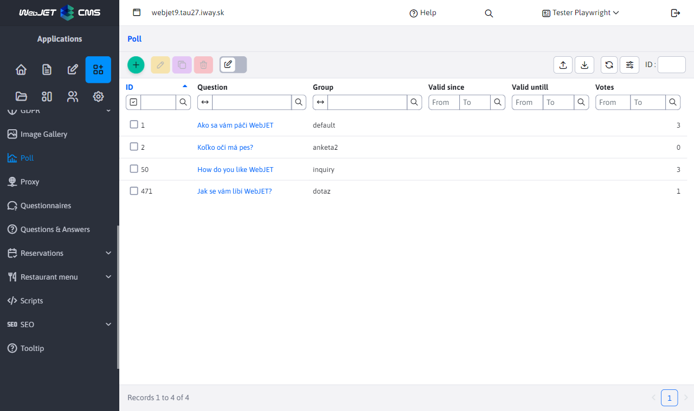
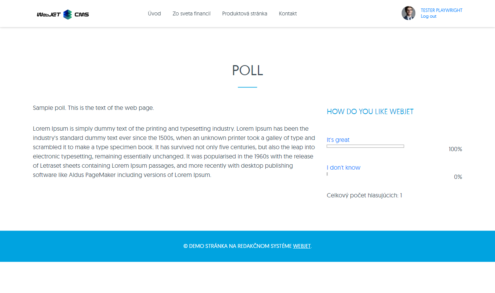
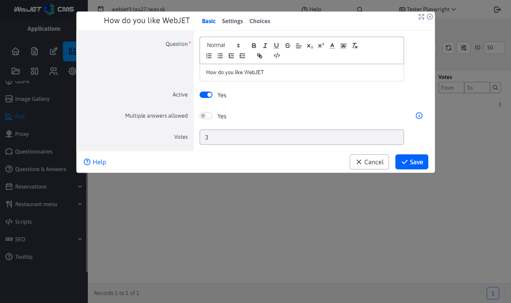

# Survey

The Poll application, allows you to create/edit/duplicate and delete polls.

We recommend displaying it on the web page in a narrower column, e.g. on the right:

The poll editor contains three tabs, which we will now describe.

## Basic

In the Basic tab there are fields:
- Question - represents the poll question.
- Active - enables/disables the display of the poll on the web page.
- Allow voting for multiple options - if enabled, the visitor can vote for multiple options on the page at the same time (by selecting the options in the selection box and then submitting the vote).
- Number of votes - the field displays the current total number of voters, it is editable in case you want to manipulate the poll.

## Settings

In the Settings tab there are fields:
- Group - you can sort polls into groups (e.g. main page, products, etc.) and then display the poll from the selected group on the page. Enter a character `*` to view existing groups.
- Post-vote text - the text that will be displayed to the visitor after a successful vote in the poll.
- Text if already voted - text that will be displayed to the visitor when a voting error occurs (e.g. if the visitor has already voted in the poll).
- The number of hours after which it is possible to vote again - the visitor will not be able to vote again for the specified number of hours. For a visitor who is not logged in, the voting information is held in cookies. Technically, this means that he can vote repeatedly when using incognito browser mode, or using multiple browsers.
- Validity from, Validity to - date restriction for displaying the survey on the website.

## Possible answers

The Possible Answers tab has a nested data table where we can add/edit/duplicate and delete possible answers for the currently open poll (question).

Defining a response contains the following fields:
- Answer to a question - a possible answer to a question from which the visitor chooses when voting.
- Image - if you set a link to an image it will appear in the poll on the web page next to the text with the answer option.
- Link - if you set the reply option to appear as a link, clicking on the reply text will show the visitor the specified web page.
- Number of votes - the field displays the current number of voters for a given answer, it is editable in case you want to manipulate the poll.

If you create responses right when you create a poll but don't save the poll, all responses to that unsaved poll will be lost.
