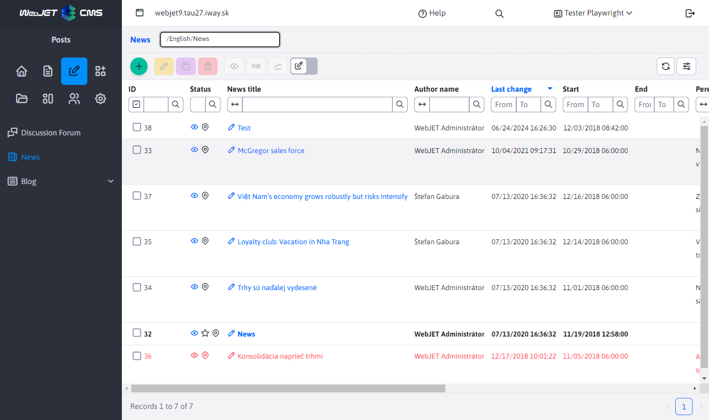
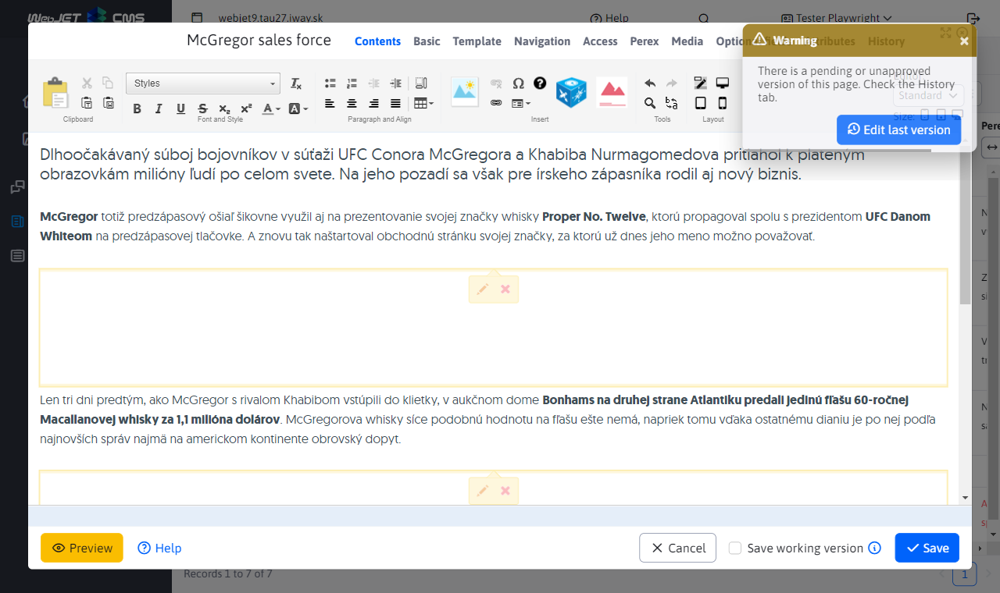
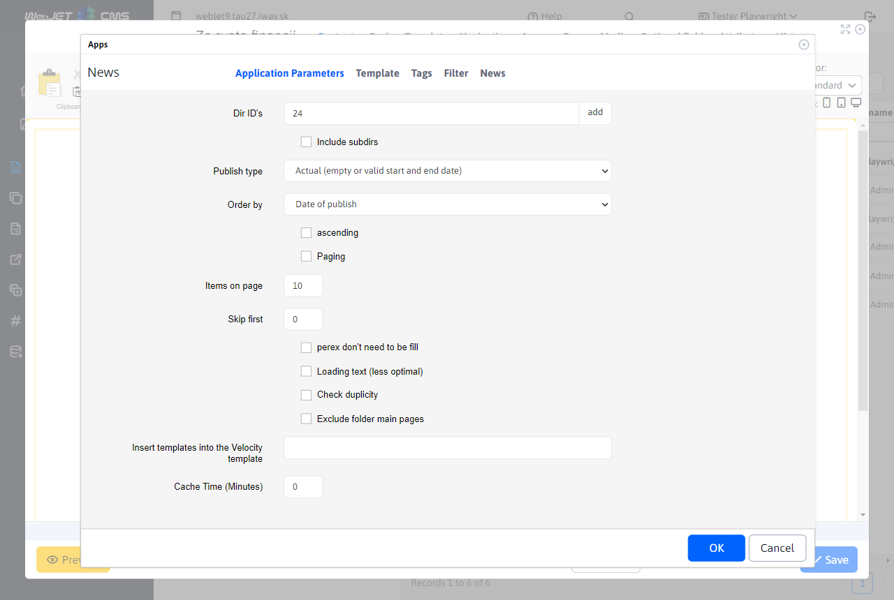
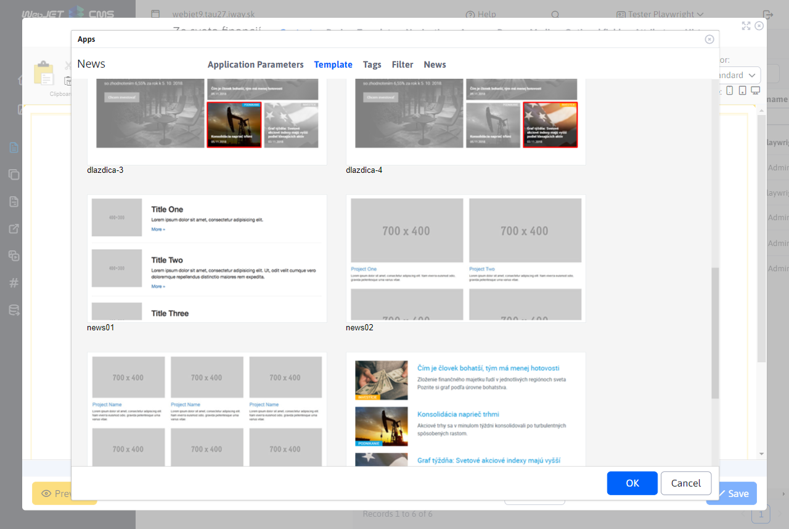
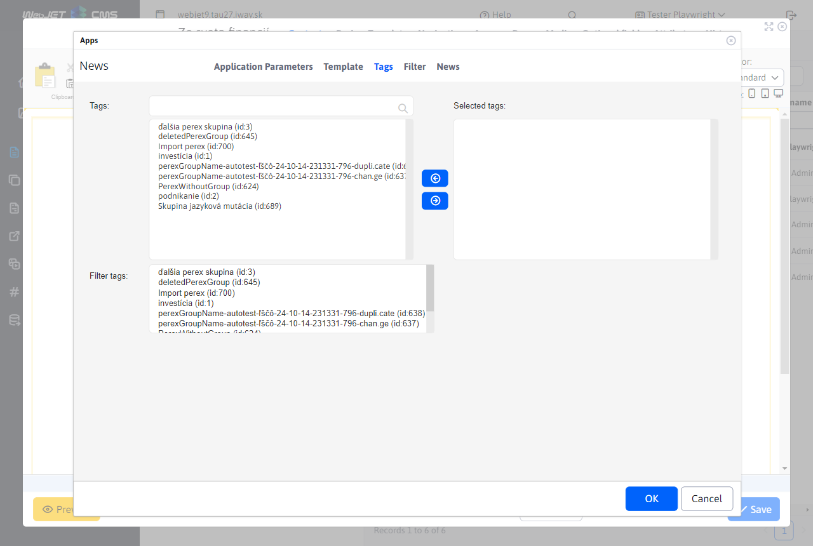
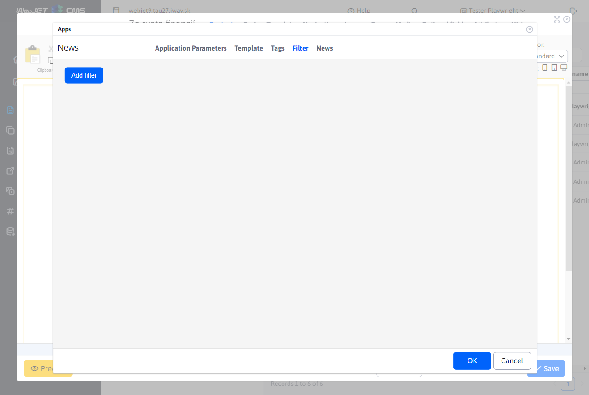
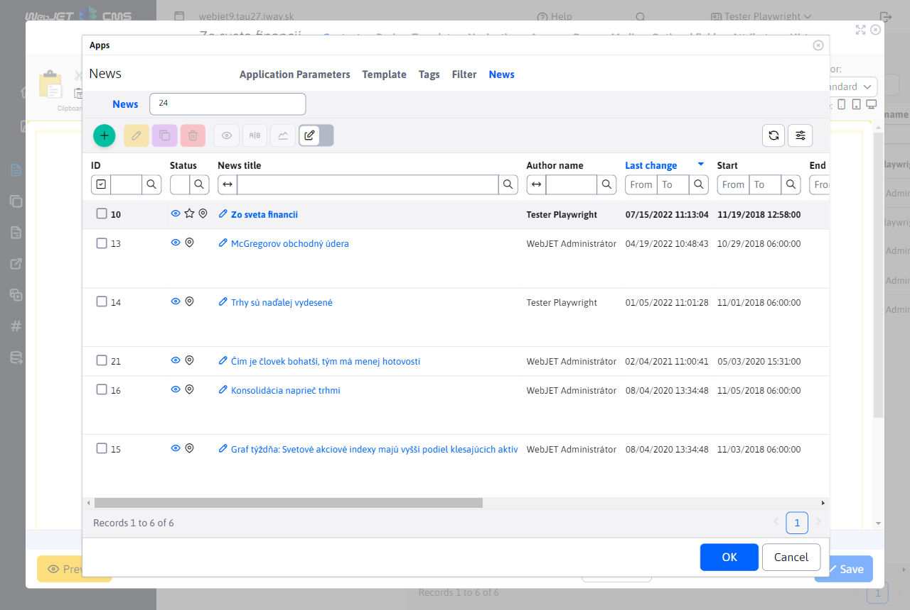

# News

The News application, puts a list of web pages in the specified folder into the page. It is used to insert a list of news, press releases, but also other similar listings (list of contact points, personal contacts, products, etc.).


# List of news

The list of news in the administration is similar to the list of web pages, but does not contain a tree structure. It is located in the menu Posts/News. At the top you can select a folder to display in the table.



The values in the folder selection field in the header are generated:
- automatically - if the conf. variable is `newsAdminGroupIds` set to empty, a list of news folder IDs is obtained by searching for the term `!INCLUDE(/components/news/` in the page bodies and by tracing the set folder ID `groupIds`.
- by conf. variable `newsAdminGroupIds`where you can specify a comma-separated list of folder IDs, e.g. `17,23*,72`, where if the folder ID ends in a character `*` news (web pages) from subfolders are also loaded when selected.
Clicking on a news title opens an editor identical to [page editor](../../webpages/editor.md).



# Setting up an application in a web page

The application embedded in the web page has the following tabs:

## Application parameters

The application parameters tab is where you set the basic behaviour of the application and its settings.



- Directory - ID of the directories (folders of web pages) from which the news (pages) will be selected. With the Add button, you can select multiple directory IDs.
- Include subdirectories - selecting this option also loads news from the subdirectories of the selected directories from the Directory field.
- Page types - selection of pages by date validity
	- Current - is a valid start and end date - only news items whose validity date (start and end of the pulication) is within the range of the current date will be displayed.
	- Old - news items that have an end date in the past (archive) will be displayed.
	- All - news items will be displayed regardless of the start and end date of their publication.
	- Next - only news items that have a future publication start date will be displayed.
	- Currently valid - only news with a filled in start date (the end date does not have to be filled in) and end date whose range is valid on the current date and time will be displayed.
- Organize by - specifies how the list of news items is arranged
	- Priority
	- Date of start of publication
	- Date of the event
	- Date of last change
	- Page title
	- Places
	- Page ID
	- Rating - the rating of the page (e.g. when using an e-shop) - the rating is set using the page rating application.
- Ascending - by default the list is ordered descending (e.g. from the newest news to the oldest), by checking this box the order will be reversed - from the oldest to the newest
- Pagination - if checked, the pagination of the list of news items will also be displayed (if the number of news items is greater than the value in the Number of items on the page field)
- Number of items on the page - number of displayed news on one page, if pagination is unchecked according to this value the number of news is retrieved from the database, suitable for example for the home page where you want to have displayed for example 3 news and a link to the list of all news, but you do not want to display pagination.
- Skip first - the number of records you want to skip when loading the list (e.g. if you have two apps underneath each other in the page with a different design, and you want to skip the number of records from the first app in the second app)
- The annotation (perex) does not have to be filled in - by default, only news items that have the annotation (perex) filled in will be displayed, if you tick this box, the news items that do not have the annotation (perex) filled in will be loaded as well.
- Load with page text (less optimal) - by default the page text is not loaded from the database, if you need it for display, check this box. However, loading will be slower and more demanding on database and server performance.
- Duplication check - if a page contains multiple news applications in one page, the list of already displayed news is recorded. The already existing ones are excluded from the list. However, the number of displayed records may not be matched afterwards, but at the same time it does not happen that the same news item is displayed multiple times on one page.
- Insert classes into `Velocity` templates - a special field for the programmer to define a Java class (program) that can then be used in a template. If you don't have exact instructions what to put in this field leave it empty.
- Buffer time (minutes) - the number of minutes the news list is remembered. Loading the news list can be demanding on the database performance, we recommend to set the buffer time to at least 10 minutes. This will speed up the page display (especially if the news list is on the home page, for example).

## Template

In the Template tab, you choose the visual way of displaying the news list.



If you have the News and press releases - Create and edit templates right, you can create a new news design template and edit existing ones. News design templates are edited in their own editor. By default, we recommend making only minor edits to the HTML code of the template and using the options offered by the context menu in the newsletter template editor.

News templates used by [Velocity Engine](https://velocity.apache.org/engine/2.3/vtl-reference.html) for display, so it is possible to define cycles, conditions and other program code. Templates with one, two and three columns are ready. We recommend that templates are only edited by users who know what they are doing and know the syntax `Velocity Engine`. We recommend starting from the prepared templates and modifying them if necessary. The standard editor should not have the right to edit the newsletter templates, they should just use them.

When editing templates, a context menu is available in the dialog box (when you right-click in the HTML Code or HTML Pagination Code field) to easily insert program blocks. Templates can be duplicated, so we recommend that you start by making a copy of an existing template and then just edit the HTML code.

Save the preview image for the template to `/components/news/images/MENO-SABLONY.png`.

Some examples of working with advanced objects:

```velocity

//nastavenie premennej podla pageParams objektu:
#set ($anonymousQuestions = $pageParams.getBooleanValue("anonymousQuestions", false))

//nastavenie premennej:
#set ($fileType = $media.mediaLink.split("[.]"))

//prechod cez zoznam perex skupin a nastavenie CSS triedy podla mena perex skupiny
<div class="grid-item grid-item-$doc.docId
#foreach($perexGroup in $doc.perexGroupNames)
    #if ($perexGroup == "news-red")
    grid-item-red
    #elseif ($perexGroup == "news-green")
    grid-item-green
    #elseif ($perexGroup == "news-blue")
    grid-item-blue
    #end
#end
" data-doc-id="$doc.docId">

//nacitanie medii a vypis
#foreach($media in $MediaDB.getMedia($doc, "files"))
    #set ($fileType = $media.mediaLink.split("[.]"))
    #if($fileType[1].equals('jpg') || $fileType[1].equals('png') || $fileType[1].equals('gif')) <a rel='wjimageviewer' href="$media.mediaLink" > </a> #end
#end

//nacitanie medii a vypis
<div class="row"> #foreach($media in $MediaDB.getMedia($doc, "files"))
    #set ($fileType = $media.mediaLink.split("[.]"))
    #if(!$fileType[1].equals('jpg') && !$fileType[1].equals('png') && !$fileType[1].equals('gif')) <a href="$media.mediaLink" class="col-md-4 text-truncate icon-$fileType[1]" target="_blank"> $media.mediaTitleSk</a> #end
#end </div>

//vypis diskusnych prispevkov
//vyzaduje pridanie sk.iway.iwcm.forum.ForumDB do parametra Vlozit triedu do Velocity sablony
#set($forumDb = $ForumDB.getForumFieldsForDoc(null, $doc.docId))
#set($commentCount = $forumDb.size())
#set($showComment = 3)
#set($e = $commentCount - $showComment)
#foreach($forum in $forumDb)
    <div class="comment" #if($foreach.count> $e)style="display:block;"#end>
    <div class="comment-header"> $forum.autorFullName <span>$forum.questionDateDisplayDate $forum.questionDateDisplayTime</span> </div>
    <p>$forum.question</p>
</div>
#end

//vypis texu podla prihlaseneho/neprihlaseneho pouzivatela
#if ($actionBean.getCurrentUser()) LOGGED #end
#if (!$actionBean.getCurrentUser()) NOT-LOGGED #end

//zoznam vsetkych stranok ako odkazy - standardne $pages pouziva format 1 2 3 ... 7 8 9, pagesAll obsahuje 1 2 3 4 5 6 7 8 9
//v pages je objekt PaginationInfo, obsahuje property label, pageNumber, url, active, actual, first, last, link a getLi() pre ziskanie celeho HTML kodu LI elementu
$pagesAll
//celkovy pocet stran strankovania, napr 23, da sa ziskat aj z $lastPage.pageNumber
$totalPages
```

## Perex Group

In the Perex Groups tab, you can create conditions for displaying news only from selected Perex Groups. They are used to mark e.g. Top news on the homepage and so on.

At the same time, if you need to exclude a perex group from the list, set it in the Do not show selected perex groups field.



This is used if you have a TOP News section at the top of your homepage where you display the news marked with the TOP flag and then below that you have a list of other news. Excluding the TOP group's perex from the second news list will prevent duplication.

## Filter

In the filter tab, you can define advanced options for displaying news according to database attributes and conditions. Between each condition is used `A/AND`, i.e. all the specified filter conditions must be met.



## News

The News tab displays a list of news items that are loaded according to the selected directories from the Application Parameters tab. You can see the list of news items and you can easily edit existing news items (edit the title, photo, or text of the news item). You can also create a new news item.



# Possible configuration variables

- `newsAdminGroupIds` - List of news folder IDs. IDs are separated by commas.
