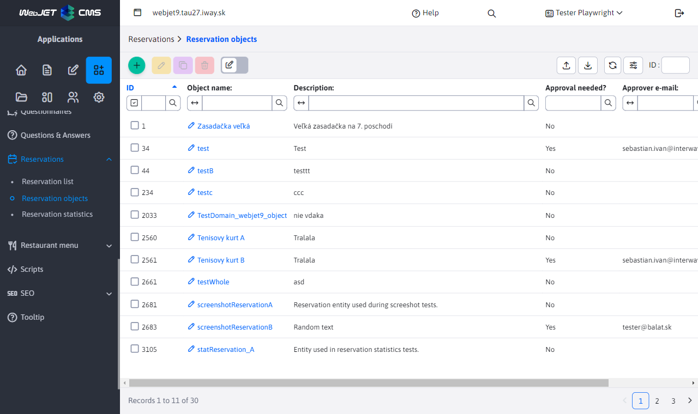
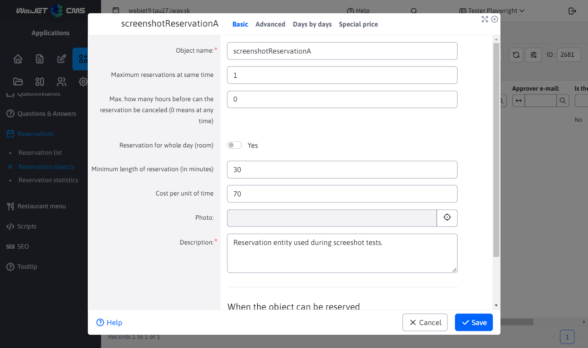
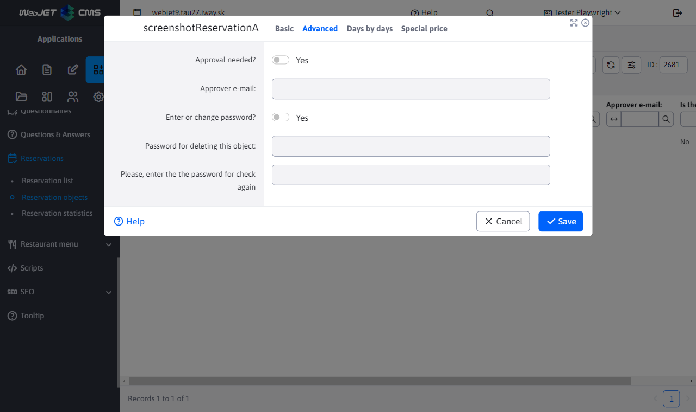
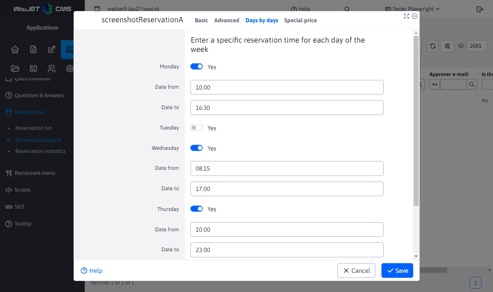
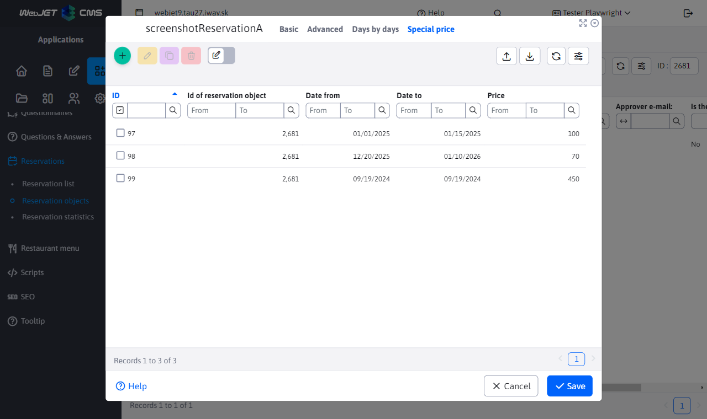
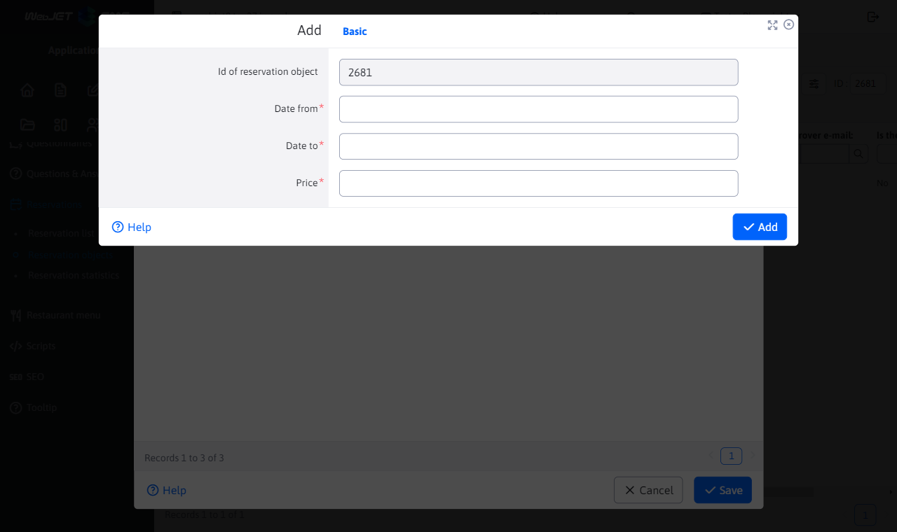

# Booking objects

The Reservation Object List application allows you to create/edit/delete reservation objects, as well as import them from an Excel file and export them to an Excel/CSV file (or even print them immediately when exporting).

The booking object editor contains 4 tabs:

## Basic

The "Basic" tab, as the name suggests, contains basic information about the reservation object. It is mandatory to enter the name of the reservation object as well as its description, the remaining parameters are optional. The lower part of the tab contains a time selection for entering the booking interval for the object. This means that this object can only be booked in the specified interval.

The "Maximum number of bookings at the same time" parameter is a very important parameter when validating new bookings - [more about validation](../reservations/readme.md). This parameter specifies how many reservations can be created over the reservation object at the same time. If this parameter is set to, for example, 3, it means that you can have a maximum of 3 bookings over this object at the same time, but it does not say how many bookings can be added during the whole interval.

Another important parameter is the switch to book a room for the whole day.

- If this option is disabled, you can specify a minimum booking length in minutes and a price for that selected unit of time. Of course, the price can be zero, in which case the reservation of this object will be free of charge. The minimum booking length must be a positive non-zero number, so at least 1 minute. This object will be bookable for at least the specified time value and up to a maximum period that is within the selected booking interval.
- If this option is enabled, you will not be able to set a minimum booking length or price per unit of time. You will only be able to enter a price per day. This means in practice that you cannot book only part of the whole interval but you book the whole interval (the whole day).

## Advanced

The "Advanced" tab contains only 2 options.

If you enable the "Approval required" option, you can enter the email of the approver of the booking object. So a booking created over this booking object will first need to be approved and a message will be sent to the specified email (see more about this in the ).

If you enable the "Enter or change password" option and enter 2 matching passwords, the user will be prompted to enter this password when attempting to delete a reservation over the reservation object. If the password is already entered, it will be replaced with a new one [more info](../reservations/readme.md).

## Times by day

The "Times by day" tab extends the possibility of entering a booking interval for an object. It allows you to specify a unique (or even the same) interval for each day of the week. In practice, weekend days such as Saturday and Sunday can have a different booking interval than weekdays, or you can have a different interval each day. If you do not enter a specific booking interval for a day of the week, the basic one set in the "Basic" tab will be used. The fields for selecting the time interval for each day will only be displayed after the option with the name of the day of the week has been enabled.

## Special price

The "Special Price" tab is only displayed when editing a booking object. In this tab there is a nested table for special prices on specific days. For example, if a booking object is set to be booked for a full day with a price of 15 euros per day, you can choose on which days of the year this price will be different (more or less, e.g. during holidays).

You can create/edit/delete or import and export records in this nested table. When creating a new special price for a specified period, the `id` of the reservation object is set automatically (without the possibility of changing it) and the remaining fields are mandatory to fill in. You enter the price and the interval in days from and until when this price should be valid.

