# Explorer

File Explorer is an application for managing and working with files.

It consists of several parts:
- toolbar
- navigation bar
- main area
- footer

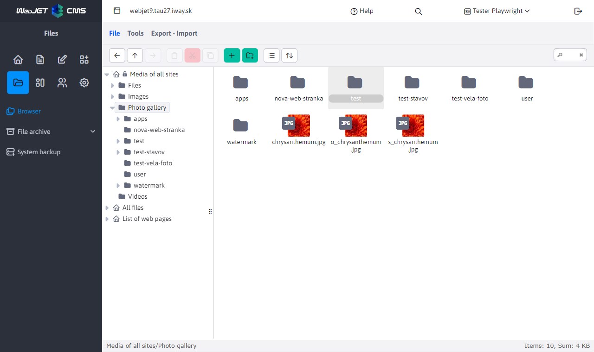

## Toolbar

The toolbar offers a wide selection of tools/functions for working with files and file folders. Each button, offers a different unique tool. **Attention**, individual buttons are only activated under specific conditions, so they are not always available. The toolbar also includes a search.

The given tools are divided into 3 tabs by the logic field:
- File
- Tools
- Export - Import

### File tab

The File tab offers basic options for work such as:

- <button class="btn btn-sm btn-outline-secondary"> <i class="ti ti-arrow-left"></i> </button> **Back** , navigation one step back in the tree structure. Option available only if another folder was selected before the currently selected folder.
- <button class="btn btn-sm btn-outline-secondary"> <i class="ti ti-arrow-up"></i> </button> **Go to parent folder**, navigation one level up in the tree structure. The option is only available if the currently selected folder has a parent folder that we can navigate to.
- <button class="btn btn-sm btn-outline-secondary"> <i class="ti ti-arrow-right"></i> </button> **Next** , navigation one step forward in the tree structure. Option available only if they used **Back**.
  
- <button class="btn btn-sm btn-outline-secondary"> <i class="ti ti-clipboard"></i> </button> **Insert**, inserts copied/cut file or folder to the currently selected location.
- <button class="btn btn-sm btn-danger"> <i class="ti ti-cut"></i> </button> **Cut**, copies the marked file /folder from the source location. After pasting into the destination location, the original is deleted from the source location.
- <button class="btn btn-sm btn-outline-secondary"> <i class="ti ti-copy"></i> </button> **Copy**, copies marked file/folder
  
- <button class="btn btn-sm btn-success"> <i class="ti ti-plus"></i> </button> **Upload files**, allows to currently selected location to upload files.
- <button class="btn btn-sm btn-success"> <i class="ti ti-folder-plus"></i> </button> **New Folder**, allows to create a new folder in the currently selected location.
  
- <button class="btn btn-sm btn-outline-secondary"> <i class="ti ti-list"></i> </button> **List**, changes view files/folders in the work area for sheet view.
- <button class="btn btn-sm btn-outline-secondary"> <i class="ti ti-layout-grid"></i> </button> **Icons** , changes the display of files/folders in the work area to an icon display.

| List | Icons |
| :--------------------: | :--------------------: |
|  |  |

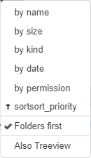

### Tools tab

Offers advanced tools for working with folders/files.

| Folder/File | Text Files | Image |
| :-----------------------: | :---------------------: | :----------------------: |
| 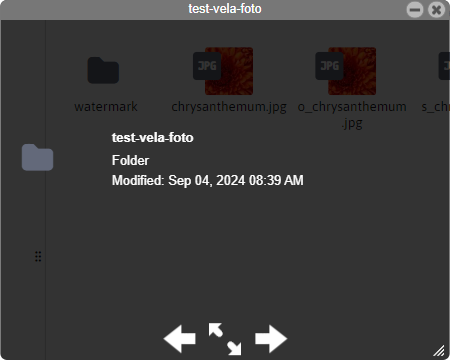 | 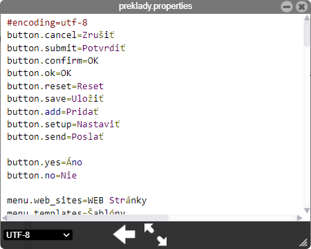 | 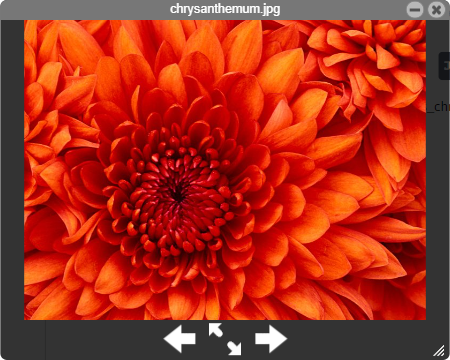 |

| Folder | File |
| :------------------: | :----------------: |
| 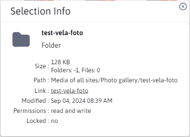 | 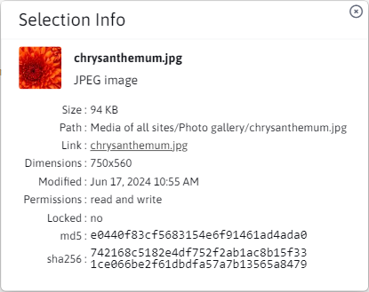 |

### Export - Import tab

Clicking on the Export - Import tab will open the file export/import/rollback dialog.

### Search

File search is available in the right side of the toolbar . Files are searched by name as well as extension. The default mode is "Here" where only files in the currently selected folder are searched. In the "In subfolders" mode, files are searched both in the current folder and in all sub-folders (and at all nesting levels).

| Mode "Here"        | Mode "In sub-folders" |
| :--------------------: | :-----------------------: |
|  | 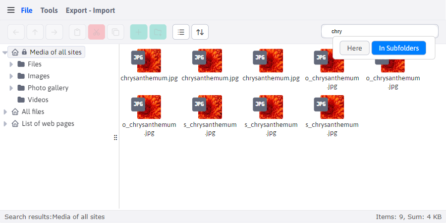 |

## Navigation bar

It contains sorted file folders in a tree structure. If folders have sub-folders (children) they can be expanded/collapsed as needed. There are also tools for navigating this tree structure **Back to**, **Go to parent folder** a **Next** from section [toolbar](#karta-súbor).

The width of the navigation bar is not fixed and can be changed as required. The tree structure also supports `Drag and Drop`, i.e. it allows you to move folders. Each folder row can contain icons:

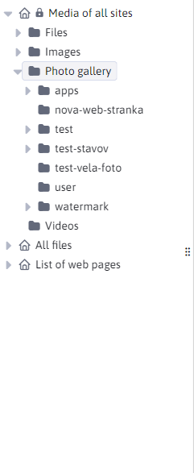

## Main area

On the main desktop we have all folders and files of the currently selected folder. **Attention**, nested folders and files are not displayed.

As well as the "Navigation Bar", the "Main Desktop" also supports `Drag and Drop` Action. **Attention**, action `Drag and Drop` also works between "Main Desktop" and "Navigation Bar", so you can move a folder/file from the desktop directly to the navigation bar folder.

**Left click**, used to label folders and files.

**Double left click**on:
- folder, performs its opening
- to a text file of types `text/plain`, `text/html`, `text/jsp`, `text/javascript`, `text/css`, `text/xml`, `text/x-js`, `text/markdown`, trigger the editing action
- to unsupported files other than `.tld`, will do nothing

**Right click** is mainly used to display the most used tools from [Toolbars](#panel-nástrojov). A small window will appear with the available tools, which may vary depending on how the element has been right-clicked.

| Right click on the desktop | Right click on a folder | Right click on a file |
| :-------------------: | :---------------------: | :-----------------: |
| 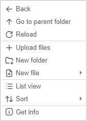 | 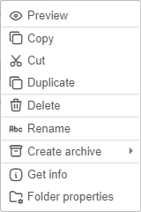    | 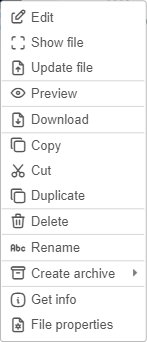   |

As you can see from the previous series of images, the tools displayed vary depending on the selected element. For example, for a file we have the option shown **Download** but not for the folder, since ONLY file downloads are allowed. You may also have noticed the tools we've listed in the [Toolbars](#panel-nástrojov) not mentioned, as they don't have their own button in the panel. These are tools:
