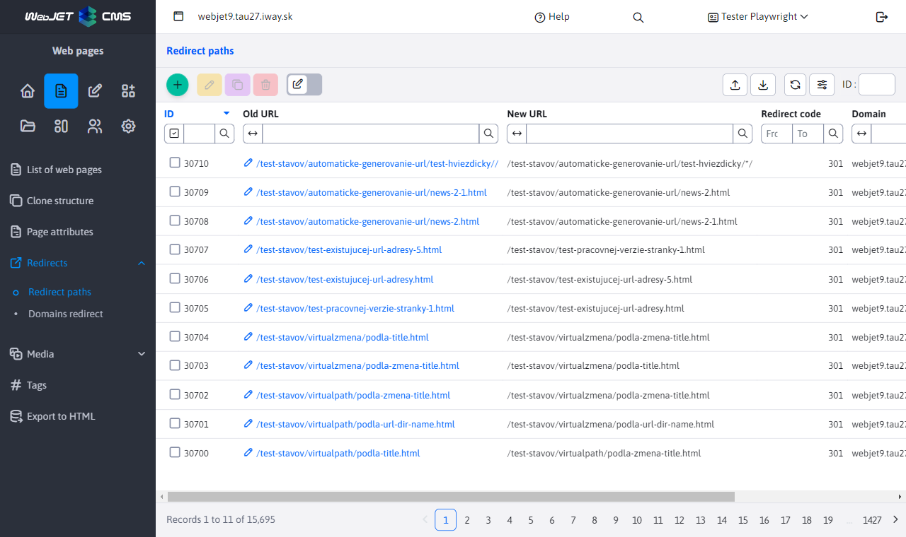
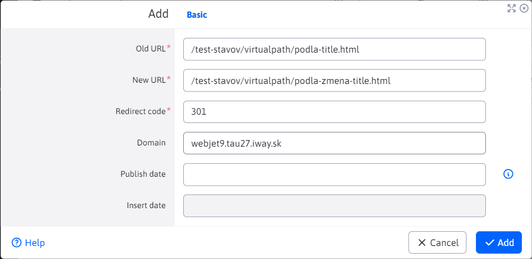
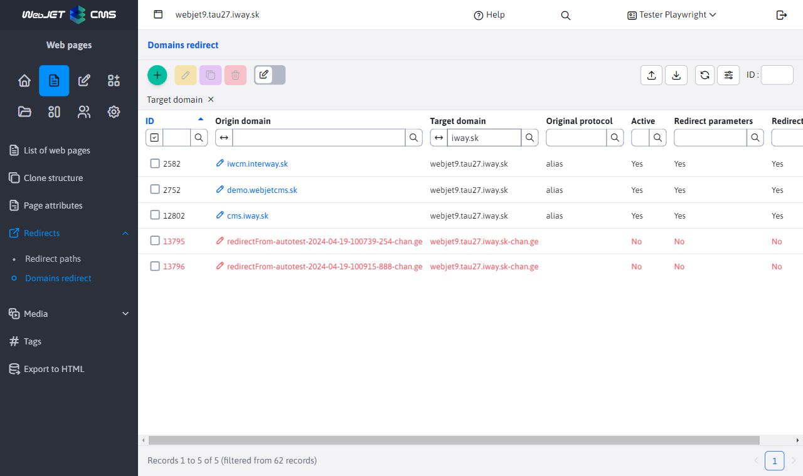

# Redirections

## Path diversions

Displays a list of existing redirects that will be executed if the specified URL does not exist. Redirects are created automatically when the URL of an existing page is changed or when the directory structure is changed.

Click on the icon **Add** a new redirect can be defined. Redirection including parameters in the URL is also supported. First a match including parameters is searched for, if no match is found, the system will try to find a match without the specified parameters.

Field value [redirection code](https://developer.mozilla.org/en-US/docs/Web/HTTP/Redirections) specifies the type of redirection, the most commonly used codes are:
- `301` permanent redirect, search engines should adjust the page address to this new value.
- `302` temporary redirection.

### Redirects via regular expressions

Using regular expressions, it is possible to set up more complex redirects of entire URL branches (e.g. after migrating an old site). Regular expression redirects are specified with a prefix `regexp:`.

The original URL can therefore be entered in the format `regexp:^\/thisiswhere\/oldfiles\/(.+)` which will be correctly translated to the new URL even with the execution/transfer of groups to the new URL in the form `/thisiswhere/myfilesmovedto/$1`

Redirection is performed, e.g. `/thisiswhere/oldfiles/page.html` at `/thisiswhere/myfilesmovedto/page.html`.

## Domain redirections

In the section **Domain redirections** you can define domain-wide redirection of requests (e.g. redirecting `domena.sk` at `www.domena.sk`).

In the domain definition dialog box, you can enter the following values:
- **Original domain** - the name of the domain you want to redirect, e.g. `domena.sk`.
- **Target Domain** - the name of the domain to which you want to redirect the request, e.g. `www.domena.sk`, we recommend to enter also `http/s` prefix `https://www.domena.sk`.
- **Original protocol** - Specifies the protocol for which the redirection is used:
  - **empty value** - redirection is used regardless of the protocol.
  - **http** - redirection is used only if the original protocol is `http` (set if you want to redirect the http version to a secure `https` version, in which case also enter a domain with the protocol in the Destination Domain field `https://` at the beginning).
  - **https** - redirection is used only if the original protocol is `https`.
  - **alias** - creates a domain alias - the value entered in the Original Domain field will be seen (and processed) internally by WebJET as the domain value in the Target Domain field. Use when e.g. migrating data from production to test, enter the value in the test environment as the original domain and enter the domain in production (without http prefix) as the target domain.
- **Active** - redirection will only be used if this field is checked.
- **Redirect parameters** - if checked, the parameters of the original HTTP request are added to the redirect, e.g. `?docid=4`.
- **Redirect the path** - if checked, the path of the original HTTP request is added to the redirect, e.g. `/produkty/webjet/novinky.html`.

