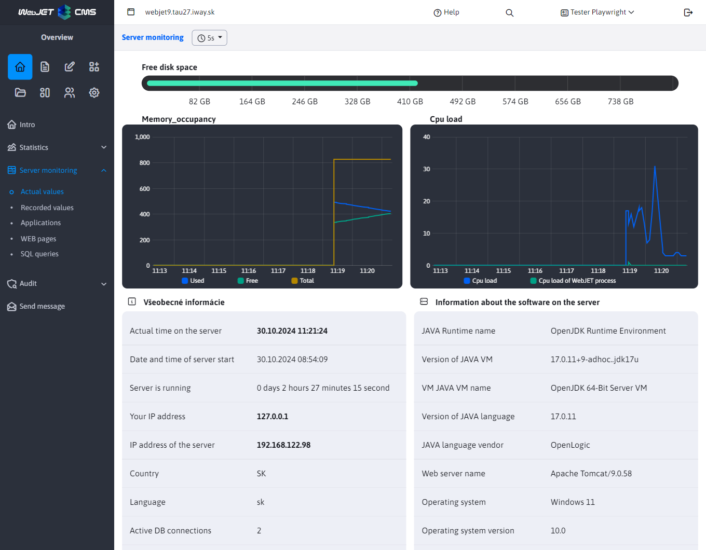
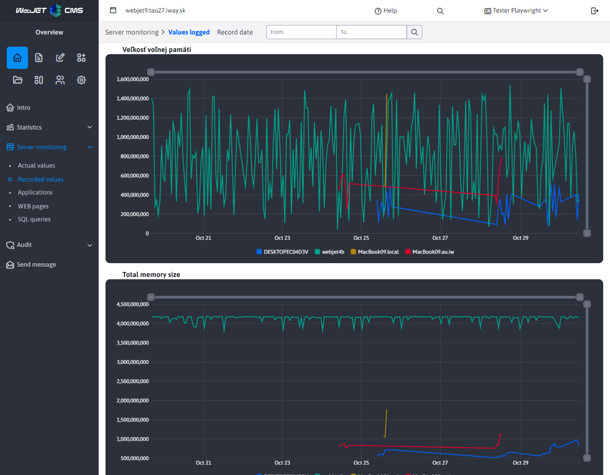

# Server monitoring

## Internal monitoring

The performance and load analysis of the server, individual applications, database queries and the pages themselves can be monitored directly in the Server Monitoring application (in the WebJET administration in the Overview section).

The module provides the following options:
- **Current values** - the current server load, memory, and number of database connections.

- **Recorded values** - a listing of historical recorded memory usage values, `sessions`, cache and database connection. For storing historical values it is necessary to set the conf. variable `serverMonitoringEnable` to the value of `true`.

After setting the configuration variable `serverMonitoringEnablePerformance` at `true` are also available:
- **Applications** - statistics on the execution of individual applications. Shows the number of executions, average execution time, number of executions from cache memory, and slowest execution.
- **WEB pages** - statistics of individual web page views. It shows the number of views, average view time, slowest and fastest views.

After setting the configuration variable `serverMonitoringEnableJPA` at `true` is also available:
- **SQL queries** - SQL query execution speed statistics. It shows the number of executions, average execution time, slowest and fastest execution and the SQL query itself.
**NOTICE:** Activating monitoring affects server performance and memory load. In addition to the ability to log values, enabling monitoring has an impact on server performance. All data except for the logged values section is held only in the server's memory, so it will start logging again when the server is restarted.
**NOTICE:** modular options **Applications**, **WEB pages** a **SQL queries** use a unique common logic, which is described in more detail in [Server monitoring by selected node](nodes-logic.md)
## Remote monitoring of the server runtime

If you need to monitor the status of WebJET via [Nagios](http://www.nagios.org)/[Zabbix](https://www.zabbix.com) or other service, WebJET provides at the URL `/components/server_monitoring/monitor.jsp` your condition. HTTP Responses **state 200 if everything is fine**, or **with a status of 500** (Internal Server Error) if **not all controls are met**.

This URL can also be called at one-second intervals, and we recommend using it within the cluster to monitor the availability of individual nodes.

**Allowed IP addresses**for which monitor.jsp responds correctly are set in the configuration variable `serverMonitoringEnableIPs`.

The component monitors the following parts:
- **WebJET initialization**, including its `preheating` (waiting for the initialization of cache objects or background tasks). The preheating time is set in the monitoringPreheatTime conf. variable (default 0). WebJET responds with the text `NOT INITIALISED` if it is not initialized correctly (e.g. there is no connectivity to the database at all when it starts, or it has an invalid license). Text `TOO SHORT AFTER START` responds during preheating time (inclusion in the cluster should wait for the background object/task cache to finish loading).
- Monitoring **availability of the database connection** - SQL select is performed from the table `documents` (specifically `SELECT title FROM documents WHERE doc_id=?`), while in the configuration variable `monitorTestDocId` is the docid of the tested page. If the SQL query fails it responds with the text `DEFAULT DOC NOT FOUND`.
- **Availability of templates** - if the list of initialized templates is less than 3 responds with the text `NOT ENOUGHT TEMPLATES`.
- **Recording of statistics data** - verifies that there are not suspiciously many records in the statistics write stack (the number of records is set in the configuration variable `statBufferSuspicionThreshold`, default 1000). If the statistics write stack contains a larger amount of data to write, this indicates either a SQL Server performance problem or a problem with background jobs. If the number of records is exceeded, it responds with the text `STAT BUFFER SUSPICION`.
- If it occurs **other error** replies with the text `EXCEPTION: xxxx`.
WebJET is also possible manually **switch to service mode** by setting the configuration variable `monitorMaintenanceMode` for real. Then monitor.jsp responds with the text `UNAVAILABLE`.

If all is well it replies with the text `OK`. For monitoring **it is sufficient to monitor the HTTP status** answers, the text is only informative for a more precise determination of the problem.

## Configuration variables

- `serverMonitoringEnable` - if set to `true`, starts monitoring the server every 30 seconds and writes these values to the table `monitoring`
- `appendQueryStringWhenMonitoringDocuments` - capture SQL parameters during monitoring `?`
- `monitorTestDocId` - The ID of the page whose database connection (name retrieval) is being tested in the component `/components/server_monitoring/monitor.jsp` that can be tested by the surveillance SW (default value: 1)
- `serverMonitoringEnablePerformance` - if set to `true`, triggers speed monitoring of SQL queries, web pages and applications (default: false)
- `serverMonitoringEnableJPA` - if set to `true`, triggers SQL query execution speed monitoring for JPA, but results in an increase in server memory load (default: false)
- `serverMonitoringEnableIPs` - List of IP addresses from which the component is available `monitor.jsp` for server monitoring (default: 127.0.0.1,192.168.,10.,62.65.161.,85.248.107.,195.168.35.)
- `monitoringPreheatTime` - The number of seconds required for the web site to warm up (cache load) after a reboot, during which it will `monitor.jsp` component returning unavailability of cluster node (default: 0)
