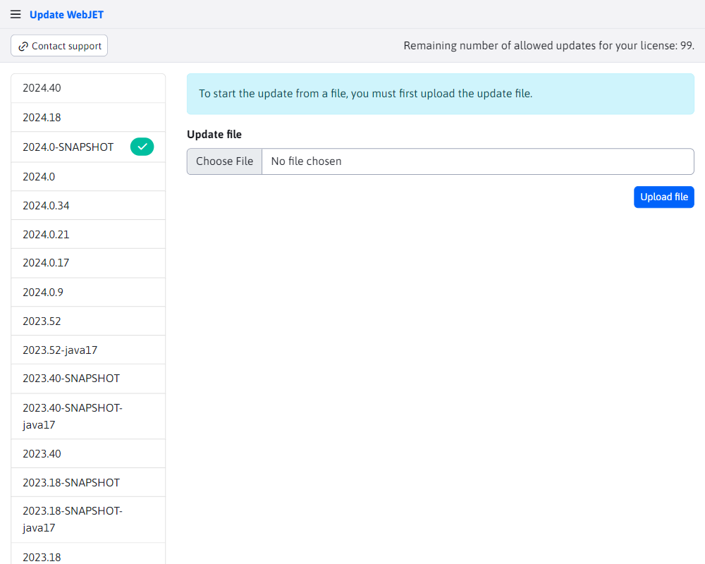

# WebJET update

The WebJET Update section is used to update WebJET versions. The left part of the screen shows a list of available WebJET versions to which your WebJET can be updated. The current version of your WebJET is marked with an icon in the list .

When you click on each version, a list of all the changes that the selected version brings will be displayed on the right side of the screen.

**Warning:** only update WebJET if you know what you are doing. Contact your hosting provider for support before updating. It may happen that WebJET does not boot properly after the update and a server restart will be required.
If your project contains additional JAR libraries you need to place them in the folder `/WEB-INF/lib-custom/`. The folder is fully replaced during the update `/WEB-INF/lib/` and thus your libraries would be deleted. This may result in an inability to boot after a reboot. If such a situation occurs copy the missing libraries to `/WEB-INF/lib/` from the advance.

## Update to a specific version

To upgrade WebJET to a specific version, you need to select the desired version and then use the button to start the upgrade 

## Updating from a file

.

.

