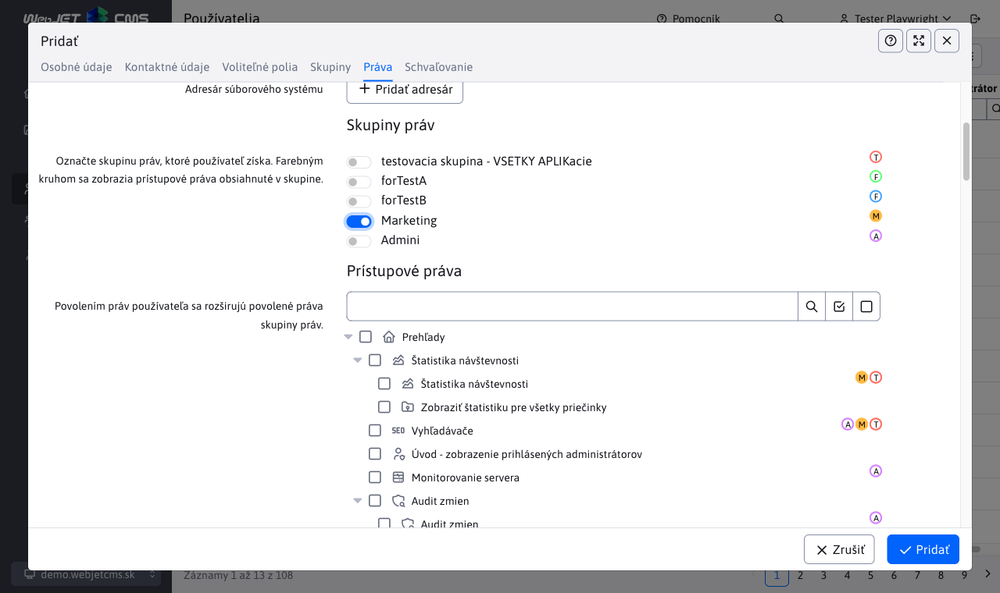

# Zoznam používateľov

## Backend

Backend je implementovaný v package ```sk.iway.iwcm.components.users```, REST controller je v triede ```UserDetailsController```.

### Triedy pre generovanie zoznamu práv

V karte Práva sa nachádza stromová štruktúra v jstree zobrazujúca jednotlivé práva. Zoznam všetkých práv sa generuje v ```MenuService.getAllPermissions()```. Použitie triedy MenuService nie je šťastné, keďže ale zdieľa viaceré metódy pre úpravu práv z WebJET verzie 8 do verzie 2021 zdalo sa nám jednoduchšie použiť ju aj pre zoznam práv.

Prvú úroveň reprezentujú sekcie rovnaké ako sú v menu, druhú jednotlivé moduly a tretiu práva vrámci modulov (hodnoty ```leftSubmenuXItemKey``` v ```modinfo.properties```).

Špecifické je generovanie CSS tried ```permgroup``` a ```permgroup-ID ```podľa skupín práv, pomocou ktorých sa zobrazujú farebné kruhy pri jednotlivých právach obsiahnutých v skupine práv.

Ak sa má zobraziť aj 3. úroveň v stromovej štruktúre (modul obsahuje pod práva) je upravená položka na 2. úrovni - k jej ID je doplnená prípona ```-leaf``` aby položka bola jedinečná a zároveň je doplnená s rovnakým názvom aj do 3. úrovne menu.

Dáta pre stromovú štruktúru práv sú do modelu vložené v ```UserDetailsListener``` ako ```model.addAttribute("jstreePerms", JsonTools.objectToJSON(MenuService.getAllPermissions()));```.

Práva, ktoré používateľ má priradené sa prenášajú v ```String[] UserDetailsEditorFields.enabledItems```. Tu je zoznam povolených práv používateľa. Technicky ale WebJET s historických dôvodov ukladá do databázy len nepovolené (zakázané) práva. V metódach ```fromUserDetailsEntity``` a ```toUserDetailsEntity``` sa zoznam práv invertuje.

## Frontend

Zobrazenie zoznamu používateľov je v súbore [user-list.pug](../../../../src/main/webapp/admin/v9/views/pages/users/user-list.pug). Obsahuje špecifické JS funkcie pre zobrazenie farebných kruhov spárovaných so skupinami práv. Pomocou kruhov sa v jednotlivých právach zobrazuje skupina práv, ktorá dané jednotlivé právo obsahuje.



Udalosti a kruhy skupín práv sa inicializujú pri prvom otvorení okna cez funkciu ```usersDatatable.EDITOR.on('opened', function (e, type, action)```. Pomocou premennej ```permGroupsColorBinded``` sa zabezpečí inicializácia len pri prvom otvorení.

V premennej ```niceColors``` je zoznam farieb kruhov (aby sa podľa poradia skupín práv zobrazili v rovnakých farbách), použité boli farby z Finder-u v MacOS. Ak je skupín práv viac ako veľkosť poľa generujú sa ďalšie farby náhodne volaním funkcie ```randomColor```.

Najskôr sa prechádza zoznam skupín práv volaním ```$(".DTE_Field_Name_editorFields\\.permGroups input").each(function(index)```. Zo vstupného poľa sa získa ID skupiny a z priradeného ```label``` elementu jej meno. V kruhoch sa zobrazuje pre lepší prehľad prvé písmeno z mena skupiny. Zároveň sa generuje definícia CSS štýlov podľa ID skupiny práv, ktorá sa následne vloží do ```head``` elementu.

Po získaní zoznamu skupín práv sa do každého LI elementu jsTree doplnia kruhy podľa CSS štýlov volaním ```$("#DTE_Field_editorFields-enabledItems li.permgroup").each(function(index)```. CSS štýly sú pre každý element stromovej štruktúry pridané na backende v ```MenuService.getAllPermissions()```, kde každý LI element obsahuje CSS triedy ```permgroup permgroup-ID```. Prechodom podľa CSS triedy ```permgroup``` sa vygeneruje do vnútra LI elementu HTML kód s farebnými kruhmi skupín práv.

Kliknutie na výberové pole skupiny práv je spracované v ```$(".DTE_Field_Name_editorFields\\.permGroups").on("click", "input", function() {``` a spôsobí pridanie CSS triedy ```permgroup-ID-checked``` na ```body``` elemente. To následne spôsobí plné zafarbenie kruhu reprezentujúce skupinu práv.