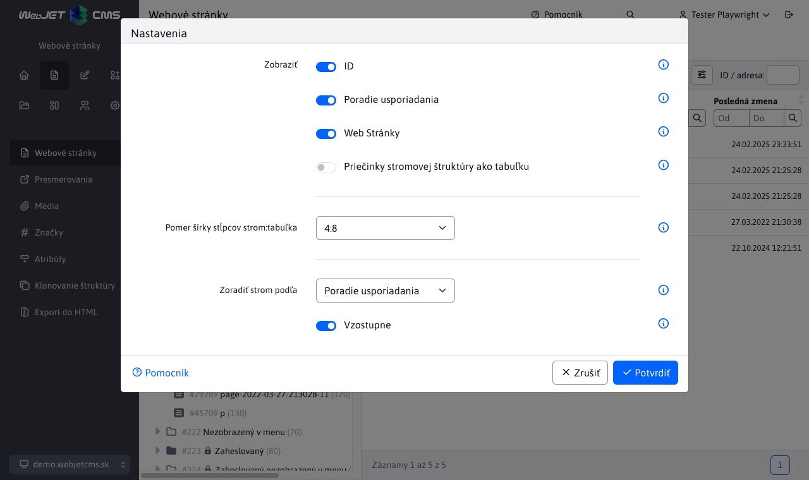

# jsTree

Knižnica [jsTree](https://www.jstree.com/) je jquery ```plugin```, ktorým zobrazujeme stromové štruktúry vo WebJETe.


<!-- @import "[TOC]" {cmd="toc" depthFrom=2 depthTo=6 orderedList=false} -->

<!-- code_chunk_output -->

- [jsTree](#jstree)
  - [Základná inicializácia v spolupráca so Spring REST](#základná-inicializácia-v-spolupráca-so-spring-rest)
  - [Konfigurácia](#konfigurácia)
    - [Vytvorenie nového REST controllera](#vytvorenie-nového-rest-controllera)
    - [Vlastné typy objektov](#vlastné-typy-objektov)
    - [Úprava zobrazenia](#úprava-zobrazenia)
    - [Zmena URL adresy REST služby](#zmena-url-adresy-rest-služby)
  - [Ikony a CSS triedy](#ikony-a-css-triedy)
    - [Spôsob použitia ikon](#spôsob-použitia-ikon)

<!-- /code_chunk_output -->


## Základná inicializácia v spolupráca so Spring REST

WebJET implementácia jsTree sa konfiguruje pomocou JSON objektu v ```app.js```.


Základný príklad:

```javascript
script.
    let jstree = $('#SomStromcek').jstree({
            'core' : {
                'check_callback' : function (operation, node, parent, position, more) {
                    if (operation === 'copy_node') {
                        return false;
                    }

                    if(operation === 'move_node') {
                        if(parent.id === '#') {
                            return false; // prevent moving a child above or below the root
                        }
                    }

                    return true; // allow everything else
                },
                'data' : function(obj, callback) {
                    let jsTreeParamValue;
                    if (jsTreeParamName === 'url') {
                        jsTreeParamValue = '/images';
                        if (obj.id !== '#' && typeof obj.original !== 'undefined') {
                            jsTreeParamValue = obj.original.virtualPath;
                        }
                    }
                    else {
                        jsTreeParamValue = 0;
                        if (obj.id !== '#') {
                            jsTreeParamValue = obj.id;
                        }
                    }

                    let data = {};
                    data[jsTreeParamName] = jsTreeParamValue;

                    if (typeof window.treeInitialJson != undefined && window.treeInitialJson != null) {
                        let items = window.treeInitialJson;
                        window.treeInitialJson = null;
                        callback.call(this, items);
                    }
                    else {
                        $.ajax({
                            url: WJ.urlAddPath(getJstreeUrl(), "/tree"),
                            method: 'post',
                            contentType: 'application/json',
                            data: JSON.stringify(data),
                            success: function (data) {
                                if (!data.result) {
                                    WJ.notifyError(data.error);
                                    return;
                                }
                                //WJ.log("calling callback, items=", data.items);
                                callback.call(this, data.items);
                            }
                        });
                    }
                }
            },
            "plugins" : [
                "dnd"
            ],
            "types" : {
                "#" : {
                    "max_children" : 1,
                    "max_depth" : 4,
                    "valid_children" : ["root"]
                },
                "root" : {
                    "icon" : "/static/3.3.8/assets/images/tree_icon.png",
                    "valid_children" : ["default"]
                },
                "default" : {
                    "valid_children" : ["default","file"]
                },
                "file" : {
                    "icon" : "glyphicon glyphicon-file",
                    "valid_children" : []
                }
            }
        }).on("move_node.jstree", function(e, data) {
            //console.log("Drop node " + data.node.id + " to " + data.parent);
            //console.log("Data", data);
            delete(data.node.children);
            //console.log("Data", data);
            let json = {
                node: data.node,
                old_parent: data.old_parent,
                old_position: data.old_position,
                parent: data.parent,
                position: data.position
            };

            $.ajax({
                url : jsTreeUrl + "/move",
                method: 'post',
                dataType: 'json',
                contentType: 'application/json',
                data: JSON.stringify(json),
                success: function(response) {
                    //console.log("response", response);
                    if (!response.result) {
                        toastr.error(response.error);

                        return;
                    }

                    // LPA: bez refreshu parenta jstree hadzalo internu chybu
                    jstree.jstree(true).refresh(data.parent);
                }
            })
        });
```

```html
<div id="SomStromcek"
    data-rest-url="/admin/rest/components/gallery/tree"
    data-rest-param-name="url">
</div>
```

## Konfigurácia

Adresa volanej REST služby sa konfiguruje pomocou HTML atribútov ```data-rest-url``` a ```data-rest-param-name``` (názov parametru poslaného do REST služby).

V objekte ```window.treeInitialJson``` je možné nastaviť inicializačné JSON dáta pre prvotné zobrazenie stromovej štruktúry. Prvé zobrazenie bude teda rýchlejšie, keďže nie je potrebné volať REST službu. Odovzdanie dát na backende je opísané v sekcii [thymeleaf](../frameworks/thymeleaf.md#vloženie-vlastných-objektov-do-modelu).

### Vytvorenie nového REST controllera
Nový controller by mal rozširovať triedu [JsTreeRestController](../../../src/main/java/sk/iway/iwcm/admin/jstree/JsTreeRestController.java), implementovať abstraktne metódy tree (položky menu), ```move``` (BE implementacia presunu položky) a ```checkAccessAllowed``` (kontrola práv používateľa pomocou requestu).

### Vlastné typy objektov

Do objektu ```JsTreeItem``` bol pridaný ```String customType```, pre definovanie vlastného typu v zákazníckych implementáciach. Použitie je rovnaké ako v prípade ```Type```, kde si vieme porovnať ```Enumy```, len v tomto prípade porovnávame ```Stringy```, metódou ```equals```.

Použitie type
```java
if (original.getType() == JsTreeItemType.GROUP) {
    // vlastny kod pre dany type
}
```

Použitie ```customType```
```java
if ("custom-jstree-item".equals(original.getCustomType())) {
    // vlastny kod pre dany custom type
}
```

### Úprava zobrazenia

Pred zobrazením stromovej štruktúry sa testuje JS objekt ```window.jstreeCustomizeData```. Ak existuje, je zavolaný. Môže upraviť prijaté dáta pred ich zobrazením.

Príkladom je zobrazenie ID a poradia usporiadania v zozname web stránok implementované v ```src/js/pages/web-pages-list/jstreesettings.js```:

```javascript
    jstreeCustomizeData(data) {
        //console.log("Customize data: ", data);

        if (data==null || typeof data == "undefined" || data.length < 1 ) return;

        const idShow = window.jstreeSettings.isIdShow();
        const priorityShow = window.jstreeSettings.isPriotityShow();

        data.forEach(function(item) {
            //console.log(item);
            if (typeof item.groupDetails != "undefined") {
                if (idShow) item.text = `<span class="id">#${item.groupDetails.groupId}</span> ${item.text}`;
                if (priorityShow) item.text = `${item.text} <span class="sortPriority">(${item.groupDetails.sortPriority})</span>`;
            } else if (typeof item.docDetails != "undefined") {
                if (idShow) item.text = `<span class="id">#${item.docDetails.docId}</span> ${item.text}`;
                if (priorityShow) item.text = `${item.text} <span class="sortPriority">(${item.docDetails.sortPriority})</span>`;
            }
        });
    }
```



### Zmena URL adresy REST služby

URL adresa REST služby sa získava z data atribútu ```data-rest-url```, ak ho potrebujete dynamicky meniť môžete vytvoriť JavaScript funkciu ```window.getJstreeUrl```, ktorá sa použije namiesto hodnoty v data atribúte:

```JavaScript
var somStromcek = null;

const queryString = window.location.search;
const urlParams = new URLSearchParams(queryString);
let dir = urlParams.get('dir')

window.getJstreeUrl = function() {
    if (somStromcek==null) somStromcek = $('#SomStromcek');
    let url = somStromcek.data("rest-url");
    if (dir != null) url = WJ.urlAddParam(url, "dir", dir);
    return url;
}
```

## Ikony a CSS triedy

Ikonu sa nastavuje pomocou [FontAwesome](https://fontawesome.com/icons?d=gallery) CSS triedy volaním [JsTreeItem.setIcon](../../../src/main/java/sk/iway/iwcm/admin/jstree/JsTreeItemState.java). Hodnota je napríklad ```ti ti-folder-filled``` alebo ```ti ti-map-pin```.

API poskytuje metódy pre nastavenie HTML atribútov na LI aj A elemente pomocou atribútov [li_attr a a_attr](https://www.jstree.com/docs/json/). Pre jednoduché pridanie CSS triedy API poskytuje metódy ```JsTreeItem.addLiClass``` a ```JsTreeItem.addAClass```. Môžete tak nastaviť CSS stavy ```is-not-public``` alebo ```fa-is-internal```.

JsTree neumožňuje zobraziť viac ikon v riadku, čo potrebujeme pre zobrazenie stavu adresárov a web stránok, tie pridávame ako HTML kód k textu pomocou metódy ```JsTreeItem.addTextIcon```.

Príklady sú v triedach [GroupsJsTreeItem](../../../src/main/java/sk/iway/iwcm/doc/GroupsJsTreeItem.java) a [DocumentsJsTreeItem](../../../src/main/java/sk/iway/iwcm/doc/DocumentsJsTreeItem.java).

### Spôsob použitia ikon

Použitie ikon má nasledovné pravidlá:

- <i class="ti ti-folder-filled" role="presentation"></i> / <i class="ti ti-map-pin" role="presentation"></i> plná ikonka stránky aj priečinku = zobrazený v menu
- <i class="ti ti-folder" role="presentation"></i> / <i class="ti ti-map-pin-off" role="presentation"></i> prázdna ikonka stránky aj priečinku = nezobrazený v menu
- <i class="ti ti-lock" role="presentation"></i> zámok = dostupné len pre prihláseného návštevníka
- <span style="color: #FF4B58">červená farba</span> = nedostupné pre verejnosť (interný adresár) alebo stránka s vypnutým zobrazením (v DT je možné použiť CSS triedu is-not-public na riadok)
- **tučné písmo** = hlavná stránka adresára (v DT je možné použiť CSS triedu ```is-default-page```)
- <i class="ti ti-external-link"></i> šípka von = stránka je presmerovaná
- <i class="ti ti-eye-off"></i> preškrtnuté oko = stránka sa nedá vyhľadať