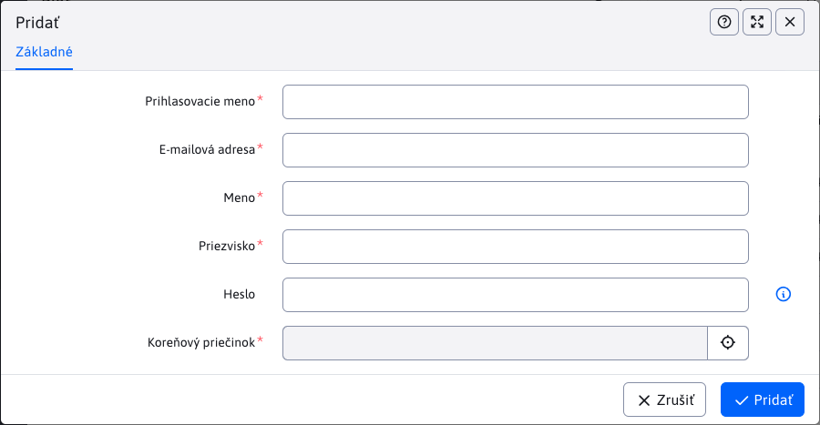

# Zoznam blogerov

Sekcia Zoznam blogerov slúži na vytváranie a správu používateľov typu **bloger**.

Prístup k tejto sekcií majú iba **administrátori blogerov**. Administrátor blogerov musí mať právo Správa blogerov a nemal by patriť do skupiny používateľov **Blog**. Pri procese vytvárania blogera sa vytvorí nový používateľ s potrebnými právami pre vytváranie článkov.

Okrem toho musí existovať [skupina používateľov](../../../admin/users/user-groups.md) s názvom `Blog`. Ak neexistuje, vytvorte ju pred pridaním prvého blogera.

!>**Upozornenie:** administrátora blogerov nepridávajte do skupiny používateľov Blog.

Ak chcete aby mal administrátor blogerov taktiež možnosť zasahovať do štruktúry a článkov jednotlivých blogerov ([Zoznam článkov](./README.md)) musí mať aj právo Blog/Zoznam článkov.

## Pridania a editovanie blogera

Bloger sa pridáva priamo cez editor, obsahuje nasledovné polia:

- Prihlasovacie meno - toto meno musí byť unikátne medzi všetkými používateľmi (nie len medzi blogermi).
- E-mailová adresa - e-mailová adresa blogera.
- Meno.
- Priezvisko.
- Heslo - pre novo vytvoreného používateľa ponechajte prázdne, WebJET heslo vygeneruje a odošle na email. Znenie emailu môžete upraviť nastavením ID stránky s textom e-mailu v skupine používateľov Blog.
- Koreňový priečinok - rodičovský (alebo `root`) priečinok, kam sa pridajú blogerové priečinky, napr. `/Blog`. Pre novo vytvoreného používateľa následne vznikne priečinok `/Blog/LOGIN`.



Vytvoreného Blogera je možné editovať, avšak už nie je možné zmeniť hodnoty Adresár web stránok a Prihlasovacie meno.

Ak chcete vidieť/nastaviť ďalšie informácie o blogerovi, môžete tak urobiť v časti [Zoznam používateľov](../../../admin/users/README.md), kde je **bloger** vedený ako každý iný používateľ.

Blogera je možné z bezpečnostných dôvodov zmazať len v sekcii Používatelia ako štandardného používateľa a následne je potrebné zmazať aj jeho články.

### Základné nastavenia

- Okrem použitia základných informácií ako Meno, Priezvisko, Heslo ... sa bloger automatický nastaví ako **Schválený používateľ**.
- Nakoľko sa jedná o používateľa typu **bloger**, je pridaný do Skupiny používateľov **Blog**.
- Získava práva na vstup do admin sekcie (správa web sídla).
- Získava práva na Nahrávanie súborov do adresárov
  - ``/images/blog/LOGIN``
  - ``/files/blog/LOGIN``
  - ``/images/gallery/blog/LOGIN``
- Získava prístupové práva, ako napr. niektoré práva k web stránkam a adresárom. Konkrétne tieto práva potrebuje pre prácu s článkami. Viac o článkoch sa dočítate v [Zoznam článkov](./README.md).
- Bonusové práva je možné pridať, ak pre vytvorením blogera upravíte konštantu ``bloggerAppPermissions`` o práve, ktoré chcete aby mu boli po vytvorení povolené.

### Štruktúra blogera

Pre každého vytvoreného nového používateľa typu **bloger** sa automaticky vytvorí štruktúra priečinkov, kde môže pridávať nové články alebo túto štruktúru ďalej rozširovať.

Priečinok, kde sa táto štruktúra vytvorí bol daný pri vytváraní blogera parametrom Koreňový priečinok. V tomto priečinku sa vytvorí pod-priečinok s názvom zodpovedajúcim hodnote Prihlasovacie meno daného blogera. Nakoľko každý používateľ musí mať unikátne prihlasovacie meno (`login`), nemôže nastať situácia s kolíziou mien priečinkov. Pre každý takýto vytvorený priečinok sa vytvorí ešte jeden pod-priečinok/sekcia s názvom **Nezaradené**.

Príklad:

Ak ako **Koreňový priečinok** bol zvolený `/Aplikácie/Blog/` tak po vytvorení blogera s prihlasovacím menom `bloggerPerm`, vznikne takáto štruktúra v sekcii web stránky:

```
- /Aplikácie/Blog/
  - /Aplikácie/Blog/bloggerPerm
    - /Aplikácie/Blog/bloggerPerm/Nezaradené
```

V týchto priečinkoch budú automaticky vytvorené 3 web stránky (články). 2 budú mať rovnaké meno ako priečinky v ktorých sa vytvoria s tým, že budú obsahovať aplikáciu pre výpis článkov v danej sekcii, jedna stránka je ukážkový článok blogu.

V hlavnej stránke každého priečinka sa nachádza aplikácia so zoznamom článkov, čo je technicky [zoznam noviniek](../news/README.md). Štandardné parametre je možné upraviť v [Prekladové kľúče](../../../admin/settings/translation-keys/README.md) s kľúčom `components.blog.atricles-code`.

### Práva na adresáre a stránky

Nakoľko bloger musí byť schopný vidieť adresáre a články, ktoré boli pre neho vytvorené, automaticky získava právo na jeho hlavný priečinok. To znamená že bude schopný vidieť a upravovať existujúcu štruktúru, ktorá bola pre neho vytvorená, ale inde sa nedostane. Jeho hlavný priečinok je ten, ktorého názov je zhodný s prihlasovacím menom.

Viac o úprave štruktúry a článok sa dozviete tu [Zoznam článkov](./README.md).

### Vstup do sekcie Diskusia

Každý používateľ typu bloger má povolený taktiež vstup do sekcie [Diskusia](../forum/README.md) pre správu diskusie pod jednotlivými článkami.

## Nastavenie šablóny

Jednotlivé články vznikajú v štandardnej stromovej štruktúre web stránok. Odporúčame pre blog pripraviť samostatnú šablónu. Ak chcete používať aj diskusiu, vložte ju v šablóne do niektorého voľného poľa/pätičky, aby sa diskusia zobrazila v každom článku.

Do stránky s diskusiu vložte nasledovný kód:

```html
!INCLUDE(/components/forum/forum.jsp, type=open, noPaging=true, sortAscending=true, isBlog=true)!
```

Parameter `isBlog=true` spôsobí vypnutie diskusie pre hlavné stránky priečinka (kde sa typicky nachádza zoznam článkov v priečinku).

V stránke s hlavičkou môžete použiť kód na generovanie menu posunuté od koreňového priečinka parametrom `startOffset`:

```html
!INCLUDE(/components/menu/menu_ul_li.jsp, rootGroupId=1, startOffset=1, maxLevel=1, menuIncludePerex=false, classes=basic, generateEmptySpan=false, openAllItems=false, onlySetVariables=false, rootUlId=menu, menuInfoDirName=)!
```

to spôsobí generovanie menu s posunom o zadaný počet priečinkov, budú sa teda zobrazovať v menu len sekcie/priečinky pre aktuálne zobrazený blog.

V sekcii Blog sa pri editácii článku nezobrazuje karta Šablóna, bloger teda nemôže štandardne šablónu zmeniť/nastaviť. Použije sa predvolená pre koreňový priečinok.