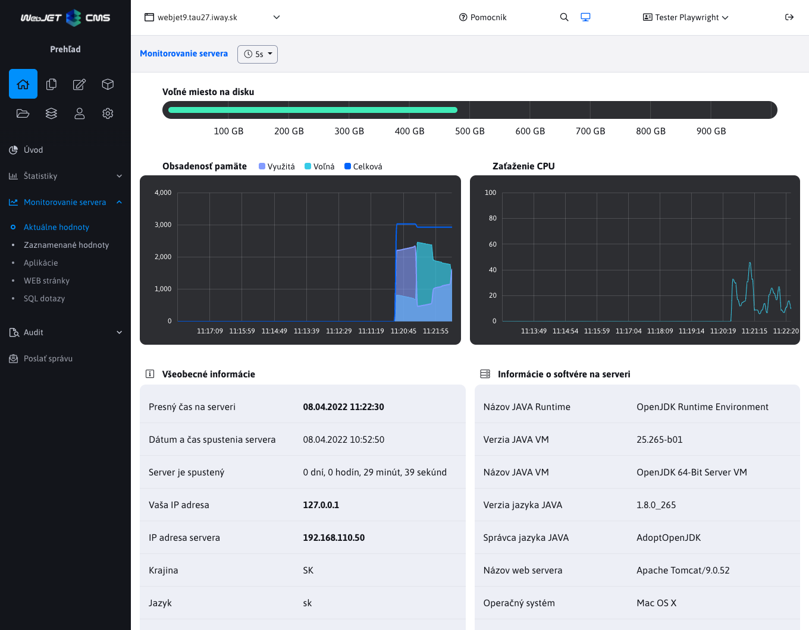
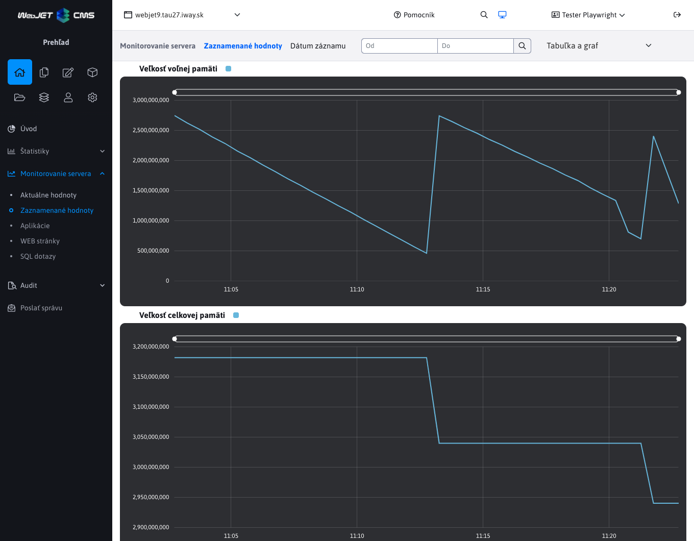

# Monitorovanie servera

## Vnútorné monitorovanie

Analýza výkonu a záťaže servera, jednotlivých aplikácií, databázových dotazov a samotných stránok je možné sledovať priamo v aplikácii Monitorovanie servera (v administrácii WebJETu v sekcii Prehľad).

Modul poskytuje nasledovné možnosti:

- **Aktuálne hodnoty** - aktuálne hodnoty zaťaženia servera, pamäte a počet databázových spojení.



- **Zaznamenané hodnoty** - výpis historických zaznamenaných hodnôt využitia pamäte, ```sessions```, cache a spojení s databázou. Pre ukladanie historických hodnôt je potrebné nastaviť konf. premennú ```serverMonitoringEnable``` na hodnotu ```true```.



Po nastavení konfiguračnej premennej ```serverMonitoringEnablePerformance``` na ```true``` sú dostupné aj:

- **Aplikácie** - štatistika vykonaní jednotlivých aplikácií. Zobrazuje počet vykonaní, priemerný čas vykonania, počet vykonaní z cache pamäte a najpomalšie vykonanie.
- **WEB stránky** - štatistika zobrazení jednotlivých web stránok. Zobrazuje počet zobrazení, priemerný čas zobrazenia, najpomalšie a najrýchlejšie zobrazenie.

Po nastavení konfiguračnej premennej ```serverMonitoringEnableJPA``` na ```true``` je dostupné aj:

- **SQL dotazy** - štatistika rýchlosti vykonávania SQL dotazov. Zobrazuje počet vykonaní, priemerný čas vykonania, najpomalšie a najrýchlejšie vykonanie a samotný SQL dotaz.

**UPOZORNENIE:** aktivácia monitorovania má vplyv na výkon servera a jeho pamäťové zaťaženie. Okrem možnosti zaznamenané hodnoty má zapnutie monitoringu dopad na výkon servera. Všetky údaje okrem časti zaznamenané hodnoty sú
držané len v pamäti servera, takže po jeho reštarte sa začnú evidovať nanovo.

**UPOZORNENIE:** modulové možnosti **Aplikácie**, **WEB stránky** a **SQL dotazy** využívajú jedinečnú spoločnú logiku, ktorá je bližšie opísaná v [Monitorovanie servera podľa vybraného uzla](nodes-logic.md)

## Vzdialené monitorovanie behu servera

Ak potrebujete monitorovať stav WebJETu cez [Nagios](http://www.nagios.org)/[Zabbix](https://www.zabbix.com) alebo inú službu, WebJET poskytuje na URL adrese ```/components/server_monitoring/monitor.jsp``` svoj stav. Odpovedá HTTP **stavom 200 ak je všetko v poriadku**, alebo **stavom 500** (Internal Server Error) ak **nie sú splnené všetky kontroly**.

Uvedenú URL adresu je možné volať aj v sekundových intervaloch, odporúčame ju používať aj vrámci clustra pre monitorovanie dostupnosti jednotlivých nodov.

**Povolené IP adresy**, pre ktoré monitor.jsp korektne odpovedá sa nastavujú v konfiguračnej premennej ```serverMonitoringEnableIPs```.

Komponenta monitoruje nasledovné časti:

- **Inicializácia WebJETu**, vrátane jeho ```preheating``` (čakanie na inicializáciu cache objektov, alebo úloh na pozadí). Čas preheating sa nastavuje v konf. premennej monitoringPreheatTime (predvolene 0). WebJET odpovedá textom ```NOT INITIALISED``` ak nie je korektne inicializovaný (napr. nie je vôbec konektivita do databázy pri jeho štarte, alebo má neplatnú licenciu). Textom ```TOO SHORT AFTER START``` odpovedá počas preheating času (zaradenie do clustra by malo čakať na dokončenie načítania cache objektov/úloh na pozadí).
- Monitorovanie **dostupnosti databázového spojenia** - vykonáva sa SQL select z tabuľky `documents` (konkrétne ```SELECT title FROM documents WHERE doc_id=?```), pričom v konfiguračnej premennej ```monitorTestDocId``` je docid testovanej stránky. Ak sa SQL dotaz nepodarí odpovedá textom ```DEFAULT DOC NOT FOUND```.
- **Dostupnosť šablón** - ak je zoznam inicializovaných šablón menší ako 3 odpovedá textom ```NOT ENOUGHT TEMPLATES```.
- **Zápis údajov štatistiky** - overuje, že v zásobníku zápisu štatistík nie je podozrivo veľa záznamov (ich počet sa nastavuje v konfiguračnej premennej ```statBufferSuspicionThreshold```, predvolene 1000). Ak zásobník zápisu štatistík obsahuje väčšie množstvo údajov na zápis indikuje to buď problém s výkonom SQL servera, alebo problém s úlohami na pozadí. V prípade prekročenia počtu záznamov odpovedá textom ```STAT BUFFER SUSPICION```.
- Ak nastane **iná chyba** odpovedá textom ```EXCEPTION: xxxx```.

WebJET je možné aj manuálne **prepnúť do servisného režimu** nastavením konfiguračnej premennej ```monitorMaintenanceMode``` na true. Vtedy monitor.jsp odpovedá textom ```UNAVAILABLE```.

Ak je všetko v poriadku odpovedá textom ```OK```. Pre monitorovanie **postačuje  sledovať HTTP stav** odpovede, text je len informačný pre presnejšie určenie problému.

## Konfiguračné premenné

- ```serverMonitoringEnable``` - ak je nastavené na ```true```, spúšťa monitorovanie servera každých 30 sekúnd a zapisuje tieto hodnoty do tabuľky `monitoring`
- ```appendQueryStringWhenMonitoringDocuments``` - zachytávať pri monitorovaní aj SQL parametre `?`
- ```cpuMonitoringEnabled``` - Ak je nastavené na `true` server monitoring zaznamenáva celkové zaťaženie CPU
- ```monitorTestDocId``` - ID stránky, ktorej databázové spojenie (získanie názvu) sa testuje v komponente `/components/server_monitoring/monitor.jsp` ktorú môže testovať dohľadový SW (predvolená hodnota: 1)
- ```serverMonitoringEnablePerformance``` - ak je nastavené na `true`, spúšťa monitorovanie rýchlosti SQL dotazov, web stránok a aplikácií (predvolená hodnota: false)
- ```serverMonitoringEnableJPA``` - ak je nastavené na `true`, spúšťa monitorovanie rýchlosti vykonávania SQL dotazov pre JPA, má ale za následok zvýšenie záťaže na pamäť servera (predvolená hodnota: false)
- ```serverMonitoringEnableIPs``` - Zoznam IP adries z ktorých je dostupná komponenta `monitor.jsp` pre monitorovanie servera (predvolená hodnota: 127.0.0.1,192.168.,10.,62.65.161.,85.248.107.,195.168.35.)
- ```monitoringPreheatTime``` - Počet sekúnd potrebných pre zahriatie web sídla (načítanie cache) po reštarte, počas ktorého bude `monitor.jsp` komponenta vracať nedostupnosť uzla clustra (predvolená hodnota: 0)